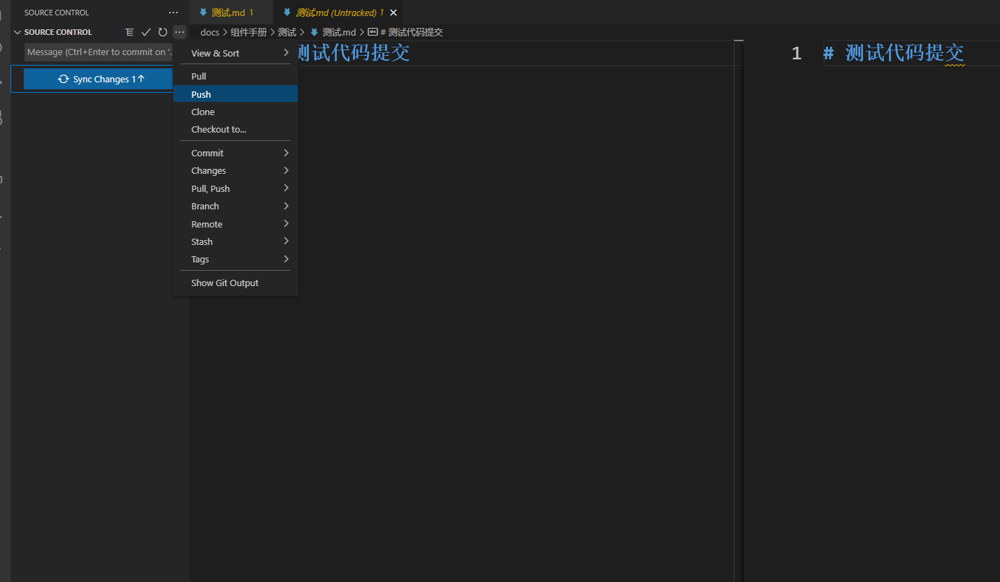
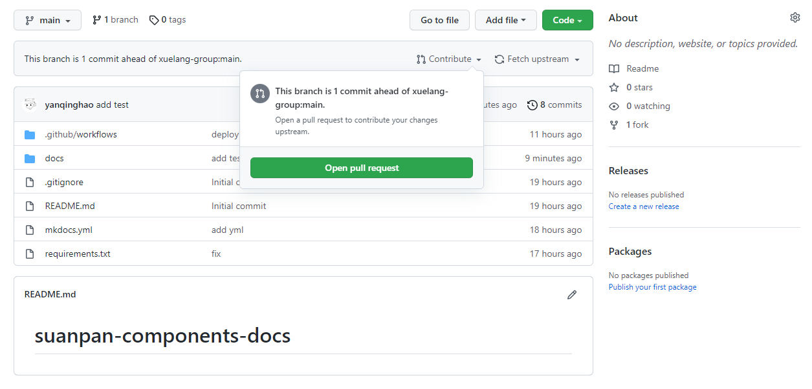

# 1. 认领任务

# 2. 代码贡献

- 打开网址：https://github.com/xuelang-group/suanpan-components-docs

- 注册并登陆github


- Fork项目


- clone到本地并编写文档
    - 编写文档格式请参考: [后面板组件帮助文档规范](./后面板组件帮助文档规范.md)
    
    

- 本地测试
    - 安装Python3
    <br />windows:<br />
    [windows安装包](https://www.python.org/ftp/python/3.9.10/python-3.9.10-amd64.exe)下载并安装，[相关教程](https://phoenixnap.com/kb/how-to-install-python-3-windows)
    <br />linux:<br />
    [linux安装包](https://www.python.org/ftp/python/3.9.10/Python-3.9.10.tgz)下载并安装，[相关教程](https://www.liquidweb.com/kb/how-to-install-python-3-on-centos-7/)
    - 安装依赖包
    <br />windows:
        ```powershell
        cd path/to/suanpan-components-docs
        python3 -m venv .venv
        .venv\Scripts\Activate.ps1
        pip install -r requirements.txt -i https://pypi.tuna.tsinghua.edu.cn/simple
        ```
        Linux or wsl:<br />
        ```bash
        cd path/to/suanpan-components-docs
        python3 -m venv .venv
        source .venv/bin/activate
        pip install -r requirements.txt -i https://pypi.tuna.tsinghua.edu.cn/simple
        ``` 

- 提交代码并提PR




# 3. 结果验收

- PR通过算盘工作人员审核并合入main分支

- 检查页面：[算盘帮助文档](http://123.60.59.142:8082/)


# 4. 奖励发放


# 5. 其他
