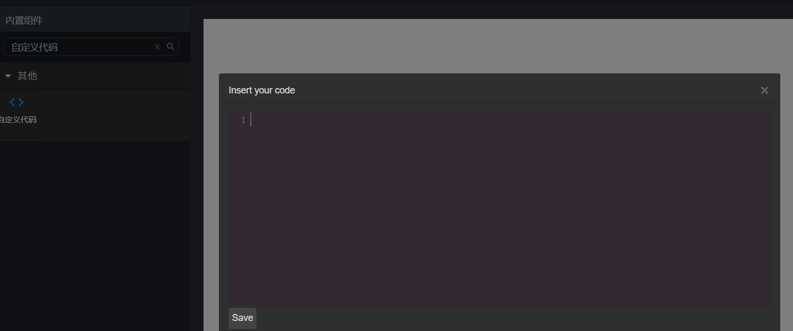
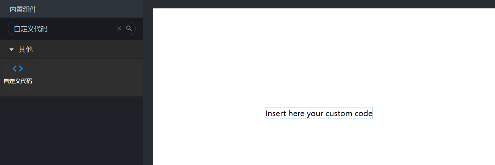
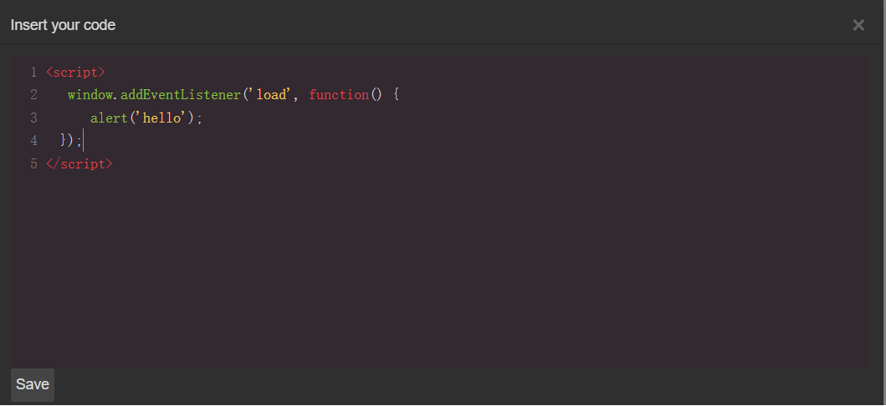
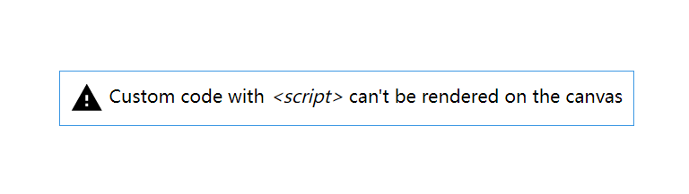
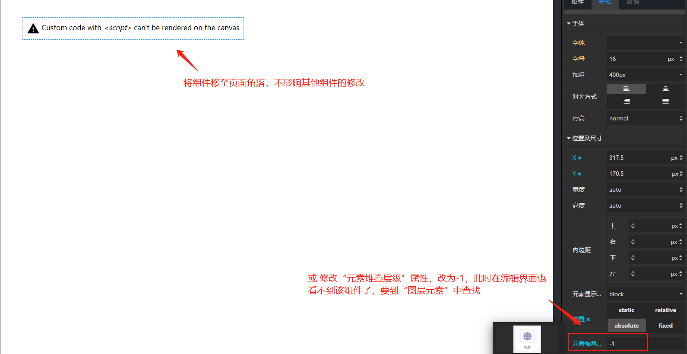

# 概览

## 前面板

自定义代码组件在“其他”组件分类下，首次拖入画布会自动弹出代码编辑弹窗

关闭弹窗后前面板展示如下：

# 功能说明

用于在前面板中插入一段 Javascript 代码，在代码编辑弹窗中编写的代码，会插入到生成的 HTML 页面中去。

在编写时，需注意连同标签一同编写，示例如下：

脚本编写完成后，点击“save”，此时看到前面板组件如下：

提示标签中的内容并不会在最终生成的 HTML 页面中展示出来，此时脚本已经编写完成，可以不用管这个组件了。

通常为了避免这个组件的干扰，可以在编辑时，将其移动到页面的边缘处，防止干扰修改其他前面板组件；也可以设置其堆叠属性为 -1，这样在编辑前面板时也看不到了，需要到页面左侧“图层元素”中查找并选中该组件。

