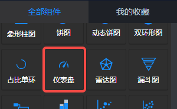
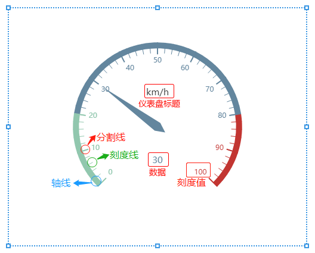
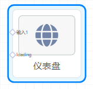

<a name="UbriT"></a>
## 概览
- 内置组件/图表/仪表盘：



- 将该组件拖入前面板画布后：



- 同时，在后面板生成一个“仪表盘”节点。其中有一个输入端口“输入1”，另“loading”端口可忽略。


<a name="b4L9o"></a>
## 数据

- 默认数据 
```json
[{value: 30, name: 'km/h'}]
```

- 数据说明
   - 来源：后面板上游节点发送。
   - 格式：JSON类型，一个数组，包含一个对象，对象中有name和value属性。
<a name="ztKWP"></a>
## 参数
<a name="gdjCQ"></a>
#### 基本设置

- 背景色：颜色值。
- 边框颜色：颜色值。
- 字体颜色：颜色值。
- 图表名称：字符串。
- 名称位置：可选项，图表名称在图表中的位置。默认值“顶部居左”，即画布左上角。
<a name="fJlQy"></a>
#### 仪表盘样式

- 起始角度：仪表盘起始角度。圆心 正右手侧为`0`度，正上方为`90`度，正左手侧为`180`度。
- 结束角度：仪表盘结束角度。
- 半径(%)：仪表盘半径，相对于容器高宽中较小的一项的一半的百分比。默认75%。
- 最小值：最小的数据值，默认0。
- 最大值：最大的数据值，默认100。
- 分隔段数：仪表盘刻度的分割段数，默认10。
- 轴线：可选，True | False，默认True，显示轴线。
- 轴线分段颜色：仪表盘轴线样式。仪表盘的轴线可以被分成不同颜色的多段，其中不同的段数之间用英文逗号, 分隔，每段的长度与颜色之间用英文冒号: 分隔。默认 0.2:#0084ff, 0.8:#339cff, 1:#66b5ff，表示仪表盘轴线分为三段。第一段从开始位置到总长的20%处，颜色为#0084ff；第二段从第一段的结束位置到轴线的80%处，颜色为#339cff；第三段从上一段的结束开始至轴线的100%处，颜色为#66b5ff。
- 轴线宽度(px)：轴线的宽度，单位px。默认10。
- 刻度值：可选，是否显示刻度值。默认显示。
- 刻度值字号：刻度值字体大小，单位px。
- 刻度值颜色：刻度值的字体颜色，默认auto。
- 刻度线：可选，是否显示刻度线。默认显示。
- 刻度线宽度(px)：刻度线宽度，单位px。默认1。
- 刻度线长度(px)：刻度线长度，单位px。默认18。
- 刻度线颜色：刻度线颜色，默认auto。
- 分隔线：可选，是否显示分隔线。默认显示。
- 分隔线宽度(px)：分隔线宽度，单位px。默认2。
- 分隔线长度(px)：分隔线长度，单位px。默认20。
- 分隔线颜色：分隔线颜色，默认auto。
- 指针：可选，是否显示指针。默认显示。
- 指针宽度(px)：默认8px。
- 指针长度(%)：默认80%。
- 仪表盘标题：是否显示仪表盘标题，默认显示。
- 标题颜色：颜色值，默认#333。
- 标题字号(px)：标题字体大小，单位px。默认15。
- 显示数据：是否显示仪表盘当前指示数据，默认显示。
- 数据字号：数据字体大小，单位px。默认15。
- 数据颜色：颜色值，默认auto。
