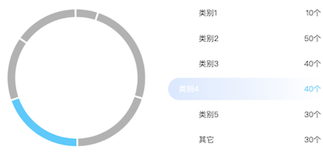

### 数据
   - 默认数据
```json
[
  ["name", "DEMO"], 
  ["类别1", 100], 
  ["类别2", 500], 
  ["类别3", 400], 
  ["类别4", 400], 
  ["类别5", 300],
  ["其它", 300]
]
```

### 参数
   - 环图颜色：环形图初始区域颜色值

   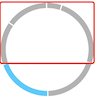

   - 环图选中颜色：环形图被选中区域颜色值

   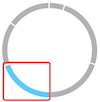

   - 中心点(h,v):  环形图中心点位置，单位可用px或%。用逗号分隔位置值，例如：50%,50%
   - 饼图大小(px)：环形图所在区域大小

   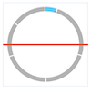

   - 外半径(%)：环形图的最外层直径

   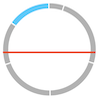

   - 内半径(%)：环形图的最内层直径占比

   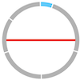
   
   - 显示内阴影：环形图最内层阴影是否显示。显示则如下图：

   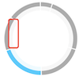

   - 阴影内半径(%): 环形图除去内阴影最内空白区域直径占比

   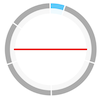

   - 图例背景色：图例初始背景色。渐变色，2个颜色值用"|"分隔，例如：rgba(255,255,255,0.15)|rgba(255,255,255,0.01)

   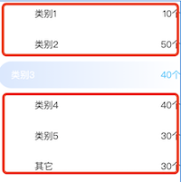
   
   - 图例选中背景色：图例被选中背景色。渐变色，2个颜色值用"|"分隔，例如：rgba(41, 139, 254, 0.2)|rgba(41, 139, 254, 0)
   
   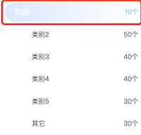
   
   - 动态切换间：循环滚动高亮图例和环形图对应的区域，设置一个的滚动时长，单位为s
   - 显示值单位：数据显示单位
   
   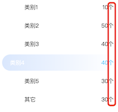
