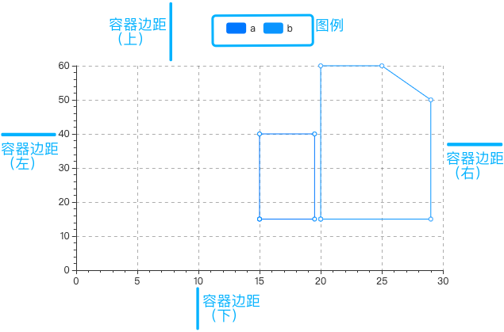
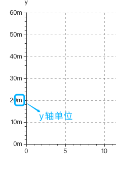
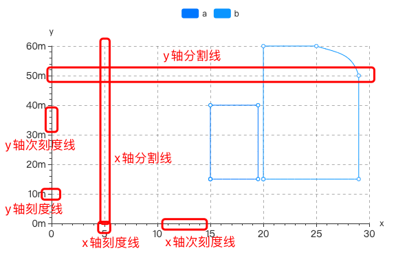
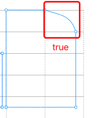
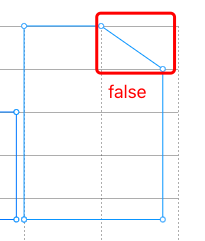

### 数据
   - 默认数据
   ```json
   [
      ["x", "y", "category"],
      [15, 15, "a"],
      [19.5, 15, "a"],
      [19.5, 40, "a"],
      [15,40, "a"],
      [15,15, "a"],
      [20, 15, "b"],
      [20, 60, "b"], 
      [25, 60, "b"], 
      [29, 50, "b"], 
      [29, 15, "b"], 
      [20, 15, "b"]
   ]
   ```

### 图表公共参数
   - 数据源：url，一个json文件的url，json文件中的数据需要遵循Echarts图表的标准数据格式。
   - 背景色：颜色值。
   - 边框颜色：颜色值。
   - 字体颜色：包含图表中标签、名称、图例字体的颜色
   - 图表色系：图表中各个系列的颜色，格式为英文逗号分隔的颜色值。
      - 默认：#c23531,#2f4554,#61a0a8,#d48265,#91c7ae,#749f83,#ca8622,#bda29a,#6e7074,#546570,#c4ccd3
      - 参考色系：
         - #37a2da,#32c5e9,#67e0e3,#9fe6b8,#ffdb5c,#ff9f7f,#fb7293,#e062ae,#e690d1,#e7bcf3,#9d96f5,#8378ea,#96bfff
         - #6ea8e5,#ff962e,#ff5c5f,#70cc62,#86d1ca
   - 图表名称：字符串。
   - 名称位置：图表名称在图表中的位置。
   - 图例：数据的列名是否显示、显示位置，‘无’表示没有图例。
   - 图例朝向：水平或垂直，图例位置选择‘中部居左’或‘中部居右’时默认垂直。
   - 图例映射：由英文冒号: 分隔，: 左侧是数据名，不区分大小写，如‘one’；右侧是自定义的数据名映射，如‘周一’；多个系列名的映射由英文逗号, 分隔。例如默认数据的图例映射可以是 one:周一,two:周二,three:周三。
   - X/Y轴名称：X/Y轴的名称，一般是X/Y轴数据的单位。
   - X/Y轴名称位置：X/Y名称显示的位置
      - 开始：坐标轴开始位置
      - 中间：坐标轴中间位置
      - 末尾：坐标轴末尾位置
   - 轴名称字号：数值，X/Y名称字体大小
   - X/Y轴轴线：可选项，true | false，默认true，不显示X/Y轴轴线。
   - X/Y轴分割线：可选项，true | false，默认false，不显示X/Y轴分割线。
   - X/Y轴刻度线：可选项，true | false，默认true，显示X/Y轴刻度线。
   - 分割线类型：X/Y轴分割线类型，选项为：实线、虚线、点线

### 专项参数
   - x轴名称：X轴的名称，一般是X轴数据的单位。
   - x轴名称颜色：颜色值
   - y轴名称：Y轴的名称，一般是Y轴数据的单位
   - y轴名称颜色：颜色值
   - 坐标轴名称字号: 坐标轴字体大小，数值
   - y轴单位：y轴数值后添加单位

   

   - 坐标轴颜色：轴线颜色，颜色值
   - 坐标轴线宽：轴线宽度，数值
   - 刻度值字号：数值，最小值9
   - x轴刻度线，y轴刻度线，次刻度线，x轴分割线，y轴分割线：可选项，true（显示） | false（不显示）

   

   - x轴分割线类型，y轴分割线类型
      - 实线
      - 虚线
      - 点线
   - 容器边距（左,上,右,下）：英文逗号分隔的四个数字或百分数，分别表示图表距离容器左、上、右、下边的距离
   - 标签：无，不显示标签；上，标签在节点上方；下，标签在节点下方；左，标签在节点左边；右，标签在节点右边
   - x轴刻度值旋转：x轴刻度值旋转的角度，数值
   - X轴标签映射：x轴刻度值映射想要的名称。由英文冒号: 分隔，: 左侧是x轴刻度值，右侧是自定义的数据名映射，如‘周一’；多个映射由英文逗号, 分隔。例如默认数据的X轴标签映射可以是 0:周一,5:周二,10:周三。
   - 平滑：可选项，true 为平滑曲线，false为直线

   

   - 线宽：数值，线条宽度
   - 节点：节点形状：空心圆、圆形、矩形、圆角矩形、三角形、菱形、大头针、箭头、无（不显示）
   - 节点大小：节点形状大小，当节点选项为无时，不起作用
   - 放大镜开始(%)：一个数值，单位是%，表示图表左侧的开始数据是所有数据的第百分之几条，默认0，表示第一条数据。如上图默认数据中，若放大镜开始为50%，则图表默认显示的X轴第一个数据是“three”。
   - 放大镜结束(%)：一个数值，单位是%，表示图表右侧的结束数据是所有数据的第百分之几条，默认100，最后一条数据。如上图默认数据中，若放大镜开始为0，结束为50%，则图表默认显示的X轴第一条数据是“one”，最后一条数据是“three”。在图表中滑动滚轮可以放大或缩小放大镜，若放大镜显示了部分数据，按住鼠标左键拖动可以左右移动放大镜。
