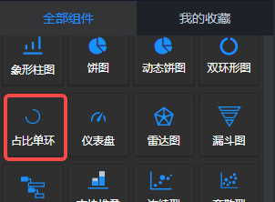
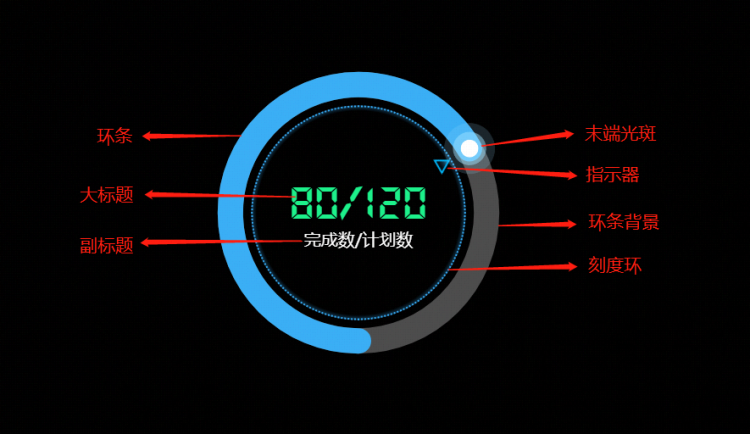
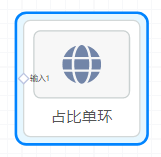
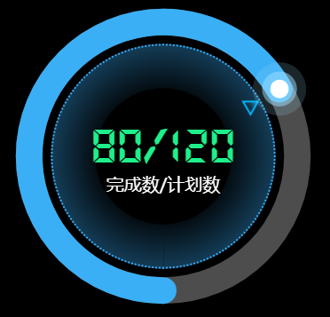

<a name="ZhxoB"></a>
## 概览
- 内置组件/图表/占比单环：



- 拖入前面板画布后（下图中的前面板画布颜色为黑色）：
- 同时，在后面板中会生成一个“占比单环”节点，有一个输入端口“输入1”：


<a name="luBcn"></a>
## 数据
<a name="0hFrg"></a>
#### 默认数据
```json
[
  ["完成数", "计划数"],
  [80, 120]
]
```
<a name="KrUwN"></a>
#### 数据格式

- 二维数组：数据格式是一个二维数组的数据集。第一行是表头，第二行是对应表头的数据。
- 数据维度：即每一列数据的索引。如上默认数据中，数据维度为0的数据为 "完成数" 80 。第二列的数据维度为 1, 以此类推。
<a name="kmZ2T"></a>
## 参数设置
<a name="KN6Fg"></a>
#### 标题

- 显示大标题：可选，布尔值。是否显示大标题，即预览图中的“80/120”文本。
- 大标题颜色：color选项，定义大标题的字体颜色。默认#1df08b。
- 大标题字号：number类型值，单位px。定义大标题的字体大小。默认58。
- 大标题字体：下拉选项，定义大标题的文本字体。可选'默认'、'庞门正道' 或 'DS-Digital'。默认‘DS-Digital’。
- 大标题加粗：number类型值，定义大标题的FontWeight，最小400，步长100，默认600。
- 大标题垂直位置：number类型值，单位%。最小0，步长1。定义大标题的顶部距离占比单环组件顶部的距离。默认38 %。
- 显示副标题：可选，布尔值。是否显示副标题，即预览图中的“完成数/计划数”文本。
- 副标题颜色：color选项，定义副标题的字体颜色。默认#fff 。
- 副标题字号：number类型值，单位px。定义副标题的字体大小。默认20。
- 副标题垂直位置：number类型值，单位%。最小0，步长1。定义副标题的顶部距离占比单环组件顶部的距离。默认55 %。
- 自定义副标题：副标题默认的文本是以"/"分隔的表头字段。若需要自定义副标题的文本，可配置该选项。默认null。
<a name="xulv8"></a>
#### 比例环

- 极坐标内半径：number类型值，单位 %。定义极坐标的内半径。默认 70%。
- 极坐标外半径：number类型值，单位 %。定义极坐标的外半径。默认 90%。
- 开始位置：选项 上、右、下、左，即环条开始的位置。默认 下。
- 环条背景色：color值，设置环条的背景颜色。默认rgba(255, 255, 255, .3)。
- 环条宽度：number类型值，定义环条的宽度。环条的宽度比极坐标的内外半径之间的间距小时，环条在内外半径之间，比内外半径间距大时，默认为内外半径之间的间距大小。
- 环条颜色：color值，定义环条的颜色。默认#3aaff5。
- 环条渐变：选项为'无' 、 '↓' 、 '↑' 、 '→' 、 '←' 、'↘'  、 '↙' 、 '↗' 、 '↖'。默认无。
- 渐变颜色：环条的渐变颜色设置。是一对由 | 分隔的颜色值。默认 '#59B5FF|#2263BD' 。
<a name="NN7vM"></a>
#### 末端光斑

- 末端光斑URL：末端光斑的本质是一个png图片，这里的值是以 data:image/png;base64, 开头的图片的DataUrl。
- 末端光斑宽度：number类型值，单位px。定义光斑图片在图表中的宽度。
- 末端光斑高度：number类型值，单位px。定义光斑图片在图表中的高度。
<a name="mUrcV"></a>
#### 刻度环

- 刻度环半径：number类型值，单位 %。定义刻度环在坐标系中的半径大小。默认67。
- 刻度分隔数：number类型值，定义刻度环被分隔出的刻度的数量。默认200。减小则稀疏，增大则稠密。
- 刻度线长：number类型值，单位px。定义刻度线的长度。默认2。
- 刻度线宽：number类型值，单位px。定义刻度线的线度。默认2。
- 刻度线颜色：color值，定义刻度线的颜色。
- 刻度线类型：可选项 '实线'  、 '虚线'  、 '点线' 。默认 实线 。
- 内发光宽度：number类型值，单位px。定义内发光的半径宽度。
- 内发光渐变起始：number类型值，单位%。定义内发光的开始半径位置，默认95。值越大，内发光的范围越小。下图是内发光宽度为50，内发光渐变起始为50时的效果预览：
<a name="ithgL"></a>
#### 指示器

- 刻度指示器URL：刻度指示器的本质同光斑一样，是一个png图片，以 data:image/png;base64, 开头的图片的DataUrl。
- 指示器宽度：number类型值，单位px。定义指示器图片在图表中的高度。
- 指示器高度：number类型值，单位px。定义指示器图片在图表中的高度。
<a name="aUM1R"></a>
#### 数据维度

- 比数维度：在计算百分比时，作为除数的数据的维度。默认为 0，即第1列数据。
- 总数维度：在计算百分比时，作为被除数的数据的维度。默认为 1，即第2列数据。
