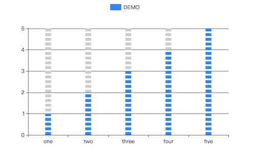

### 数据
- 默认数据格式
```json
[
  ["name", "DEMO"],
  ["one", 1],
  ["two", 2],
  ["three", 3],
  ["four", 4],
  ["five", 5]
]
```

### 图表公共参数
   - 数据源：url，一个json文件的url，json文件中的数据需要遵循Echarts图表的标准数据格式。
   - 背景色：颜色值。
   - 边框颜色：颜色值。
   - 字体颜色：包含图表中标签、名称、图例字体的颜色
   - 图表色系：图表中各个系列的颜色，格式为英文逗号分隔的颜色值。
      - 默认：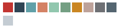#c23531,#2f4554,#61a0a8,#d48265,#91c7ae,#749f83,#ca8622,#bda29a,#6e7074,#546570,#c4ccd3
      - 参考色系：
         - #37a2da,#32c5e9,#67e0e3,#9fe6b8,#ffdb5c,#ff9f7f,#fb7293,#e062ae,#e690d1,#e7bcf3,#9d96f5,#8378ea,#96bfff
         - )#6ea8e5,#ff962e,#ff5c5f,#70cc62,#86d1ca
   - 图表名称：字符串。
   - 名称位置：图表名称在图表中的位置。
   - 图例：数据的列名是否显示、显示位置，‘无’表示没有图例。
   - 图例朝向：水平或垂直，图例位置选择‘中部居左’或‘中部居右’时默认垂直。
   - 图例映射：由英文冒号: 分隔，: 左侧是数据名，不区分大小写，如‘one’；右侧是自定义的数据名映射，如‘周一’；多个系列名的映射由英文逗号, 分隔。例如默认数据的图例映射可以是 one:周一,two:周二,three:周三。
   - X/Y轴名称：X/Y轴的名称，一般是X/Y轴数据的单位。
   - X/Y轴名称位置：X/Y名称显示的位置
      - 开始：坐标轴开始位置
      - 中间：坐标轴中间位置
      - 末尾：坐标轴末尾位置
   - 轴名称字号：数值，X/Y名称字体大小
   - X/Y轴轴线：可选项，true | false，默认true，不显示X/Y轴轴线。
   - X/Y轴分割线：可选项，true | false，默认false，不显示X/Y轴分割线。
   - X/Y轴刻度线：可选项，true | false，默认true，显示X/Y轴刻度线。
   - 分割线类型：X/Y轴分割线类型，选项为：实线、虚线、点线
### 专项参数
   - 容器边距(左,上,右,下)：逗号分隔数值

   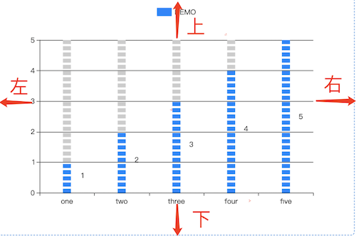
   
   - 标签：每个柱图数据值标签显示位置选项
      - 无标签：不显示标签
      - 上
      - 左
      - 右
      - 下
      - 内部
      - 内部左侧
      - 内部右侧
      - 内部上侧
      - 内部下侧
   - 标签单位：数据值单位

   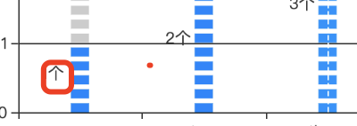

   - 图形类型: 柱图显示的图形样式
      - 自定义：配合【自定义图形】配置项使用
      - 圆形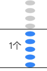
      - 矩形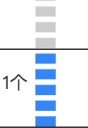
      - 圆角矩形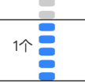
      - 三角形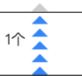
      - 菱形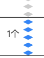
      - 大头针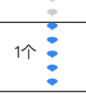
      - 箭头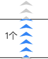
   - 自定义图形：上传需要显示的图形样式。当【图形类型】为自定义时，生效
   - 图形大小：单个图形的长宽值，长宽值用英文逗号分隔
   - 图形角度：数值。单个图形旋转的角度
   - 图形重复：指定图形元素是否重复。不重复，即每个数据值用一个图形元素表示
   - 图形剪裁：是否剪裁图形
      - false：图形本身表示数值大小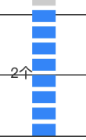
      - true：图形被剪裁后剩余的部分表示数值大小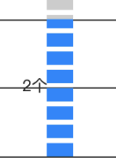
   - 图形间隔：数值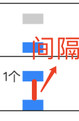
   - 鼠标事件：指定某个鼠标事件，当用户触发时，当前触发所在区域的值将从该组件的【输出桩1】输出。支持以下鼠标事件：
      - 无：
      - 单击：当鼠标指针移动到某个柱体上方，并单击某个柱体时
      - 双击：当鼠标指针移动到某个柱体上方，并双击某个柱体时
      - 按下：当鼠标指针移动到某个柱体上方，并按下鼠标左键时
      - 松开：当鼠标指针移动到某个柱体上方，并松开鼠标左键时
      - 滑过：当鼠标指针位于某个柱体上方时
      - 滑出：当鼠标指针离开某个柱体时
   - Tooltip指示器类型
      - 直线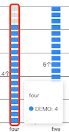
      - 阴影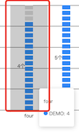
      - 十字准星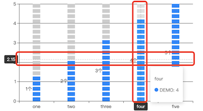
      - 无：不限时
   - 指示器颜色：配合【Tooltip指示器类型】使用，指定其显示颜色
   - 柱形背景：是否显示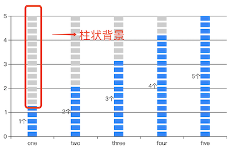
   - 柱形背景颜色：显示柱状背景时，指定其颜色
