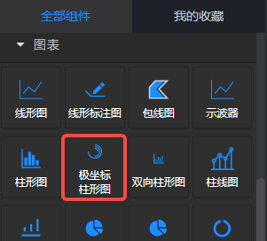
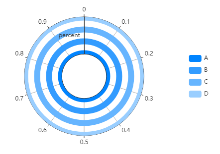
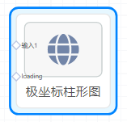
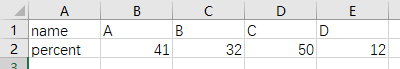
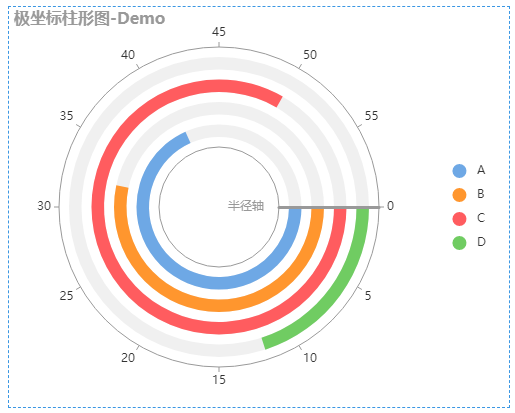
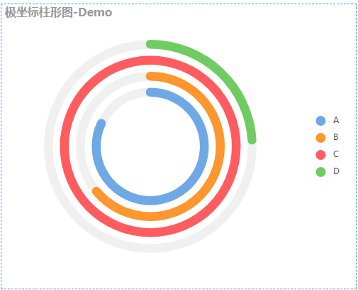
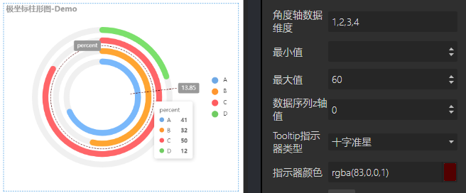

<a name="n9ws6"></a>
## 概览
- 内置组件/图表/极坐标柱形图：



- 将组件拖入前面板画布后：



- 同时，在后面板生成一个对应的“极坐标柱形图”节点，该节点有一个输入1端口和一个loading端口，loading端口可以忽略。上游节点数据从输入1端口流入极坐标柱形图。


<a name="saJtG"></a>
## 数据

- 默认数据：
```json
[["name", "A", "B", "C", "D"], ["percent", 41, 32, 50, 12]]
```

- 数据格式：JSON，csv表格与json对应如下示例：


<a name="xVeaL"></a>
## 参数
<a name="j1cdH"></a>
#### 基本设置

- 数据源：url，一个json文件的url，json文件中的数据需要遵循Echarts图表的标准数据格式。
- 背景色：颜色值。
- 边框颜色：颜色值。
- 字体颜色：包含图表中标签、名称、图例字体的颜色
- 图表色系：图表中各个系列的颜色，格式为英文逗号分隔的颜色值。
   - 默认：#c23531,#2f4554,#61a0a8,#d48265,#91c7ae,#749f83,#ca8622,#bda29a,#6e7074,#546570,#c4ccd3
   - 参考色系：
      - #37a2da,#32c5e9,#67e0e3,#9fe6b8,#ffdb5c,#ff9f7f,#fb7293,#e062ae,#e690d1,#e7bcf3,#9d96f5,#8378ea,#96bfff
      - #6ea8e5,#ff962e,#ff5c5f,#70cc62,#86d1ca
- 图表名称：字符串。
- 名称位置：图表名称在图表中的位置。英文逗号, 分隔，“,”前是水平方向位置，后是垂直方向位置。
- 名称颜色：名称的字体颜色。
<a name="kKnL2"></a>
#### 图例设置

- 图例：“无、水平、垂直”三个选项。默认“垂直”。
   - 无：不显示图例。选择“无”时，图例位置、图例映射的设置不生效。
   - 水平：图例水平方向排列。
   - 垂直：图例垂直方向排列。
- 图例位置：图例在容器中的位置。共2个键值对，一个键值对表示水平方向的位置，另一个键值对表示垂直方向的位置。
   - 水平方向：键可以是 left 或 right，值可以是 left、center、right 或者 数字、百分比。
   - 垂直方向：键可以是 top或 bottom，值可以是 top、center、bottom或者 数字、百分比
- 图例映射：由英文冒号: 分隔，: 左侧是数据名，不区分大小写，如‘one’；右侧是自定义的数据名映射，如‘周一’；多个系列名的映射由英文逗号, 分隔。例如默认数据的图例映射可以是 one:周一,two:周二,three:周三。
- 图例字号：number类型值，定义图例的字体大小，单位px。默认12。最小 8 。
- 图例字体：选项 "默认"、"庞门正道"、"DS-Digital" 。
- 图例间隔：number类型值，定义图例之间的间距，单位px。默认10。最小 4 。
- 图例标记类型：选项 '圆形'、'矩形'、'圆角矩形'、'三角形'、'菱形'、'大头针'、'箭头'、'无' ，默认 圆角矩形。
- 图例标记宽度：number类型值，定义图例标记的宽度，单位px。默认25 。最小 4 。
- 图例标记高度：number类型值，定义图例标记的高度，单位px。默认14 。最小 4 。
<a name="Oreu3"></a>
#### 坐标轴设置


- 极坐标中心：英文逗号,分隔的Number数值或百分比数值，“逗号”左侧定义极坐标的水平位置，右侧定义垂直位置。默认36%,50%。
- 极坐标半径（%）：一个Number类型数值，表示极坐标半径；或由英文逗号, 分隔的两个Number类型数值，表示极坐标的内半径和外半径。默认30, 80 即内半径在从中心到边缘的 30% 位置，外半径在 80% 位置。
- 坐标轴颜色：颜色值，定义坐标轴的颜色。默认#333333
- 角度轴轴线：可选项，true | false，默认true，显示角度轴轴线。
- 角度轴刻度：可选项，true | false，默认true，显示角度轴刻度线和刻度值。
- 角度轴刻度字体：定义角度轴的刻度值字体。
- 角度轴分割线：可选项，true | false，默认true，显示角度轴分割线。
- 半径轴名称：定义半径轴的名称。
- 半精车名称字号：定义半径轴名称的字体大小。
- 半径轴轴线：可选项，true | false，默认true，显示半径轴轴线。
- 半径轴线宽：Number类型值，单位px，定义半径轴的轴线宽度。默认 1px。
- 半径轴刻度：可选项，true | false，默认true，显示半径轴刻度线和刻度值。
- 半径轴两边留白：略。
- 半径轴刻度：是否显示半径轴的刻度值。默认显示。
- 半径轴刻度值：语法同“图例映射”。
- 半径轴刻度字体：定义半径轴的刻度值字体。
- 半径轴分割线：可选项，true | false，默认true，显示半径轴分割线。
- 半径轴分割线线宽：Number类型值，定义半径轴分割线的线宽，单位px。默认1px。
<a name="nJ7AH"></a>
#### 柱形样式


- 柱宽：一个数值，单位px。
- 柱间距(%)：一个数值，不同系列的柱子间的距离。单位是%，-100时，柱形堆叠。
- 数据堆叠：一个字符串，String类型。同个类目轴上系列配置相同的值可以堆叠放置。
- 顺时针：角度轴是否顺时针旋转。
- 起始刻度角度：定义角度轴的开始位置，单位 角度。默认0，如上图。
- 柱条端部圆弧效果：定义是否圆弧，如上图。
- 显示柱条背景色：是否设置柱条的背景。
- 柱条背景颜色：柱条的背景颜色。在勾选“柱形背景”后生效。
<a name="hRBtW"></a>
#### 数据设置
上游输入的数据或静态数据是二维数组。至少有两列，一列为半径轴数据，其他为角度轴数据。数据维度是只数据所在列的索引。

- 半径轴数据维度：> 或 = 0 的数字。默认为 0，即第一列数据。
- 角度轴数据维度：英文逗号分隔的多个 > 或 = 0 的数字。默认为 1,2,3,4，即第二、三、四、五列数据。
- 最小值：角度轴的最小刻度值。
- 最大值：角度轴的最大刻度值。
<a name="j60ub"></a>
#### 其他设置


- 数据序列z轴值：图层层级，数字越大显示在越上层。
- Tooltip指示器类型：鼠标悬停在图表上时，显示的提示框的坐标轴指示器。
- 指示器颜色：提示框指示器的颜色。
- 示例数据：点击“查看”后下载默认数据的csv文件。
