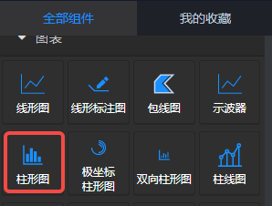
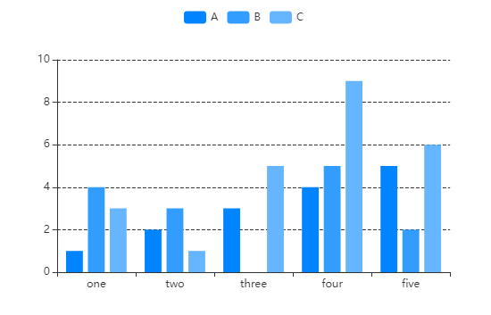
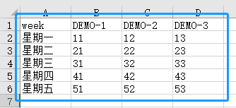
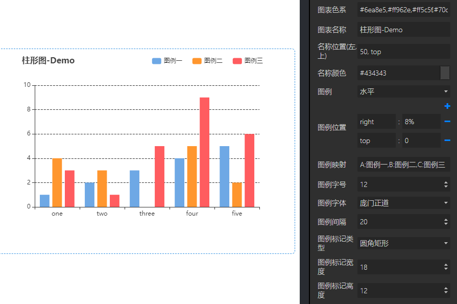
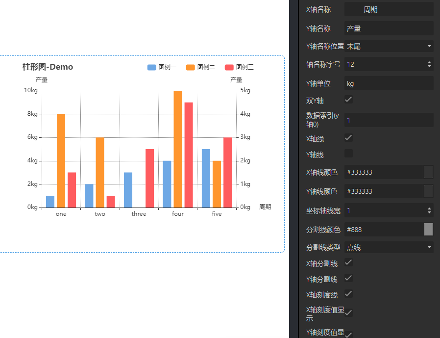
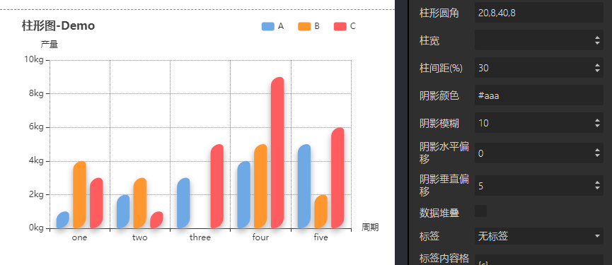
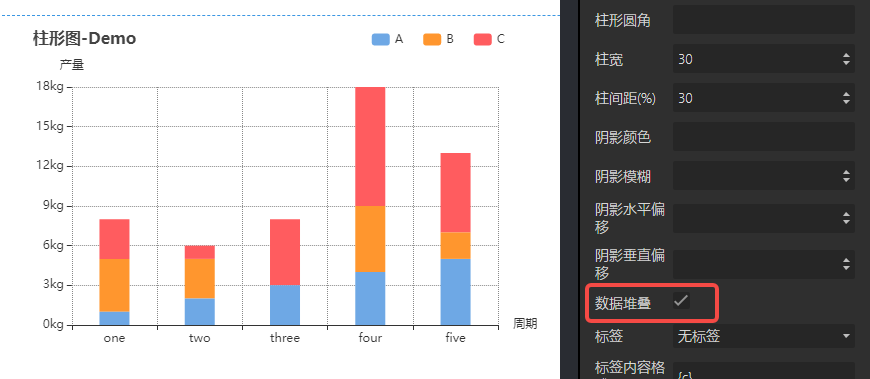
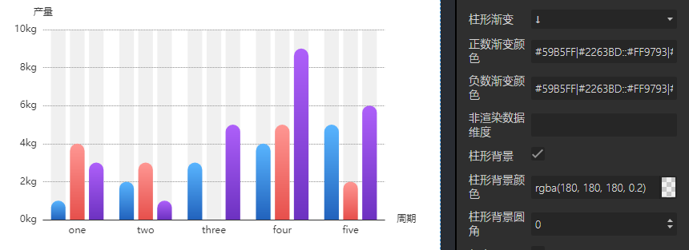

<a name="zrwvA"></a>
## 概览
- 内置组件/图表/柱形图：



- 将柱形图组件拖入前面板画布后：



- 同时，在后面板画布会生成一个对应的节点，该节点有一个输入端口和一个输出端口：


<a name="zaPxo"></a>
## 数据

- 默认数据：
```json
[
  ["name", "A", "B", "C"],
  ["one", 1, 4, 3],
  ["two", 2, 3, 1],
  ["three", 3, 0, 5],
  ["four", 4, 5, 9],
  ["five", 5, 2, 6]
]
```

- 数据格式：JSON，csv表格与json对应如下示例：
   - 
```json
[
  ["week","DEMO-1","DEMO-2","DEMO-3"],
  ["星期一",11,12,13],
  ["星期二",21,22,23],
  ["星期三",31,32,33],
  ["星期四",41,42,43],
  ["星期五",51,52,53]
]
```
<a name="JAp0p"></a>
## 参数

<a name="VzS5D"></a>
#### 基本设置

- 数据源：url，一个json文件的url，json文件中的数据需要遵循Echarts图表的标准数据格式。
- 背景色：颜色值。
- 边框颜色：颜色值。
- 字体颜色：包含图表中标签、名称、图例字体的颜色
- 图表色系：图表中各个系列的颜色，格式为英文逗号分隔的颜色值。
   - 默认：#c23531,#2f4554,#61a0a8,#d48265,#91c7ae,#749f83,#ca8622,#bda29a,#6e7074,#546570,#c4ccd3
   - 参考色系：
      - #37a2da,#32c5e9,#67e0e3,#9fe6b8,#ffdb5c,#ff9f7f,#fb7293,#e062ae,#e690d1,#e7bcf3,#9d96f5,#8378ea,#96bfff
      - #6ea8e5,#ff962e,#ff5c5f,#70cc62,#86d1ca
- 图表名称：字符串。
- 名称位置：图表名称在图表中的位置。
- 容器边距（左,上,右,下）：英文逗号分隔的四个数字或百分数，分别表示图表距离容器左、上、右、下边的距离。
- 包含刻度标签：布尔值，定义容器内是否包含刻度标签。默认true
<a name="wF4Gc"></a>
#### 图例设置

- 图例：“无、水平、垂直”三个选项。默认“水平”。
- 图例位置：图例在容器中的位置。共2个键值对，一个键值对表示水平方向的位置，另一个键值对表示垂直方向的位置。
   - 水平方向：键可以是 left 或 right，值可以是 left、center、right 或者 数字、百分比。
   - 垂直方向：键可以是 top或 bottom，值可以是 top、center、bottom或者 数字、百分比
- 图例映射：由英文冒号: 分隔，: 左侧是数据名，不区分大小写，如‘one’；右侧是自定义的数据名映射，如‘周一’；多个系列名的映射由英文逗号, 分隔。例如默认数据的图例映射可以是 one:周一,two:周二,three:周三。
- 图例字号：number类型值，定义图例的字体大小，单位px。默认12。最小 8 。
- 图例字体：选项 "默认"、"庞门正道"、"DS-Digital" 。
- 图例间隔：number类型值，定义图例之间的间距，单位px。默认10。最小 4 。
- 图例标记类型：选项 '圆形'、'矩形'、'圆角矩形'、'三角形'、'菱形'、'大头针'、'箭头'、'无' ，默认 圆角矩形。
- 图例标记宽度：number类型值，定义图例标记的宽度，单位px。默认25 。最小 4 。
- 图例标记高度：number类型值，定义图例标记的高度，单位px。默认14 。最小 4 。
<a name="ftZek"></a>
#### 坐标轴设置


- X轴名称：X轴的名称，一般是X轴数据的单位。
- Y轴名称：Y轴的名称，一般是Y轴数据的单位。
- Y轴名称位置：选项“开始、中间、末尾”，定义Y轴名称在坐标轴的位置。默认“末尾”。
- 轴名称字号：X、Y轴名称的字体大小，单位px。默认 12px。
- Y轴单位：Y轴的单位，如 ℃、kg 等。
- 双Y轴：是否定义左右两个Y轴。
- 数据索引（y轴0）：配合“双Y轴”设置，定义右侧Y轴的数据维度。默认0,1。
- X轴线：是否显示X轴的轴线。默认显示。
- Y轴线：是否显示Y轴的轴线。默认显示。
- X轴线颜色：X轴的轴线颜色。默认#333333。
- Y轴线颜色：Y轴的轴线颜色。默认#333333。
- 坐标轴线宽：X、Y轴的轴线宽度。单位px，默认1px。
- 分割线颜色：X、Y轴的分割线颜色。默认#333333。
- 分割线类型：选项'实线'、'虚线'、'点线'，定义Y轴分割线的类型。默认“虚线”。
- X轴分割线：可选项，true | false，默认false，不显示X轴分割线。
- Y轴分割线：可选项，true | false，默认true，显示Y轴分割线。
- X轴刻度线：可选项，true | false，默认true，显示X轴刻度线。
- X轴刻度值显示：是否显示X轴的刻度值。默认显示。
- Y轴刻度值显示：是否显示Y轴的刻度值。默认显示。
- Y轴分割段数：Number类型，定义Y轴有几段。默认 5 段。
- Y轴最大值：Number类型，定义Y轴最大刻度。默认为空，即不定义。
- 大于最大值：略。
- 刻度值字号：Number类型，定义X、Y轴刻度值的字体大小，单位px。默认 12px。
- 刻度值字体：选项“默认、庞门正道、DS-Digital”，定义刻度值的字体。默认选“默认”。
- X轴刻度标签间隔（自动）：当X轴数据过密时，是否自动间隔显示刻度。默认true。
- Y轴刻度线：可选项，true | false，默认true，显示Y轴刻度线。
- X轴标签旋转：number类型数值。定义X轴标签的旋转角度，常用于X轴的数据中字段过长时。
- X轴标签映射：语法同“图例映射”。
- X轴标签朝向：定义X轴标签是否在X轴线的上方。默认false。
- X轴标签垂直对齐方式：选项“默认、顶部、中部、底部”，定义X轴标签的垂直对齐位置。
- X轴标签行高：Number类型，定义X轴标签的行高。
<a name="nxmFO"></a>
#### 柱形样式


- 柱形圆角：数字，或英文逗号分隔的四个数字，单位px。一个数字，柱形的四个角均为半径为该值的圆角；英文逗号分隔的四个数字，则分别表示柱形的左上、右上、右下、左下角的圆角半径。
- 柱宽：一个数值，单位px。
- 柱间距(%)：一个数值，不同系列的柱子间的距离。单位是%，-100时，柱形堆叠。
- 阴影颜色：柱形的阴影颜色。
- 阴影模糊：阴影模糊。
- 阴影水平偏移：阴影在水平方向的偏移量。
- 阴影垂直偏移：阴影在垂直方向的偏移量。
- 数据堆叠：多列数据时，同一X轴刻度的柱条是否堆叠在一起。用于设置柱形堆积图。



- 坐标轴对换：可选项，true | false，默认false，坐标轴不兑换，垂直柱形。若为true，则x轴与y轴互换，为水平柱形。
- 柱形渐变：选项“无”以及 6 个方向。“无”时没有渐变。选择任一方向，定义在该方向的渐变。
- 正数渐变颜色：定义Y轴上大于0的柱条的渐变颜色。每列数据的渐变之间用双冒号::分隔，柱条渐变的开始颜色和结束颜色之间用竖线|分隔。默认#59B5FF|#2263BD::#FF9793|#E7504C::#AE60FA|#6D32C1::#EFCE49|#D79C12::#FFB058|#C56625::#4ACC88|#27A657::#2C989E|#27BCC9::#8A98FF|#2B36A8
- 负数渐变颜色：定义Y轴上小于0的柱条的渐变颜色。每列数据的渐变之间用双冒号::分隔，柱条渐变的开始颜色和结束颜色之间用竖线|分隔。
- 柱形背景：是否设置柱条的背景。
- 柱形背景颜色：柱条的背景颜色。在勾选“柱形背景”后生效。
- 柱形背景圆角：Number类型，定义柱条背景的圆角，单位px。默认0，即无圆角。


<a name="d5khM"></a>
#### 标签设置

- 标签：标签相对于节点的显示方向。默认 “无标签”，即不显示标签。
- 标签内容格式：定义标签内容的格式，字符串模板。模板变量有：
   - {a}：系列名。
   - {b}：数据名。
   - {c}：数据值。
- 标签边距：标签到节点的距离。
- 标签字号：标签的字体大小。
- 标签颜色：标签的字体颜色。
<a name="lQBrZ"></a>
#### 其他设置

- 放大镜开始(%)：一个数值，单位是%，表示图表左侧的开始数据是所有数据的第百分之几条，默认0，表示第一条数据。如上图默认数据中，若放大镜开始为50%，则图表默认显示的X轴第一个数据是“three”。
- 放大镜结束(%)：一个数值，单位是%，表示图表右侧的结束数据是所有数据的第百分之几条，默认100，最后一条数据。如上图默认数据中，若放大镜开始为0，结束为50%，则图表默认显示的X轴第一条数据是“one”，最后一条数据是“three”。在图表中滑动滚轮可以放大或缩小放大镜，若放大镜显示了部分数据，按住鼠标左键拖动可以左右移动放大镜。
- 鼠标事件：定义项目运行后，在前面板页面上像下游节点发送响应数据的方式。默认无。
- 示例数据：点击“查看”后下载默认数据的csv文件。
