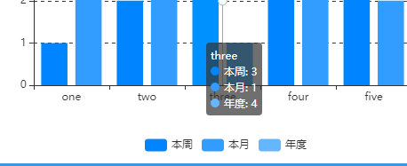

<a name="WpZvr"></a>
## 概览
- 内置组件/图表/柱线图：


- 拖入画布后：


- 柱线图拖入画布后，会在后面板生成一个节点，包含一个输入端口和一个输出端口：


<a name="YRBQI"></a>
## 数据

- 柱线图组件带有一个示例用的默认数据：
```json
[
  ["name", "A", "B", "C"], 
  ["one", 1, 4, 5], 
  ["two", 2, 3, 5], 
  ["three", 3, 1, 4], 
  ["four", 4, 5, 9], 
  ["five", 5, 2, 7]
]
```

- 数据格式：二维数组的json数据。
<a name="Cyj7S"></a>
## 参数
<a name="2Idca"></a>
#### 基本设置

- 数据源：url，一个json文件的url，json文件中的数据需要遵循Echarts图表的标准数据格式。
- 背景色：颜色值。
- 边框颜色：颜色值。
- 字体颜色：包含图表中标签、名称、图例字体的颜色
- 图表色系：图表中各个系列的颜色，格式为英文逗号分隔的颜色值。
   - 默认：

<br />#0084ff, #339cff, #66b5ff, #99ceff, #cce6ff

   - 参考色系：
      - #37a2da,#32c5e9,#67e0e3,#9fe6b8,#ffdb5c,#ff9f7f,#fb7293,#e062ae,#e690d1,#e7bcf3,#9d96f5,#8378ea,#96bfff
      - #6ea8e5,#ff962e,#ff5c5f,#70cc62,#86d1ca
- 图表名称：字符串，默认null。
- 名称位置：英文逗号, 分隔的两个字符串或数值，分别定义名称相对于图表左侧和上方的位置。默认 left, top 即名称位于左上角。还可以是 40, 20 等数字，表示距离左侧40像素，距离上方20像素。
- 名称颜色：color值，定义图表名称的字体颜色。
<a name="XzmDv"></a>
#### 图例设置

- 图例：选项 "无"、"水平"、"垂直" ，默认 无 ，即图表中不渲染图例。
   - 水平：图例水平排列
   - 垂直：图例垂直排列。
- 图例位置：两个冒号: 分隔的键值对。
   - : 左侧填写图例的相对位置，一个是水平方向（left或right），另一个是垂直方向（top或bottom）；
   - : 右侧填写水平或垂直方向对应的位置，可以是数值、百分比，若水平方向也可以填 left、right、center、auto，若垂直方向也可以是 top、bottom、center、auto。
   - 配合图例的 水平/垂直 方向，可以设置为图表的任何位置。
   - 示例：

![image.png]h(images/柱线图/10.png)

- 图例映射：一对或多对由英文冒号: 分隔的数据，: 左侧是数据表中表头的字段，右侧是自定义的表头。如果要自定义多对，那么用英文逗号, 分隔。
   - 示例 A: 本周, B: 本月, C: 年度



- 图例字号：number类型值，定义图例的字体大小，单位px。默认12。最小 8 。
- 图例字体：选项 "默认"、"庞门正道"、"DS-Digital" 。
- 图例间隔：number类型值，定义图例之间的间距，单位px。默认10。最小 4 。
- 图例标记类型：选项 '圆形'、'矩形'、'圆角矩形'、'三角形'、'菱形'、'大头针'、'箭头'、'无' ，默认 圆角矩形。
- 图例标记宽度：number类型值，定义图例标记的宽度，单位px。默认25 。最小 4 。
- 图例标记高度：number类型值，定义图例标记的高度，单位px。默认14 。最小 4 。
<a name="Do5ik"></a>
#### 坐标系设置

- 容器边距（左,上,右,下）：英文逗号分隔的四个数字或百分数，分别表示图表距离容器左、上、右、下边的距离。默认 10%,60,10%,60 
- 包含刻度标签：布尔值，默认false。定义Y轴的刻度值是否包含在坐标系中。默认false，即不包含。
   - 不包含：当Y轴的刻度值是一个很长的数值时，将渲染在画布外部。如下


   - 包含：Y轴的刻度值包含在坐标系内部。如下


<a name="e5v0C"></a>
#### 坐标轴设置

- X轴名称：string类型，定义X轴的名称。
- Y轴名称：string类型，定义Y轴的名称。
- 轴名称字号：number类型，定义X、Y轴名称的字体大小，单位px。默认12，最小10。
- 双Y轴：布尔值，定义是否有两个Y轴，第一个Y轴位于坐标系的左侧，第二个Y轴位于坐标系的右侧。默认false，仅一个Y轴。
- Y轴单位：string类型，定义Y轴的单位。该单位会加在Y轴刻度值的后面。


- 坐标轴颜色：color值，定义X、Y轴的轴线及刻度线的颜色。默认 #333。
- 坐标轴线宽：number类型，定义X、Y轴的轴线及刻度线的宽度，单位px。默认1，最小1。
- X轴分割线：布尔值，定义是否显示X轴的分割线。默认false，不显示。
- Y轴分割线：布尔值，定义是否显示Y轴的分割线。默认true，显示。
- Y轴分割线类型：选项'实线'、'虚线'、'点线'，定义Y轴分割线的类型。默认 实线 。
- 分割线颜色：color值，定义X、Y轴的分割线颜色。默认#333。
- X轴刻度线：布尔值，定义是否显示X轴的刻度线。默认true，显示。
- Y轴刻度线：布尔值，定义是否显示Y轴的刻度线。默认true，显示。
- 刻度值字号：number类型，定义X、Y轴的刻度值的字体大小，单位px。默认12，最小 9。
- 刻度值字体：选项"默认"、"庞门正道"、"DS-Digital" 。定义X、Y轴的刻度值字体。
- X轴数据索引：number类型，定义二维数组中，作为X轴坐标数据的那一列的数据维度。默认 0，即数据中序列号index为0的（第一列）数据。
- X轴标签旋转：number类型，定义X轴标签的旋转角度，常用于X轴的数据中，字段过长时。


<a name="YiOYO"></a>
#### 柱形样式

- 柱形数据索引：一个数字，或者多个由英文逗号, 分隔的数字。一个数字代表二维数组中渲染为柱形图的一列数据的数据维度。默认'1,2'，即数据中序列号index为1（表中左侧第2列）和序列号index为2（第3列）的数据被渲染为柱形图。
- 柱形图Y轴映射：number类型值，定义双Y轴时，柱形图的Y轴索引，默认0，即左侧的Y轴。最小0，最大1。双Y轴时，定义了柱形图的Y轴后，线形图的Y轴为另一个。
- 柱形圆角：一个数值，或多个由英文逗号, 分隔的数值。
   - 一个数值时，柱条的四个角的圆角半径都为这个值。
      - 
   - 多个值时，英文逗号, 分隔的数值分别为柱条的左上、右上、右下、左下角的圆角半径。
      - 
      - 
- 柱宽：number类型值，定义柱条的宽度，单位px。
- 柱间距(%)：_柱形数据索引_ 的值有多个时，定义渲染在柱线图中的每个维度的柱条直接的间距，单位%，默认30，即柱条宽度的30%。当为-100%时，不同维度的柱条重叠。
   - 
- 柱形渐变：选项为'无' 、 '↓' 、 '↑' 、 '→' 、 '←' 、'↘'  、 '↙' 、 '↗' 、 '↖'。默认 无，没有渐变。
- 渐变颜色：一对渐变色是由 | 分隔的两个颜色值，左侧代表渐变的起始颜色，右侧代表渐变结束颜色。当有多个维度的柱形图时，可以定义多对渐变颜色，每对渐变颜色之间用 :: 分隔。
   - 默认值 '#59B5FF|#2263BD::#FF9793|#E7504C::#AE60FA|#6D32C1::#EFCE49|#D79C12::#FFB058|#C56625::#4ACC88|#27A657::#2C989E|#27BCC9::#8A98FF|#2B36A8'
   - 若有多个维度柱形而只定义了一对渐变色，或则定义的柱条维度多于渐变颜色，那么不足的柱条会循环使用前面的颜色对。
   - 示例，三个维度的柱形而渐变颜色只定义了两对，第三列柱形则用从第一对渐变色开始：
<a name="hytWj"></a>
#### 线形样式

- 线形数据索引：一个数字，或者多个由英文逗号, 分隔的数字。一个数字代表二维数组中渲染为线形图的一列数据的数据维度。默认'3'，即第3列数据被渲染为线形图。
- 线平滑：布尔值，定义线形是否平滑。默认false，不平滑。
- 线宽：number类型值，定义线条的宽度，单位px。默认1，即线条宽度1像素。
- 线透明度：number类型值，定义线条的透明度。最大1，不透明，最小0，完全透明。默认1，不透明。
- 节点：选项'空心圆'、'圆形'、'矩形'、'圆角矩形'、'三角形'、'菱形'、'大头针'、'箭头'、'无'，定义线条上每个数据节点的形状。默认‘空心圆’。
- 节点大小：number类型值，定义线条上每个数据节点的大小，单位px。默认4。
- 区域填充：选项'无填充'、'渐变填充'、'纯色填充'，定义线条到X轴的区域内的填充。
   - 无填充：没有填充。
   - 渐变填充：线条颜色的50%透明至完全透明的渐变，方向从上至下。
   - 纯色填充：30%透明度的线条颜色填充该 区域。
   - 示例
<a name="bDAV4"></a>
#### 标签参数

- 柱标签：选项，定义柱形条标签数据的位置。默认 无标签，即不显示标签。
- 柱标签颜色：color值，定义柱形标签的字体颜色。
- 线标签：选项，定义线形数据节点标签的位置。默认 无标签，即不显示标签。
- 线标签颜色：color值，定义线形标签的字体颜色。
- 标签边距：number类型值，定义标签距离图形元素的距离，单位px。默认5。
- 标签字号：number类型值，定义标签的字体大小，单位px。默认12。
- 标签字体：选项"默认"、"庞门正道"、"DS-Digital" 。定义标签的字体，默认"默认"。
<a name="SItwe"></a>
#### 其他

- 数据堆叠：选项'无堆叠'、'柱形堆叠'、'线形堆叠'，'全部堆叠'，默认 无堆叠。同个类目轴上系列堆叠后，后一个系列的值会在前一个系列的值上相加。
   - 无堆叠：不设置数据堆叠。
   - 柱形堆叠：仅柱形维度的数据堆叠。
   - 线形堆叠：仅线形维度的数据堆叠。
   - 全部堆叠：柱线图上的柱形和线形数据都堆叠。
   - 示例，柱形堆叠
- 放大镜开始(%)：一个数值，单位是%，表示图表左侧的开始数据是所有数据的第百分之几条，**默认-1，表示不设置放大镜**。若为0，则表示第一条数据。如上图默认数据中，若放大镜开始为50%，则图表默认显示的X轴第一个数据是“three”。
- 放大镜结束(%)：一个数值，单位是%，表示图表右侧的结束数据是所有数据的第百分之几条，默认100，最后一条数据。如上图默认数据中，若放大镜开始为0，结束为50%，则图表默认显示的X轴第一条数据是“one”，最后一条数据是“three”。在图表中滑动滚轮可以放大或缩小放大镜，若放大镜显示了部分数据，按住鼠标左键拖动可以左右移动放大镜。
- 鼠标事件：选项'无'、'单击' 、'双击'、'按下'、'松开'、'滑过'、 '滑出' ，定义柱形图上的鼠标事件。默认 无，即不响应任何事件。当响应事件时，组件会向下游节点发送鼠标响应的那一行的数据。

