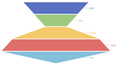

### 数据
   - 默认数据
```json
[
  ["name", "DEMO-1"], 
  ["one", 60], 
  ["two", 40], 
  ["three", 20], 
  ["four", 80], 
  ["five", 100]
]
```

### 图表公共参数
   - 数据源：url，一个json文件的url，json文件中的数据需要遵循Echarts图表的标准数据格式。
   - 背景色：颜色值。
   - 边框颜色：颜色值。
   - 字体颜色：包含图表中标签、名称、图例字体的颜色
   - 图表色系：图表中各个系列的颜色，格式为英文逗号分隔的颜色值。
      - 默认：#c23531,#2f4554,#61a0a8,#d48265,#91c7ae,#749f83,#ca8622,#bda29a,#6e7074,#546570,#c4ccd3
      - 参考色系：
         - #37a2da,#32c5e9,#67e0e3,#9fe6b8,#ffdb5c,#ff9f7f,#fb7293,#e062ae,#e690d1,#e7bcf3,#9d96f5,#8378ea,#96bfff
         - #6ea8e5,#ff962e,#ff5c5f,#70cc62,#86d1ca
   - 图表名称：字符串。
   - 名称位置：图表名称在图表中的位置。
   - 图例：数据的列名是否显示、显示位置，‘无’表示没有图例。
   - 图例朝向：水平或垂直，图例位置选择‘中部居左’或‘中部居右’时默认垂直。
   - 图例映射：由英文冒号: 分隔，: 左侧是数据名，不区分大小写，如‘one’；右侧是自定义的数据名映射，如‘周一’；多个系列名的映射由英文逗号, 分隔。例如默认数据的图例映射可以是 one:周一,two:周二,three:周三。
   - X/Y轴名称：X/Y轴的名称，一般是X/Y轴数据的单位。
   - X/Y轴名称位置：X/Y名称显示的位置
      - 开始：坐标轴开始位置
      - 中间：坐标轴中间位置
      - 末尾：坐标轴末尾位置
   - 轴名称字号：数值，X/Y名称字体大小
   - X/Y轴轴线：可选项，true | false，默认true，不显示X/Y轴轴线。
   - X/Y轴分割线：可选项，true | false，默认false，不显示X/Y轴分割线。
   - X/Y轴刻度线：可选项，true | false，默认true，显示X/Y轴刻度线。
   - 分割线类型：X/Y轴分割线类型，选项为：实线、虚线、点线

### 专项参数
   - 漏斗图宽度：单位可以为px或%
   - 漏斗图朝向：
      - 垂直
      - 水平

   - 数据排序
      - 正序
      - 倒序
      - 按数据顺序

   - 数据图形间距：数值

   

   - 显示标签：

   

   - 标签位置：标签显示的位置，选项有：
      - 左侧(漏斗图朝向为垂直时有效)
      - 右侧(漏斗图朝向为垂直时有效)
      - 上侧(漏斗图朝向为水平时有效)
      - 下侧(漏斗图朝向为水平时有效)
      - 内侧
      - 内侧右部
      - 内侧左部
      - 左侧上部
      - 左侧下部
      - 右侧上部
      - 右侧下部
   - 显示视觉引导线

   

   - 图形渐变：配合【渐变颜色】配置项使用。设置渐变方向， 选项有
      - ↓：从上往下
      - ↑：从下往上
      - →：从左往右
      - ←：从右往左
      - ↘：从左上到右下
      - ↙：从右上到左下
      - ↗：从左下到右上
      - ↖：从右下到左上
   - 渐变颜色：配合【图形渐变】配置项使用。单个渐变颜色数据格式由"::"分隔两个颜色值，例如：rgba(10,255,179,0.8)::rgba(10,255,179,0.2)。再由“|”分隔多个渐变颜色数据，例如：rgba(10,255,179,0.8)::rgba(10,255,179,0.2)|rgba(10,255,179,0.8)::rgba(10,255,179,0.2)|rgba(10,255,179,0.8)::rgba(10,255,179,0.2)|rgba(10,255,179,0.8)::rgba(10,255,179,0.2)

