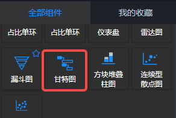
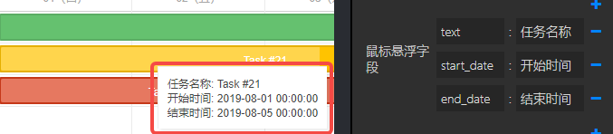

<a name="C6Liq"></a>
## 概览
- 内置组件/图表/甘特图：



- 将组件拖入前面板画布后，组件在画布中宽度和高度均是100%，可以在**样式**中修改x、y、宽度和高度：


- 同时，在后面板画布中生成一个对应的“甘特图”节点，有一个输入端口：


<a name="W6DEE"></a>
## 数据
<a name="zHWJs"></a>
#### 默认数据
```json
[
  { id: 1, text: "Project #1", owner: "张三", start_date: null, duration: null, type: "project", parent: 0, progress: 0, open: true },
  { id: 2, text: "Task #3", owner: "张三", start_date: "2019-08-01 00:00", duration: null, type: "project", render: "split", parent: 1, progress: null },
  { id: 21, text: "Task #21", owner: "张三", start_date: "2019-08-01 00:00", duration: 4, parent: 2, progress: 0.6, color: "#ffc300" },
  { id: 22, text: "Task #33", owner: "张三", start_date: "2019-08-04 00:00", duration: 2, parent: 2, progress: 0.6, color: "#ffc300" },
  { id: 23, text: "Task #1", owner: "张三", start_date: "2019-08-06 00:00", duration: 3, parent: 2, progress: 0.6, color: "#ffc300" },
  { id: 3, text: "Task #3", owner: "张三", start_date: "2019-08-01 00:00", duration: null, type: "project", render: "split", parent: 1, progress: null },
  { id: 31, text: "Task #2", owner: "张三", start_date: "2019-08-01 00:00", end_date: "2019-08-03 12:30", parent: 3, progress: 0.5, color: '#db3e1c' },
  { id: 32, text: "Task #2", owner: "张三", start_date: "2019-08-03 00:00", end_date: "2019-08-06 12:30", parent: 3, progress: 0.5, color: '#db3e1c' },
  { id: 4, text: "Task #3", owner: "张三", start_date: "2019-08-03 00:00", duration: null, type: "project", render: "split", parent: 1, progress: null },
  { id: 41, text: "Task #3.1", owner: "张三", start_date: "2019-08-05 00:00", duration: 3, parent: 4, progress: 0.2, color: '#42db1c' },
  { id: 42, text: "Task #3.2", owner: "张三", start_date: "2019-08-08 00:00", duration: 2, parent: 4, progress: 0, color: '#42db1c' }
]
```

- id：任务id
- text：任务名称
- owner：任务所属人
- parent：父级任务id
- start_date: 开始时间
- end_date: 结束时间
- type：任务类型
- duration: 任务期限
- progress: 0~1的数字，定义进度。

<a name="DmeJ3"></a>
#### 输入数据
项目运行后，从上游节点发送到输入端口“输入1”的数据。<br />数据格式：{ "data": Data, "scale": Scale }

- Data：格式如同默认数据。
- Scales：定义时间轴尺度。格式 [{ "format": Format, "unit": Unit }]
   - Format：
      - **%y** -  00~99的年份 ( _00 to 99_ );
      - **%Y** - 1900~9999的年份 ( _1900-9999_ ); 
      - **%m** - 01~12的月份;
      - **%n** -  1~12的月份; 
      - **%M** - 1月~12月;
      - **%F** -  一月~十二月; 
      - **%d** -  01~31的日期;
      - **%j** -   1~31的日期;
      - **%D** - 一、二、三、四、五、六、日;
      - **%l** - 星期一 ~ 星期日; 
      - **%h** - 00~11 的小时;
      - **%H** - 00~23 的小时;
      - **%i** - 00~59 的分钟;
      - **%s** -  00~59 的秒;
   - Unit：year | month | week | day | hour | minute 
   - 示例：
```json
[{format: "%F, %Y", unit: 'month'}, {format: "%d（%D）", unit: 'day'}]
```
<a name="sEQFX"></a>
## 参数
<a name="G3ryx"></a>
#### 左侧列表设置


- 左侧字段：任务中的字段，如 id、text 等。
- 左侧面板宽度：Number类型数值，单位px。定义左侧面板的宽度。默认200px。
- 左侧字段宽度：左侧字段的宽度。
<a name="o3CxV"></a>
#### 提示框设置


- 鼠标悬浮字段：鼠标悬停在任务条上时，提示框中显示的任务字段。
<a name="q8Wqs"></a>
#### 时间轴设置


- 时间轴：定义时间轴的格式。可以增加或减少一行，建议1~2行。
- 时间轴高度：Number类型值，单位px。定义时间轴的高度。默认 60 px。
- 期间单位：定义时间轴的单位，见 数据/输入数据 中的 Scales / Unit。
<a name="RIiCo"></a>
#### 样式设置


- 显示字段：任务中的字段，如 id、text 等。定义任务条中的显示字段。
- 开始前：Number类型，>= 0 的数字。定义任务列表前的空白列数。
- 结束后：Number类型，>= 0 的数字。定义任务列表后的空白列数。
- 背景色：定义甘特图的背景颜色。
- 边框颜色：定义甘特图的边框颜色。
- 字体颜色：定义甘特图的字体颜色。
- 任务行背景：定义任务条所在行的背景颜色。
- 任务odd行背景：定义任务条奇数行的背景颜色。
- 任务行边框：定义任务条所在行的边框颜色。
- 行高：Number类型值，单位px。定义任务行所在行的高度。
- Bar Height：Number类型值，单位px。定义任务条的高度。
