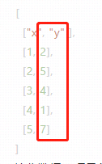

<a name="yC1BL"></a>
## 概览
- 内置组件/图表/示波器：


- 拖入前面板画布后，生成示波器组件图表：


- 同时，在后面板画布中生成一个对应的“示波器”节点，该节点有一个输入端口：


<a name="UeuT8"></a>
## 数据

- 默认数据
```json
[
  ["x", "y"], 
  [1, 2], 
  [2, 5], 
  [3, 4], 
  [4, 1], 
  [5, 7]
]
```

- 接收数据：项目部署之后，从输入节点接收上游组件发送来的数据，**发送的数据是一个数组，如“默认数据”中的 [1,2]或[2,5]，是示波器图表的一条数据点**。输入的数据逐条累加直到参数中的“最大数据量”。
<a name="RWz1I"></a>
## 参数
<a name="Ou28H"></a>
#### 基本设置

- 容器边距(左,上,右,下)：默认 6%,40,6%,40 。英文逗号分隔的数字或百分数，若为数字，则单位为像素，分别设置图表到左、上、右、下边框的距离。
- 字体颜色：默认#333。设置图表中除Tooltip之外的所有字体的颜色。
- 字号：单位px，默认 14。设置图表中所有文字的字体大小。
- 图表色系：图表中各条波线的颜色，格式为英文逗号分隔的颜色值。默认 #0084ff, #339cff 。
- 最大数据量：波形图能够渲染的最大数据量，超出后会移除队列中最先接收到的数据。默认 12，最小 1。
<a name="K04HV"></a>
#### 坐标轴设置

- x轴名称：x轴的名称。字体颜色同“坐标轴颜色”，字体大小是“字号”的 4/5。
- y轴名称：y轴的名称。字体颜色同“坐标轴颜色”，字体大小是“字号”的 4/5。
- 坐标轴颜色：x、y轴的轴线颜色。默认#000 。
- 分割线颜色：x、y轴的分割线颜色。默认 #d9d9d9。
- x轴分割线：布尔值，默认 true。设置 x轴的分割线是否显示。
- x轴分割线类型：x轴分割线的类型。默认“实线”。
- x轴分割区域：布尔值，默认 false。设置 x轴的区域分割是否显示。
- x轴分割区域间隔：坐标轴分隔区域的显示间隔。默认“auto”会采用标签不重叠的策略间隔显示标签。可以设置成 0 强制显示所有标签。如果设置为 `1`，表示『隔一个标签显示一个标签』，如果值为 `2`，表示隔两个标签显示一个标签，以此类推。在类目轴中有效，所以y轴不设置该参数。
- x轴分割区域颜色：单个颜色值，或多个英文分号; 分割的颜色值。分隔区域颜色。分隔区域会按数组中颜色的顺序依次循环设置颜色。默认是一个深浅的间隔色：rgba(250,250,250,0.3); rgba(200,200,200,0.3)。
- y轴分割线：布尔值，默认 true。设置 y轴的分割线是否显示。
- y轴分割线类型：y轴分割线的类型。默认“虚线”。
- y轴分割区域：布尔值，默认 false。设置 y轴的区域分割是否显示。
- y轴分割区域颜色：同x轴分割区域颜色。
<a name="uJ5le"></a>
#### 数据维度

- X轴维度：x轴的数据维度，即数据在列表中的索引。例如默认数据中，x轴的维度是0，即每行的索引为0的数据，即下图中红框中的数据
- Y轴维度：y轴的数据维度，即数据在列表中的索引。例如默认数据中，y轴的维度是1，即每行的索引为1的数据，即下图中红框中的数据
<a name="LsqGN"></a>
#### 线条样式

- 平滑：布尔值，默认为 false。控制波形折线是否平滑。
- 线宽：Number类型值，默认为 1。控制波形折线的粗细。
- 节点：波线中数据节点的类型，默认为“空心圆”。
- 节点大小(px)：Number类型值，单位“像素”，默认4。设置波线数据节点的大小。
<a name="GdAu0"></a>
#### 其他设置

- 放大镜开始(%)：Number类型值，单位%，表示图表左侧的开始数据是所有数据的第百分之几条，表示第一条数据。如上图默认数据中，若放大镜开始为50%，则图表默认显示的X轴第一个数据是“three”。默认-1，没有放大镜功能。
- 放大镜结束(%)：Number类型值，单位是%，表示图表右侧的结束数据是所有数据的第百分之几条，默认100，最后一条数据。如上图默认数据中，若放大镜开始为0，结束为50%，则图表默认显示的X轴第一条数据是“one”，最后一条数据是“three”。在图表中滑动滚轮可以放大或缩小放大镜，若放大镜显示了部分数据，按住鼠标左-键拖动可以左右移动放大镜。
- 示例数据：点击下载示例数据。
