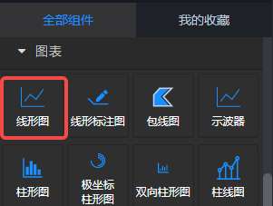
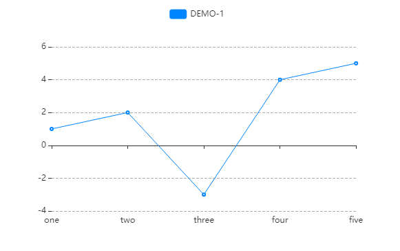
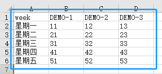
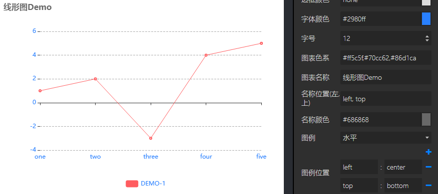
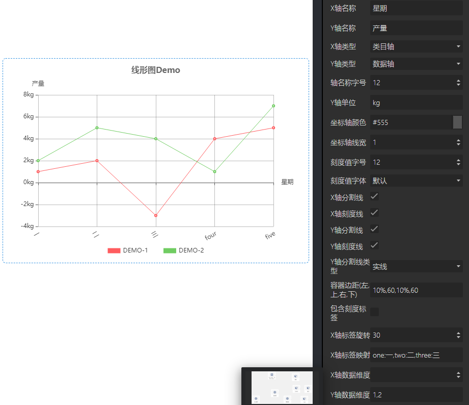
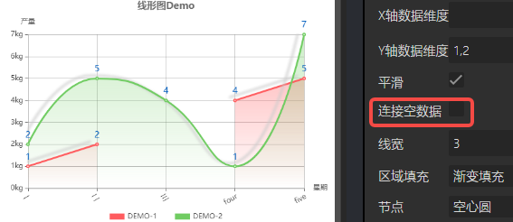
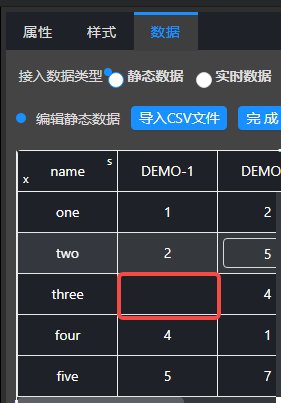
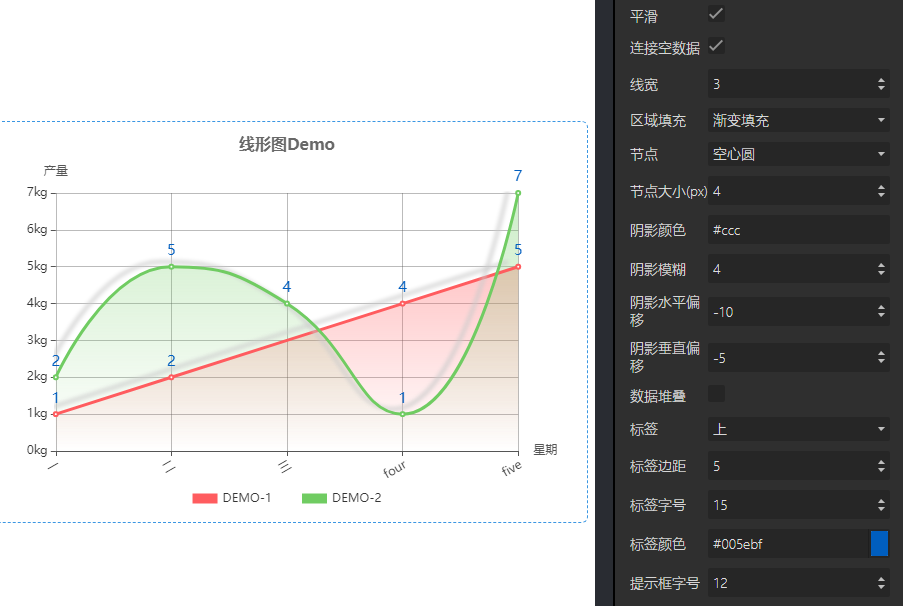

## 概览
- 内置组件/图表/线形图

- 拖入前面板画布后，在前面板

- 拖入前面板画布后在后面板生成一个对应的节点，有一个输入和一个输出端口

## 数据

- 默认数据：[["name", "DEMO"], ["one", 1], ["two", 2], ["three", 3], ["four", 4], ["five", 5]]
- 数据格式：JSON，csv表格与json对应如下示例：

 "[["week","DEMO-1","DEMO-2","DEMO-3"],["星期一",11,12,13],["星期二",21,22,23],["星期三",31,32,33],["星期四",41,42,43],["星期五",51,52,53]]"

- 输入数据：项目运行后，后面板节点接收的上游节点发来的数据，JSON格式。
- 输出数据：项目运行后，点击前面板中线形图中的线后，后面板输出端口向下游发送的数据。

## 参数

#### 基础设置

- 数据源：url，一个json文件的url，json文件中的数据需要遵循Echarts图表的标准数据格式。
- 背景色：颜色值。
- 边框颜色：颜色值。
- 字体颜色：包含图表中标签、名称、图例字体的颜色
- 图表色系：图表中各个系列的颜色，格式为英文逗号分隔的颜色值。
   - 默认：#c23531,#2f4554,#61a0a8,#d48265,#91c7ae,#749f83,#ca8622,#bda29a,#6e7074,#546570,#c4ccd3
   - 参考色系：
      - #37a2da,#32c5e9,#67e0e3,#9fe6b8,#ffdb5c,#ff9f7f,#fb7293,#e062ae,#e690d1,#e7bcf3,#9d96f5,#8378ea,#96bfff
      - #6ea8e5,#ff962e,#ff5c5f,#70cc62,#86d1ca
- 图表名称：字符串。
- 名称位置：图表名称在图表中的位置。
- 容器边距（左,上,右,下）：英文逗号分隔的四个数字或百分数，分别表示图表距离容器左、上、右、下边的距离。
- 包含刻度标签：布尔值，定义容器内是否包含刻度标签。默认true。

#### 图例设置

- 图例设置：“无、水平、垂直”三个选项。默认“水平”
   - 无：不显示图例。选择“无”时，图例位置、图例映射的设置不生效。
   - 水平：图例水平方向排列。
   - 垂直：图例垂直方向排列。
- 图例位置：图例在容器中的位置。共2个键值对，一个键值对表示水平方向的位置，另一个键值对表示垂直方向的位置。
   - 水平方向：键可以是 left 或 right，值可以是 left、center、right 或者 数字、百分比。
   - 垂直方向：键可以是 top或 bottom，值可以是 top、center、bottom或者 数字、百分比
- 图例映射：由英文冒号: 分隔，: 左侧是数据名，不区分大小写，如‘one’；右侧是自定义的数据名映射，如‘周一’；多个系列名的映射由英文逗号, 分隔。例如默认数据的图例映射可以是 one:周一,two:周二,three:周三。
- 图例字号：number类型值，定义图例的字体大小，单位px。默认12。最小 8 。
- 图例字体：选项 "默认"、"庞门正道"、"DS-Digital" 。
- 图例间隔：number类型值，定义图例之间的间距，单位px。默认10。最小 4 。
- 图例标记类型：选项 '圆形'、'矩形'、'圆角矩形'、'三角形'、'菱形'、'大头针'、'箭头'、'无' ，默认 圆角矩形。
- 图例标记宽度：number类型值，定义图例标记的宽度，单位px。默认25 。最小 4 。
- 图例标记高度：number类型值，定义图例标记的高度，单位px。默认14 。最小 4 。

#### 坐标轴设置

- X轴名称：X轴的名称，一般是X轴数据的单位。
- Y轴名称：Y轴的名称，一般是Y轴数据的单位。
- X轴类型：可以选择“类目轴”或“数据轴”，默认为类目轴。
- Y轴类型：可以选择“类目轴”或“数据轴”，默认为数据轴。
- 轴名称字号：X、Y轴的名称字体大小，单位px。默认 12px。
- Y轴单位：Y轴的单位。如℃
- 坐标轴颜色：color值，定义X、Y轴的轴线及刻度线的颜色。默认 #333。
- 坐标轴线宽：number类型，定义X、Y轴的轴线及刻度线的宽度，单位px。默认1，最小1。
- 刻度值字号：number类型，定义X、Y轴的刻度值的字体大小，单位px。默认12，最小 9。
- 刻度值字体：选项"默认"、"庞门正道"、"DS-Digital" 。定义X、Y轴的刻度值字体。
- X轴分割线：布尔值，定义是否显示X轴的分割线。默认false，不显示。
- X轴刻度线：布尔值，定义是否显示X轴的刻度线。默认true，显示。
- Y轴分割线：布尔值，定义是否显示Y轴的分割线。默认true，显示。
- Y轴刻度线：布尔值，定义是否显示Y轴的刻度线。默认true，显示。
- Y轴分割线类型：选项'实线'、'虚线'、'点线'，定义Y轴分割线的类型。默认 实线 。
- X轴标签旋转：number类型数值。定义X轴标签的旋转角度，常用于X轴的数据中字段过长时。
- X轴标签映射：语法同“图例映射”。

#### 数据维度
上游输入的数据或静态数据是二维数组。至少有两列，一列为X轴数据，另一列为Y轴数据。数据维度是只数据所在列的索引。

- X轴数据维度：> 或 = 0 的数字。默认为 0，即第一列数据。
- Y轴数据维度：英文逗号分隔的多个 > 或 = 0 的数字。默认为 1,2,3,4,5，即第二、三、四、五、六列数据。

#### 线条样式

- 平滑：Boolean值，true / false。
- 连接空数据：Boolean值，true / false。若Y轴有数据为空时，如下图中红色的DEMO-1线条，X轴为三时Y轴数据为空。为空时，其左右两点间是没有连线的，若选择“连接空数据”，则该空会被忽略。

- 线宽：一个数值，单位px。
- 区域填充：选项“无填充、渐变填充、纯色填充”，默认“无填充”。渐变和纯色填充示例如下
   - 渐变填充：填充颜色从上至下由不透明到透明渐变；透明度由“区域透明度”的设置决定。
   - 纯色填充：纯色填充。由“区域透明度”控制区域整体透明度。
- 节点：选项'空心圆'、'圆形'、'矩形'、'圆角矩形'、'三角形'、'菱形'、'大头针'、'箭头'、'无'，默认‘空心圆’。
- 节点大小：Number值，最小1，默认4，标记的大小。
- 阴影颜色：线条的阴影颜色。
- 阴影模糊：阴影模糊。
- 阴影水平偏移：阴影在水平方向的偏移量。
- 阴影垂直偏移：阴影在垂直方向的偏移量。
- 数据堆叠：可选项，true | false，默认false。同个类目轴上系列数据堆叠后，后一个系列的值会在前一个系列的值上相加。可以用来配置堆积图。

#### 标签设置

- 标签：标签相对于节点的显示方向。默认 “无”，即不显示标签。
- 标签边距：标签到节点的距离。
- 标签字号：标签的字体大小。
- 标签颜色：标签的字体颜色。
- 提示框字号：略。

#### 其他

- 显示放大镜：是否显示放大镜。
- 放大镜开始(%)：一个数值，单位是%，表示图表左侧的开始数据是所有数据的第百分之几条，默认0，表示第一条数据。如上图默认数据中，若放大镜开始为50%，则图表默认显示的X轴第一个数据是“three”。
- 放大镜结束(%)：一个数值，单位是%，表示图表右侧的结束数据是所有数据的第百分之几条，默认100，最后一条数据。如上图默认数据中，若放大镜开始为0，结束为50%，则图表默认显示的X轴第一条数据是“one”，最后一条数据是“three”。在图表中滑动滚轮可以放大或缩小放大镜，若放大镜显示了部分数据，按住鼠标左键拖动可以左右移动放大镜。
- 全量更新：布尔值，定义每次输入端口接收到数据后，前面板页面中的线形图是否完全更新。false 时仅更新数据。
