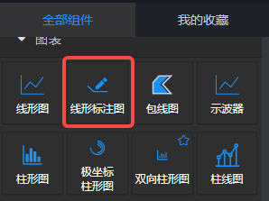
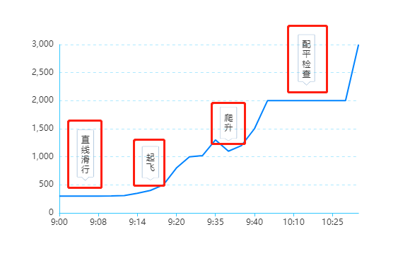

<a name="dcZbQ"></a>
## 概览
- 内置组件/图表/线形标注图



- 拖入前面板画布后，下图红色框中的内容，即为“标注”。



- 拖入前面板画布后，在后面板中生成对应的“线形标注图”节点，该节点有一个输入端口和一个输出端口。


<a name="SFlXX"></a>
## 数据

- 示例数据，其中的 title 列即为上图中的标注数据列。
```json
[
  ['time', 'title', 'ft'],
  ['9:00', '直线滑行', 300],
  ['9:02', '直线滑行', 300],
  ['9:03', '直线滑行', 300],
  ['9:08', '直线滑行', 300],
  ['9:10', '起飞', 304],
  ['9:12', '起飞', 310],
  ['9:14', '起飞', 350],
  ['9:15', '起飞', 400],
  ['9:18', '起飞', 500],
  ['9:20', '起飞', 800],
  ['9:30', '爬升', 1000],
  ['9:32', '爬升', 1020],
  ['9:35', '爬升', 1300],
  ['9:36', '爬升', 1100],
  ['9:38', '爬升', 1200],
  ['9:40', '爬升', 1500],
  ['9:50', '配平检查', 2000],
  ['10:00', '配平检查', 2000],
  ['10:10', '配平检查', 2000],
  ['10:15', '配平检查', 2000],
  ['10:20', '配平检查', 2000],
  ['10:25', '配平检查', 2000],
  ['10:30', '配平检查', 2000],
  ['10:40', '配平检查', 3000]
]
```

- 数据格式：json
<a name="tnTcK"></a>
## 参数
<a name="BpH7f"></a>
#### 基本设置

- 容器边距(左,上,右,下)：默认 10%,60,10%,60 。英文逗号分隔的数字或百分数，若为数字，则单位为像素，分别设置图表到左、上、右、下边框的距离。
- 字体颜色：默认#333。设置图表中除Tooltip之外的所有字体的颜色。
- 字号：单位px，默认 12。设置图表中所有文字的字体大小。
- 图表色系：图表中各条波线的颜色，格式为英文逗号分隔的颜色值。默认 #0084ff 。
<a name="ANC11"></a>
#### 坐标轴设置

- x轴名称：X轴的名称，一般是X轴数据的单位。字体颜色同“坐标轴颜色”，字号是“轴名称字号”。
- y轴名称：Y轴的名称，一般是Y轴数据的单位。字体颜色同“坐标轴颜色”，字号是“轴名称字号”。
- 轴名称字号：X、Y轴名称的文本字号。默认12。
- 刻度值字号：X、Y轴刻度的文本字号。默认12。
- 刻度值字体：X、Y轴刻度的字体。选项 默认 | 庞门正道 | DS-Digital。
- x轴刻度线：布尔值，默认为true。显示/隐藏X轴的刻度线。
- y轴分割线类型：默认“实线”。
- 坐标轴颜色：颜色值，默认#32c8ff 。坐标轴轴线的颜色。
<a name="Mrykd"></a>
#### 线条样式

- 平滑：布尔值，默认false。折线是否平滑。
- 线宽：Number类型值，默认为 2，单位“像素”。控制折线的粗细。
- 区域填充：可选 无填充 | 渐变填充 | 纯色填充，即折线至x轴之间的区域填充。默认“无填充”。
- 节点：折线中数据节点的类型，默认为“空心圆”。
- 节点大小(px)：Number类型值，单位“像素”，默认8。设置折线数据节点的大小。
<a name="qG9J9"></a>
#### 标注设置

- 标注：选择标注的图形，默认“大头针”。
- 标注自定义：如果自定义标注，优先用自定义标注的图形，没有则用“标注”中选择的图形。
   - 可以通过 `'image://url'` 设置为图片，其中 URL 为图片的链接，或者 `dataURI`。
      - URL 为图片链接例如：'image://http://xxx.xxx.xxx/a/b.png'。
      - URL 为 `dataURI` 例如：'image://data:image/gif;base64,R0lGODlhEAAQAMQAAORHHOVSKudfOulrSOp3WOyDZu6QdvCchPGolfO0o/XBs/fNwfjZ0frl3/zy7////wAAAAAAAAAAAAAAAAAAAAAAAAAAAAAAAAAAAAAAAAAAAAAAAAAAAAAAAAAAAAAAACH5BAkAABAALAAAAAAQABAAAAVVICSOZGlCQAosJ6mu7fiyZeKqNKToQGDsM8hBADgUXoGAiqhSvp5QAnQKGIgUhwFUYLCVDFCrKUE1lBavAViFIDlTImbKC5Gm2hB0SlBCBMQiB0UjIQA7'。
   - 可以通过 `'path://'` 将图标设置为任意的矢量路径。这种方式相比于使用图片的方式，不用担心因为缩放而产生锯齿或模糊，而且可以设置为任意颜色。路径图形会自适应调整为合适的大小。路径的格式参见 [SVG PathData](http://www.w3.org/TR/SVG/paths.html#PathData)。可以从 Adobe Illustrator 等工具编辑导出。例如：'path://M30.9,53.2C16.8,53.2,5.3,41.7,5.3,27.6S16.8,2,30.9,2C45,2,56.4,13.5,56.4,27.6S45,53.2,30.9,53.2z M30.9,3.5C17.6,3.5,6.8,14.4,6.8,27.6c0,13.3,10.8,24.1,24.101,24.1C44.2,51.7,55,40.9,55,27.6C54.9,14.4,44.1,3.5,30.9,3.5z M36.9,35.8c0,0.601-0.4,1-0.9,1h-1.3c-0.5,0-0.9-0.399-0.9-1V19.5c0-0.6,0.4-1,0.9-1H36c0.5,0,0.9,0.4,0.9,1V35.8z M27.8,35.8 c0,0.601-0.4,1-0.9,1h-1.3c-0.5,0-0.9-0.399-0.9-1V19.5c0-0.6,0.4-1,0.9-1H27c0.5,0,0.9,0.4,0.9,1L27.8,35.8L27.8,35.8z'。
   - 默认：'path://M51,547.3l-22.2-38.4H8c-3.6,0-6.5-2.9-6.5-6.5v-490c0-3.6,2.9-6.5,6.5-6.5h86c3.6,0,6.5,2.9,6.5,6.5v490 c0,3.6-2.9,6.5-6.5,6.5H73.2L51,547.3z M8,8.9c-1.9,0-3.5,1.6-3.5,3.5v490c0,1.9,1.6,3.5,3.5,3.5h22.6L51,541.3l20.4-35.4H94 c1.9,0,3.5-1.6,3.5-3.5v-490c0-1.9-1.6-3.5-3.5-3.5H8z'
- 标注偏移：英文逗号; 分隔的两个数值，分别代表标注图形在水平和垂直方向的便宜。默认 0, -80%
- 标注垂直：布尔值，表示标注的文本是否垂直排列。默认 true。
- 标注颜色：标注图形的颜色， 标注 或者 自定义标注为'path://' 时有效。默认 #9fbbd7
- 标注字号：标注文本的字体大小， 单位“像素”。默认 12。为0时用“字号”的值。
- 标注字体颜色： 标注文本的字体颜色，默认 null。不设置时用“字体颜色”的值。
<a name="vrlp9"></a>
#### 数据维度

- 标注名称维度：Number数值，标注文本数据的维度，即数据的列索引。默认 1，即默认数据中的“title”列。
- X轴维度：Number数值，X轴数据的维度，即数据的列索引。默认 0，即默认数据中的“time”列。
- Y轴维度：Number数值，Y轴数据的维度，即数据的列索引。默认 2，即默认数据中的“ft”列。
<a name="ZXPTI"></a>
#### 其他设置

- 放大镜开始(%)：Number类型值，单位%，表示图表左侧的开始数据是所有数据的第百分之几条，表示第一条数据。如上图默认数据中，若放大镜开始为50%，则图表默认显示的X轴第一个数据是“three”。默认-1，没有放大镜功能。
- 放大镜结束(%)：Number类型值，单位是%，表示图表右侧的结束数据是所有数据的第百分之几条，默认100，最后一条数据。如上图默认数据中，若放大镜开始为0，结束为50%，则图表默认显示的X轴第一条数据是“one”，最后一条数据是“three”。在图表中滑动滚轮可以放大或缩小放大镜，若放大镜显示了部分数据，按住鼠标左-键拖动可以左右移动放大镜。
- 非渲染数据维度：
- 包含Loading：布尔值，默认false。是否显示加载动画。
- 鼠标事件：默认无。选择其他如“单击”等，项目运行后，在前面板页面的该图表上做相应操作会将响应的节点数据向后面板的下游节点发送。
- 示例数据：点击下载示例数据。
