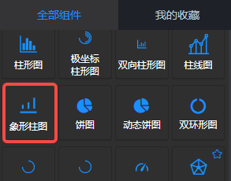
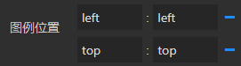
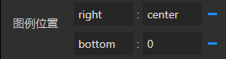

<a name="seYxr"></a>
## 概览
- 内置组件/图表/象形柱图：



- 将组件拖入前面板画布后：


- 同时，后面板生成一个对应的“象形柱图”节点，含有1个输入端口和1个输出端口：


<a name="FwK5d"></a>
## 数据
<a name="QUs1X"></a>
#### 默认数据
数据格式：二维数组。
```json
[
  ["name", "DEMO", "Other"],
  ["one", 1, 7],
  ["two", 2, 3],
  ["three", 3, 1],
  ["four", 4, 2],
  ["five", 5, 4]
]
```
<a name="sCAsG"></a>
#### 输入数据
项目运行后，输入1 端口接收上游发送来的数据。数据格式如“默认数据”。
<a name="uI3H1"></a>
#### 输出数据
若“象形柱图”的“鼠标事件”参数不是“无”，那么项目运行后，上游的输入数据渲染在前面板的象形柱图后，在图表上响应设置的鼠标事件后，响应数据（如：["two",2,3] ）会从后面板节点的输出1端口发送向下游。
<a name="a70ip"></a>
## 参数
<a name="2Idca"></a>
#### 基本设置

- 数据源：url，一个json文件的url，json文件中的数据需要遵循Echarts图表的标准数据格式。
- 背景色：颜色值。
- 边框颜色：颜色值。
- 字体颜色：包含图表中标签、名称、图例字体的颜色
- 图表色系：图表中各个系列的颜色，格式为英文逗号分隔的颜色值。
   - 默认：

<br />#0084ff, #339cff, #66b5ff, #99ceff, #cce6ff

   - 参考色系：
      - #37a2da,#32c5e9,#67e0e3,#9fe6b8,#ffdb5c,#ff9f7f,#fb7293,#e062ae,#e690d1,#e7bcf3,#9d96f5,#8378ea,#96bfff
      - #6ea8e5,#ff962e,#ff5c5f,#70cc62,#86d1ca
- 图表名称：字符串，默认null。
- 名称位置：英文逗号, 分隔的两个字符串或数值，分别定义名称相对于图表左侧和上方的位置。默认 left, top 即名称位于左上角。还可以是 40, 20 等数字，表示距离左侧40像素，距离上方20像素。
- 名称颜色：color值，定义图表名称的字体颜色。
<a name="XzmDv"></a>
#### 图例设置

- 图例：选项 "无"、"水平"、"垂直" ，默认 无 ，即图表中不渲染图例。
   - 水平：图例水平排列
   - 垂直：图例垂直排列。
- 图例位置：两个冒号: 分隔的键值对。
   - : 左侧填写图例的相对位置，一个是水平方向（left或right），另一个是垂直方向（top或bottom）；
   - : 右侧填写水平或垂直方向对应的位置，可以是数值、百分比，若水平方向也可以填 left、right、center、auto，若垂直方向也可以是 top、bottom、center、auto。
   - 配合图例的 水平/垂直 方向，可以设置为图表的任何位置。
   - 示例：



- 图例映射：一对或多对由英文冒号: 分隔的数据，: 左侧是数据表中表头的字段，右侧是自定义的表头。如果要自定义多对，那么用英文逗号, 分隔。
   - 示例 A: 本周, B: 本月, C: 年度
- 图例字号：number类型值，定义图例的字体大小，单位px。默认12。最小 8 。
- 图例字体：选项 "默认"、"庞门正道"、"DS-Digital" 。
- 图例间隔：number类型值，定义图例之间的间距，单位px。默认10。最小 4 。
- 图例标记类型：选项 '圆形'、'矩形'、'圆角矩形'、'三角形'、'菱形'、'大头针'、'箭头'、'无' ，默认 圆角矩形。
- 图例标记宽度：number类型值，定义图例标记的宽度，单位px。默认25 。最小 4 。
- 图例标记高度：number类型值，定义图例标记的高度，单位px。默认14 。最小 4 。
<a name="Do5ik"></a>
#### 坐标系设置

- 容器边距（左,上,右,下）：英文逗号分隔的四个数字或百分数，分别表示图表距离容器左、上、右、下边的距离。默认 10%,60,10%,60 
- 包含刻度标签：布尔值，默认false。定义Y轴的刻度值是否包含在坐标系中。默认false，即不包含。
   - 不包含：当Y轴的刻度值是一个很长的数值时，将渲染在画布外部。
<a name="d5khM"></a>
#### 标签设置

- 标签：标签相对于节点的显示方向。默认 “无”，即不显示标签。
- 标签边距：标签到节点的距离。
- 标签字号：标签的字体大小。
- 标签字体：标签的字体。
- 标签颜色：标签的字体颜色。
<a name="effCO"></a>
#### 柱形样式

- 柱宽：number类型值，定义柱条的宽度，单位px。
- 图形类型：选项'自定义'、'空心圆'、'圆形'、'矩形'、'圆角矩形'、'三角形'、'菱形'、'大头针'、'箭头'、'无'，定义象形柱图的形状。默认‘三角形’。当选择“自定义”时，需要上传“自定义图形”。
- 自定义图形1：上传一个自定义图形。
- 自定义图形2：当数据有多列时，第二列数据（默认数据的Other列）的自定义图形。
- 自定义图形3：当数据有多列时，第三列数据的自定义图形。
- 图形大小：英文逗号, 分隔的两个Number或百分比，分别定义图形的宽度和高度。
- 图形角度：Number类型，定义图形的旋转角度。并不会影响图形的定位（哪怕超出基准柱的边界），而只是单纯得绕自身中心旋转。
- 图形重复：Boolean类型， 指定图形元素是否重复。
- 图形间隔：Number类型，定义图形的两边间隔 。
<a name="vGzSn"></a>
#### 提示框设置

- Tooltip指示器类型：鼠标悬停在图表上时，显示的提示框的坐标轴指示器。
- 指示器颜色：提示框指示器的颜色。
<a name="uIWVS"></a>
#### 鼠标事件

- 鼠标事件：选项'无'、'单击' 、'双击'、'按下'、'松开'、'滑过'、 '滑出' ，定义柱形图上的鼠标事件。默认 无，即不响应任何事件。当响应事件时，组件会向下游节点发送鼠标响应的那一行的数据。
<a name="qMoj1"></a>
#### 坐标轴设置

- X轴类型：可以选择“类目轴”或“数据轴”，默认为类目轴。
- Y轴类型：可以选择“类目轴”或“数据轴”，默认为数据轴。
- X轴名称：X轴的名称，一般是X轴数据的单位。
- Y轴名称：Y轴的名称，一般是Y轴数据的单位。
- X轴名称位置：选项“开始、中间、末尾”，定义Y轴名称在坐标轴的位置。默认“末尾”。
- Y轴名称位置：选项“开始、中间、末尾”，定义Y轴名称在坐标轴的位置。默认“末尾”。
- 轴名称字号：X、Y轴名称的字体大小，单位px。默认 12px。
- X轴线：是否显示X轴的轴线。默认显示。
- Y轴线：是否显示Y轴的轴线。默认显示。
- 坐标轴颜色：坐标轴的颜色。默认#333333。
- 坐标轴线宽：X、Y轴的轴线宽度。单位px，默认1px。
- X轴刻度线：可选项，true | false，默认true，显示X轴刻度线。
- Y轴刻度线：可选项，true | false，默认true，显示Y轴刻度线。
- X轴刻度值：是否显示X轴的刻度值。默认显示。
- Y轴刻度值：是否显示Y轴的刻度值。默认显示。
- Y轴刻度值对齐：选项“右对齐、左对齐、居中对齐”，定义Y轴刻度值的水平对齐方式。默认“右对齐”。
- 刻度值字号：Number类型，定义X、Y轴刻度值的字体大小，单位px。默认 12px。
- 刻度值字体：选项“默认、庞门正道、DS-Digital”，定义刻度值的字体。默认选“默认”。
- X轴分割线：可选项，true | false，默认false，不显示X轴分割线。
- Y轴分割线：可选项，true | false，默认true，显示Y轴分割线。
- 分割线颜色：X、Y轴的分割线颜色。默认#333333。
- 分割线类型：选项'实线'、'虚线'、'点线'，定义Y轴分割线的类型。默认“虚线”。
- Y轴反向：Boolean类型，定义Y轴是否反向。
- Y轴偏移：Number类型，定义Y轴相对于默认位置的偏移。
<a name="rWfQB"></a>
#### 其他设置

- 示例数据：点击“查看”后下载默认数据的csv文件。

 

