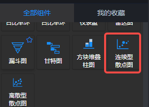
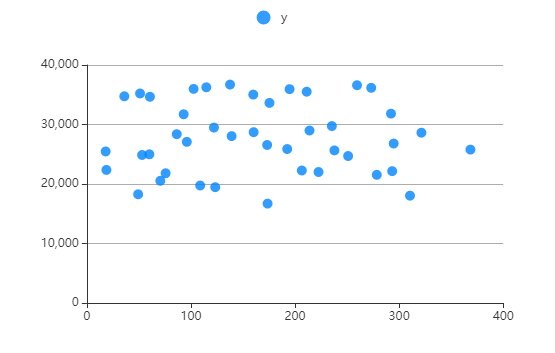
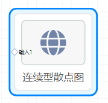
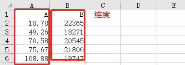
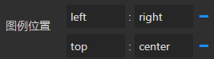
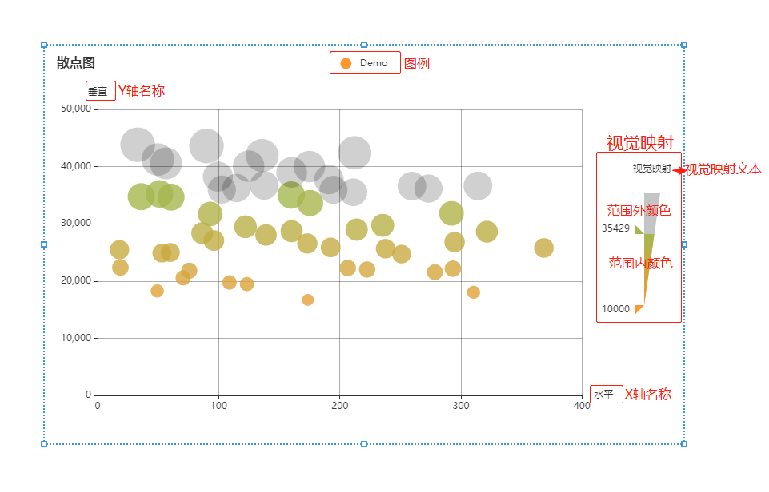

<a name="kD3Ax"></a>
## 概览
- 内置组件/图表/连续型散点图：



- 拖入前面板画布后：



- 同时，在后面板生成一个对应的“离散型散点图”节点，有一个输入端口：


<a name="GAEVm"></a>
## 数据
<a name="WSLfX"></a>
#### 默认数据
```json
[
  [18.78,22365],[49.26,18271],[70.58,20545],[75.67,21806],[108.88,19747],[123.31,19464],[173.62,16704],[206.54,22272],[222.57,22016],[278.52,21543],[293.35,22158],[310.46,18038],[18.06,25471],[53.06,24878],[60.03,24988],[86.35,28373],[96.01,27081],[122.11,29482],[139.06,28046],[160.23,28709],[173.2,26559],[192.45,25877],[213.91,28985],[237.83,25649],[251.01,24701],[294.77,26801],[321.42,28623],[368.52,25779],[35.98,34742],[51.11,35219],[60.59,34660],[93,31721],[102.55,35983],[114.76,36250],[137.57,36709],[159.87,35029],[175.44,33630],[194.76,35942],[211.19,35514],[235.4,29737],[259.57,36599],[273.19,36166],[292.21,31827],[314.01,36624],[33.08,43834],[49.68,41265],[56.44,40575],[89.91,43600],[99.32,38261],[124.73,40087],[135.86,41955],[160.24,39004],[174.93,40017],[191.01,37747],[212.21,42411]
]
```
<a name="DXXLn"></a>
#### 数据格式

- json数据。csv表格示例：



   - 第一行可以是维度的名称，也可以没有维度名称，在参数中“自定义维度”。
   - 维度的序列号，最左边的维度为0，向右依次递增为1、2、3、……
   - X轴维度默认为0，Y轴维度默认为1
<a name="CTXdJ"></a>
## 参数
<a name="YTYzY"></a>
#### 基本设置

- 数据源：url，一个json文件的url，json文件中的数据需要遵循Echarts图表的标准数据格式。
- 背景色：颜色值。
- 边框颜色：颜色值。
- 字体颜色：包含图表中标签、名称、图例字体的颜色
- 图表色系：图表中各个系列的颜色，格式为英文逗号分隔的颜色值。
   - 默认：

<br />#0084ff, #339cff, #66b5ff, #99ceff, #cce6ff

   - 参考色系：
      - #37a2da,#32c5e9,#67e0e3,#9fe6b8,#ffdb5c,#ff9f7f,#fb7293,#e062ae,#e690d1,#e7bcf3,#9d96f5,#8378ea,#96bfff
      - #6ea8e5,#ff962e,#ff5c5f,#70cc62,#86d1ca
- 图表名称：字符串，默认null。
- 名称位置：英文逗号, 分隔的两个字符串或数值，分别定义名称相对于图表左侧和上方的位置。默认 left, top 即名称位于左上角。还可以是 40, 20 等数字，表示距离左侧40像素，距离上方20像素。
- 名称颜色：color值，定义图表名称的字体颜色。
- 容器边距（左,上,右,下）：英文逗号分隔的四个数字或百分数，分别表示图表距离容器左、上、右、下边的距离。
<a name="XzmDv"></a>
#### 图例设置

- 图例：选项 "无"、"水平"、"垂直" ，默认 无 ，即图表中不渲染图例。
   - 水平：图例水平排列
   - 垂直：图例垂直排列。
- 图例位置：两个冒号: 分隔的键值对。
   - : 左侧填写图例的相对位置，一个是水平方向（left或right），另一个是垂直方向（top或bottom）；
   - : 右侧填写水平或垂直方向对应的位置，可以是数值、百分比，若水平方向也可以填 left、right、center、auto，若垂直方向也可以是 top、bottom、center、auto。
   - 配合图例的 水平/垂直 方向，可以设置为图表的任何位置。
   - 示例：



- 图例映射：一对或多对由英文冒号: 分隔的数据，: 左侧是数据表中表头的字段，右侧是自定义的表头。如果要自定义多对，那么用英文逗号, 分隔。
- 图例字号：number类型值，定义图例的字体大小，单位px。默认12。最小 8 。
- 图例字体：选项 "默认"、"庞门正道"、"DS-Digital" 。
- 图例间隔：number类型值，定义图例之间的间距，单位px。默认10。最小 4 。
- 图例标记类型：选项 '圆形'、'矩形'、'圆角矩形'、'三角形'、'菱形'、'大头针'、'箭头'、'无' ，默认 圆角矩形。
- 图例标记宽度：number类型值，定义图例标记的宽度，单位px。默认25 。最小 4 。
- 图例标记高度：number类型值，定义图例标记的高度，单位px。默认14 。最小 4 
<a name="sN0Ff"></a>
#### 坐标轴设置

- X轴名称：X轴的名称，一般是X轴数据的单位。
- Y轴名称：Y轴的名称，一般是Y轴数据的单位。
- 坐标轴颜色：颜色值。
- X轴分割线：可选项，true | false，默认false，不显示X轴分割线。
- Y轴分割线：可选项，true | false，默认true，显示Y轴分割线。
- X轴标签旋转：X轴标签旋转的角度。
<a name="NERAW"></a>
#### 数据设置

- X轴维度：对应数据的第几列，默认为0，维度是第一列。
- Y轴维度：对应数据的第几列，默认为1，维度是第二列。
- 视觉映射维度：Int数值，默认1，最小0。
<a name="aGBYS"></a>
#### 样式设置


- 节点类型：选项'空心圆'、'圆形'、'矩形'、'圆角矩形'、'三角形'、'菱形'、'大头针'、'箭头'、'无'、
- 节点大小：Int数值，最小1，默认10，标记的大小。
- 视觉映射：默认为'无' ，视觉映射控制器不可见。可选'无'、'顶部居左'、'顶部居右'、'中部居左'、'中部居右'、'底部居左'、'底部居右'。
- 颜色透明度：0到1的数值，多个则用英文逗号, 分隔。
- 颜色明暗度：0到1的数值，多个则用英文逗号, 分隔。
- 颜色饱和度：0到1的数值，多个则用英文逗号, 分隔。
- 颜色色调：0到360的数值，必须是英文逗号, 分隔的两个数值。
- 范围内颜色：单个或多个颜色值，参考**基本设置->图表色系。**
- 范围外颜色：可选颜色值。
- 控制器颜色：单个或多个颜色值，参考**基本设置->图表色系。**若已经设置了范围内颜色，该参数可不设置。
- 视觉映射文本：视觉映射上下两端的问题，中间可用英文逗号, 分隔，若只有上端文本则不需要分隔。
- 视觉最小值：视觉可见数据的最小值。
- 视觉最大值：视觉可见数据的最大值。
- 图元最小：视觉可见的最小的节点大小。
- 图元最大：视觉可见的最大的节点大小。
<a name="WoLnI"></a>
#### 其他设置

- 放大镜开始(%)：一个数值，单位是%，表示图表左侧的开始数据是所有数据的第百分之几条，默认0，表示第一条数据。如上图默认数据中，若放大镜开始为50%，则图表默认显示的X轴第一个数据是“three”。
- 放大镜结束(%)：一个数值，单位是%，表示图表右侧的结束数据是所有数据的第百分之几条，默认100，最后一条数据。如上图默认数据中，若放大镜开始为0，结束为50%，则图表默认显示的X轴第一条数据是“one”，最后一条数据是“three”。在图表中滑动滚轮可以放大或缩小放大镜，若放大镜显示了部分数据，按住鼠标左键拖动可以左右移动放大镜。
- 全量更新：布尔值，定义每次输入端口接收到数据后，前面板页面中的线形图是否完全更新。false 时仅更新数据。
- 示例数据：点击下载示例数据。

