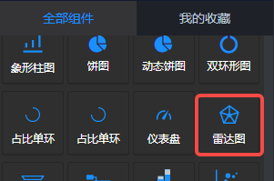
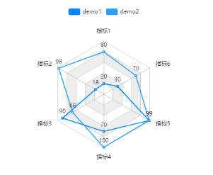
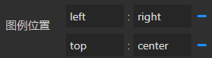
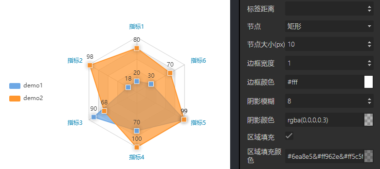

<a name="nZHx2"></a>
## 概览
- 内置组件/图表/雷达图：



- 拖入前面板画布后：



- 同时，在后面板生成一个“雷达图”节点，含有1个输入端口和1个输出端口：


<a name="gI0DU"></a>
## 数据
<a name="xv3KN"></a>
#### 默认数据
数据格式：JSON，二维数组。
```json
[
  ['name', '指标1', '指标2', '指标3', '指标4', '指标5', '指标6'],
  ['demo1', 20, 18, 90, 70, 99, 30],
  ['demo2', 80, 98, 68, 100, 99, 70]
]
```
<a name="FBsD1"></a>
#### 输入数据
项目运行后，输入1 端口接收上游发送来的数据。数据格式如“默认数据”。
<a name="UqkTC"></a>
#### 输出数据
若“雷达图”的“鼠标事件”参数不是“无”，那么项目运行后，上游的输入数据渲染在前面板的雷达图后，在图表上响应设置的鼠标事件后，响应数据（如：["two",2,3] ）会从后面板节点的输出1端口发送向下游。
<a name="qAuiq"></a>
## 参数
<a name="2Idca"></a>
#### 基本设置

- 数据源：url，一个json文件的url，json文件中的数据需要遵循Echarts图表的标准数据格式。
- 背景色：颜色值。
- 边框颜色：颜色值。
- 字体颜色：包含图表中标签、名称、图例字体的颜色
- 图表色系：图表中各个系列的颜色，格式为英文逗号分隔的颜色值。
   - 默认：

<br />#0084ff, #339cff, #66b5ff, #99ceff, #cce6ff

   - 参考色系：
      - #37a2da,#32c5e9,#67e0e3,#9fe6b8,#ffdb5c,#ff9f7f,#fb7293,#e062ae,#e690d1,#e7bcf3,#9d96f5,#8378ea,#96bfff
      - #6ea8e5,#ff962e,#ff5c5f,#70cc62,#86d1ca
- 图表名称：字符串，默认null。
- 名称位置：英文逗号, 分隔的两个字符串或数值，分别定义名称相对于图表左侧和上方的位置。默认 left, top 即名称位于左上角。还可以是 40, 20 等数字，表示距离左侧40像素，距离上方20像素。
- 名称颜色：color值，定义图表名称的字体颜色。
<a name="XzmDv"></a>
#### 图例设置

- 图例：选项 "无"、"水平"、"垂直" ，默认 无 ，即图表中不渲染图例。
   - 水平：图例水平排列
   - 垂直：图例垂直排列。
- 图例位置：两个冒号: 分隔的键值对。
   - : 左侧填写图例的相对位置，一个是水平方向（left或right），另一个是垂直方向（top或bottom）；
   - : 右侧填写水平或垂直方向对应的位置，可以是数值、百分比，若水平方向也可以填 left、right、center、auto，若垂直方向也可以是 top、bottom、center、auto。
   - 配合图例的 水平/垂直 方向，可以设置为图表的任何位置。
   - 示例：



- 图例映射：一对或多对由英文冒号: 分隔的数据，: 左侧是数据表中表头的字段，右侧是自定义的表头。如果要自定义多对，那么用英文逗号, 分隔。
   - 示例 A: 本周, B: 本月, C: 年度
- 图例字号：number类型值，定义图例的字体大小，单位px。默认12。最小 8 。
- 图例字体：选项 "默认"、"庞门正道"、"DS-Digital" 。
- 图例间隔：number类型值，定义图例之间的间距，单位px。默认10。最小 4 。
- 图例标记类型：选项 '圆形'、'矩形'、'圆角矩形'、'三角形'、'菱形'、'大头针'、'箭头'、'无' ，默认 圆角矩形。
- 图例标记宽度：number类型值，定义图例标记的宽度，单位px。默认25 。最小 4 。
- 图例标记高度：number类型值，定义图例标记的高度，单位px。默认14 。最小 4 。
<a name="Do5ik"></a>
#### 坐标系设置

- 中心（h,v）：英文逗号,分隔的Number值或百分比，定义饼图的中心位置。“逗号”左侧定义中心的水平位置，右侧定义中心的垂直位置。默认50%,50% 即中心。
- 半径（%）：Number类型值，单位%。定义雷达图从中心到外围的半径。
<a name="dFFcS"></a>
#### 坐标轴设置

- 坐标轴线：Boolean值，定义是否显示坐标轴轴线。
- 分割线颜色：定义坐标轴分隔线的颜色。
- 分隔区域颜色：单个颜色值，或多个 & 分隔的颜色值，定义分隔区域的填充颜色。默认 rgba(250,250,250,0.3)&rgba(200,200,200,0.3)
<a name="EWpjh"></a>
#### 指示器设置

- 指示器名称：Boolean值，定义是否显示雷达图上的系列名称。
- 指示器名称颜色：定义雷达图上系列名称的的文字颜色。
- 指示器最大值映射：英文逗号, 分隔的Number数值，对应每个系列的最大值。
<a name="zTiCE"></a>
#### 样式设置


- 节点：选项'空心圆'、'圆形'、'矩形'、'圆角矩形'、'三角形'、'菱形'、'大头针'、'箭头'、'无'，默认‘空心圆’。
- 节点大小：Number值，最小1，默认4，标记的大小。
- 边框宽度：Number值，单位px。定义折线拐点标志的边框宽度。
- 边框颜色：定义折线拐点标志的边框的颜色。
- 阴影模糊：Number类型值，单位px。阴影的模糊大小。
- 阴影颜色：阴影的颜色。
- 区域填充：Boolean值，定义是否进行区域填充。
- 区域填充颜色：单个颜色值，或多个 & 分隔的颜色值，定义区域填充颜色。默认 rgba(0,0,0,0.5)&rgba(200,200,200,0.8)
<a name="tKpoI"></a>
#### 标签设置

- 标签：选项“无标签、顶部、左部、右部、底部、内部”，定义是否有标签及标签的位置。
- 标签模板：选项“数据名、数据值、百分比”，定义标签显示的内容。默认“数据值”。
- 标签颜色：标签的字体颜色。
- 标签边距：Number类型数值，单位px， 定义标签到节点的距离。
