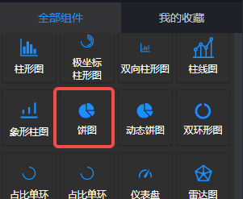
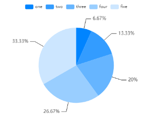
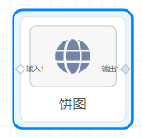
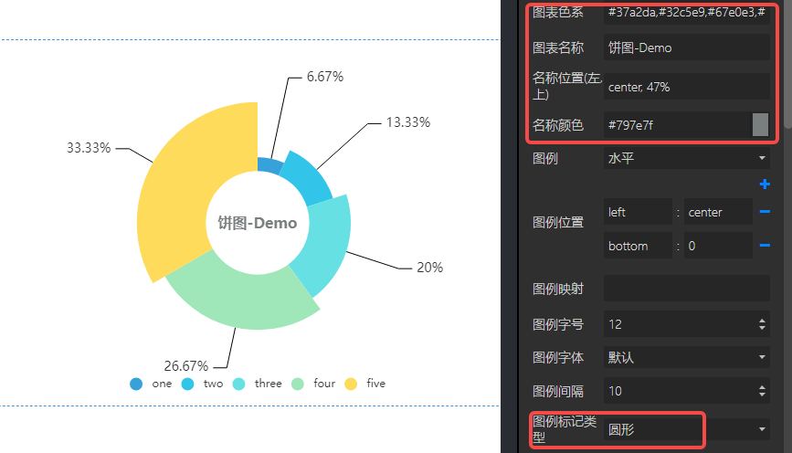
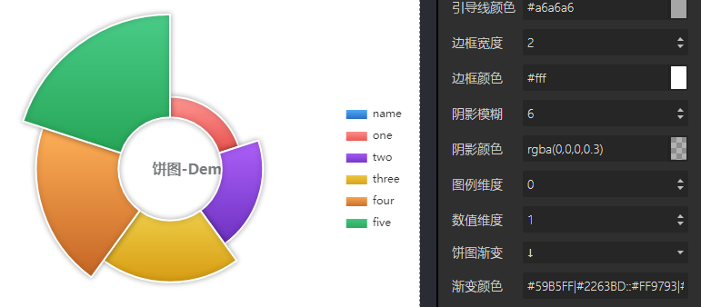
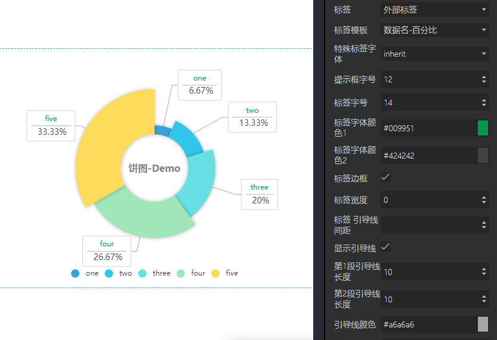

<a name="liHOH"></a>
## 概览
- 内置组件/图表/饼图：



- 将组件拖入前面板画布：



- 同时，后面板会生成一个对应的“饼图”节点，含有一个输入端口“输入1”和一个输出端口“输出1”：


<a name="XmN8d"></a>
## 数据

- 默认数据：
```json
[
  ['name', 'DEMO', 'demo2'], 
  ['one', 1, 3], 
  ['two', 2, 3], 
  ['three', 3, 3], 
  ['four', 4, 3], 
  ['five', 5, 3]
]
```

- 输入数据：项目运行后，上游节点向“饼图”节点的 输入1 输入的数据。
- 输出数据：项目运行后，如果“饼图”设置了“鼠标事件”参数，点击“饼图”时从 输出1 端口向下游节点发送数据。
<a name="BO7SS"></a>
## 参数
<a name="ahaxc"></a>
#### 基本设置

- 数据源：url，一个json文件的url，json文件中的数据需要遵循Echarts图表的标准数据格式。
- 背景色：颜色值。
- 边框颜色：颜色值。
- 字体颜色：包含图表中标签、名称、图例字体的颜色。
- 字号：图表中的字体大小。
- 图表色系：图表中各个系列的颜色，格式为英文逗号分隔的颜色值。
   - 默认：#0084ff, #339cff, #66b5ff, #99ceff, #cce6ff
   - 参考色系：
      - #37a2da,#32c5e9,#67e0e3,#9fe6b8,#ffdb5c,#ff9f7f,#fb7293,#e062ae,#e690d1,#e7bcf3,#9d96f5,#8378ea,#96bfff
      - #6ea8e5,#ff962e,#ff5c5f,#70cc62,#86d1ca
- 图表名称：字符串。
- 名称位置：图表名称在图表中的位置。


<a name="kKnL2"></a>
#### 图例设置

- 图例：“无、水平、垂直”三个选项。默认“垂直”。
   - 无：不显示图例。选择“无”时，图例位置、图例映射的设置不生效。
   - 水平：图例水平方向排列。
   - 垂直：图例垂直方向排列。
- 图例位置：图例在容器中的位置。共2个键值对，一个键值对表示水平方向的位置，另一个键值对表示垂直方向的位置。
   - 水平方向：键可以是 left 或 right，值可以是 left、center、right 或者 数字、百分比。
   - 垂直方向：键可以是 top或 bottom，值可以是 top、center、bottom或者 数字、百分比
- 图例映射：由英文冒号: 分隔，: 左侧是数据名，不区分大小写，如‘one’；右侧是自定义的数据名映射，如‘周一’；多个系列名的映射由英文逗号, 分隔。例如默认数据的图例映射可以是 one:周一,two:周二,three:周三。
- 图例字号：number类型值，定义图例的字体大小，单位px。默认12。最小 8 。
- 图例字体：选项 "默认"、"庞门正道"、"DS-Digital" 。
- 图例间隔：number类型值，定义图例之间的间距，单位px。默认10。最小 4 。
- 图例标记类型：选项 '圆形'、'矩形'、'圆角矩形'、'三角形'、'菱形'、'大头针'、'箭头'、'无' ，默认 圆角矩形。
- 图例标记宽度：number类型值，定义图例标记的宽度，单位px。默认25 。最小 4 。
- 图例标记高度：number类型值，定义图例标记的高度，单位px。默认14 。最小 4 。
- 图例类型：选项“普通图例、分页图例”，默认“分页图例”，定义图例数量超出时是否分页。
<a name="vD5Vp"></a>
#### 饼图样式


- 中心（h,v）：英文逗号,分隔的Number值或百分比，定义饼图的中心位置。“逗号”左侧定义中心的水平位置，右侧定义中心的垂直位置。默认50%,50% 即中心。
- 内半径%：一个Number类型数值，单位%，定义饼图的内部半径，为0时为圆形，大于0时为环形。
- 外半径%：一个Number类型数值，单位%，定义饼图的外部半径。
- 南丁格尔图：选项“无，radius，area”，默认无。上图“南丁格尔图”设置为“area”。
- 阴影模糊：Number类型值，单位px。阴影的模糊大小。
- 阴影颜色：阴影的颜色。
- 饼图渐变：选项“无”以及 6 个方向。“无”时没有渐变。选择任一方向，定义在该方向的渐变。上图设置为 ↓。
- 渐变颜色：定义饼图的渐变颜色。每项数据的渐变之间用双冒号::分隔，柱条渐变的开始颜色和结束颜色之间用竖线|分隔。默认#59B5FF|#2263BD::#FF9793|#E7504C::#AE60FA|#6D32C1::#EFCE49|#D79C12::#FFB058|#C56625::#4ACC88|#27A657::#2C989E|#27BCC9::#8A98FF|#2B36A8
- 边框宽度：Number类型值，单位px。定义饼图的边框宽度。上图设置为 2。
- 边框颜色：定义边框的颜色。上图默认为 #fff 白色。
<a name="kKfcM"></a>
#### 数据维度
上游输入的数据或静态数据是二维数组。至少有两列，一列为图例的数据，另一列为饼图的数据。数据维度是只数据所在列的索引。

- 图例维度：> 或 = 0 的数字。默认为 0，即第一列数据。
- 数值维度：> 或 = 0 的数字。默认为 1，即第二列数据。
<a name="cMQlV"></a>
#### 标签设置


- 标签：无，不显示标签；内部标签，标签在饼图扇面的内部；外部标签，标签在饼图扇面的外部。
- 标签模板：系列名，如默认数据中的“DEMO”；数据名，如“one、two、three、four、five”；数据值，即默认数据中的“1、2、3、4、5”；百分比，即每条数据所占总数的百分比。
- 特殊标签字体：设置标签的字体。默认“inherit”继承。
- 提示框字号：提示框的字体大小。
- 标签字号：标签字体大小。
- 标签字体颜色1：当“标签模板”为“数据名-百分比”或“数据名-数据值-百分比”时，分上下两行，第一行的标签字体颜色。如上图。
- 标签字体颜色2：当“标签模板”为“数据名-百分比”或“数据名-数据值-百分比”时，分上下两行，第二行的标签字体颜色。如上图。
- 标签边框：定义标签是否有边框。默认无边框。
- 标签宽度：Number类型值，单位px。定义标签边框的宽度。超出标签宽度的内容会省略。
- 标签导引线间距：Number类型值，单位px。定义标签文本/边框和导引线间的距离。
- 显示导引线：定义是否显示导引线。默认显示。
- 第1段导引线长度：Number类型值，单位px。定义第1段导引线的长度。
- 第2段导引线长度：Number类型值，单位px。定义第2段导引线的长度。
- 导引线颜色：定义导引线的颜色。

