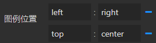

<a name="lMcId"></a>
## 概览
- 内置组件/图表/散点地图：


- 拖入画布后：


- 后面板生成一个有输入端口的节点：


<a name="CjMLl"></a>
## 数据

- 从上游节点接收二维数组的json数据，数据中需要包含城市、值、经度、维度和类目数据。
- 数据的维度固定，不可编辑：
   - 城市数据维度：0；
   - 三维散点数据Z值数据维度：1；
   - 视觉映射数据维度：2；
   - 三维散点数据X值（即经度）：3；
   - 三维散点数据Y值（即纬度）：4；
- 默认数据：
```json
[
  ["position", "value", "categroy", "longitude", "latitude", "trade", "area"],
  ["长沙",      10,      "掘进",      113.009351,  28.208469, "行业1", "区域3"],
  ["长沙",      10,      "掘进",      113.009351,  28.208469, "行业2", "区域2"],
  ["北京",      10,      "特装",      116.397947,  39.908173, "行业3", "区域1"],
  ["青岛",      10,      "特装",      120.415961,  36.107933, "行业2", "区域2"],
  ["太原",      10,      "掘进",      112.522305,  37.835742, "行业1", "区域3"],
  ["广州",      10,      "掘进",      113.341527,  23.127041, "行业2", "区域1"],
  ["深圳",      10,      "掘进",      114.057795,  22.544230, "行业3", "区域2"],
  ["广州",      10,      "掘进",      113.341527,  23.127041, "行业1", "区域3"],
  ["重庆",      10,      "特装",      106.548425,  29.554914, "行业2", "区域3"],
  ["重庆",      10,      "特装",      106.548425,  29.554914, "行业3", "区域2"],
  ["上海",      10,      "掘进",      121.469269,  31.238176, "行业3", "区域1"],
  ["成都",      10,      "掘进",      104.088668,  30.710589, "行业2", "区域2"],
  ["保山",      10,      "特装",      99.1625980,  25.116213, "行业1", "区域1"],
]
```
<a name="um96p"></a>
## 参数
<a name="2Idca"></a>
#### 基本参数

- 数据源：url，一个json文件的url，json文件中的数据需要遵循Echarts图表的标准数据格式。
- 背景色：颜色值。
- 边框颜色：颜色值。
- 字体颜色：包含图表中标签、名称、图例字体的颜色
- 图表色系：图表中各个系列的颜色，格式为英文逗号分隔的颜色值。
   - 默认：

<br />#0084ff, #339cff, #66b5ff, #99ceff, #cce6ff

   - 参考色系：
      - #37a2da,#32c5e9,#67e0e3,#9fe6b8,#ffdb5c,#ff9f7f,#fb7293,#e062ae,#e690d1,#e7bcf3,#9d96f5,#8378ea,#96bfff
      - #6ea8e5,#ff962e,#ff5c5f,#70cc62,#86d1ca
- 图表名称：字符串，默认null。
- 名称位置：英文逗号, 分隔的两个字符串或数值，分别定义名称相对于图表左侧和上方的位置。默认 left, top 即名称位于左上角。还可以是 40, 20 等数字，表示距离左侧40像素，距离上方20像素。
- 名称颜色：color值，定义图表名称的字体颜色。
<a name="XzmDv"></a>
#### 图例参数

- 图例：选项 "无"、"水平"、"垂直" ，默认 无 ，即图表中不渲染图例。
   - 水平：图例水平排列
   - 垂直：图例垂直排列。
- 图例位置：两个冒号: 分隔的键值对。
   - : 左侧填写图例的相对位置，一个是水平方向（left或right），另一个是垂直方向（top或bottom）；
   - : 右侧填写水平或垂直方向对应的位置，可以是数值、百分比，若水平方向也可以填 left、right、center、auto，若垂直方向也可以是 top、bottom、center、auto。
   - 配合图例的 水平/垂直 方向，可以设置为图表的任何位置。
   - 示例：



- 图例映射：一对或多对由英文冒号: 分隔的数据，: 左侧是数据表中表头的字段，右侧是自定义的表头。如果要自定义多对，那么用英文逗号, 分隔。
- 图例字号：number类型值，定义图例的字体大小，单位px。默认12。最小 8 。
- 图例字体：选项 "默认"、"庞门正道"、"DS-Digital" 。
- 图例间隔：number类型值，定义图例之间的间距，单位px。默认10。最小 4 。
- 图例标记类型：选项 '圆形'、'矩形'、'圆角矩形'、'三角形'、'菱形'、'大头针'、'箭头'、'无' ，默认 圆角矩形。
- 图例标记宽度：number类型值，定义图例标记的宽度，单位px。默认25 。最小 4 。
- 图例标记高度：number类型值，定义图例标记的高度，单位px。默认14 。最小 4 。
<a name="HC7EE"></a>
#### 地图

- 地图名称：string类型，定义地图的名称，初始化时请求对应名称的地图json数据，然后将数据注册为该名称的地图。默认 china，中国地图。若江苏地图，则输入jiangsu。
   - 目前仅支持 china，即中国地图。若需要其他区域地图，请在用户的oss中，/common/data/echarts/map/中添加相应的地图json数。
- 地图颜色：color值，定义地图的区域颜色。默认#002c4d。
- 地图边框颜色：color值，定义地图的区域之间的边框颜色。默认#66b5ff。
- 左,上,右,下：定义地图距离图表左侧、上侧、右侧和下侧的距离。英文逗号, 分隔。类似其他图表组件的容器边距选项。默认 auto,auto,auto,auto 。
- 放大镜：number类型值，默认1。最小0，步长0.1。定义当前视角的缩放比例。
- 长宽比：number类型值，默认0.75，步长0.1。定义地图的长宽比。
- 启用滚轮缩放：布尔值，定义是否开启鼠标缩放。默认false。
- 启用鼠标拖动：布尔值，定义是否开启鼠标漫游。默认false。
- 标签：布尔值，默认false。是否显示地图上的标签。
- 标签颜色：color值，定义地图标签的字体颜色。
<a name="tWYdW"></a>
#### 下拉过滤

- 下拉过滤列表：用来过滤数据的条件。
   - 由包含label、key和value字段的对象组成的数组的json数据。每一个对象会生成一个下拉框选项。
      - label：select标签显示的名称。
      - key：过滤的数据的维度。如下面的"trade"即为过滤条件为_**数据/默认数据 **_中表头为"trade"的那一列数据。
      - value：key定义的那一列数据中的一些值组成的数组。
   - 数据中的引号为""，并且转义，即\" \"。
   - 示例数据

[{\"label\": \"行业\", \"key\": \"trade\", \"value\": [\"行业1\", \"行业2\", \"行业3\", \"行业4\"]}, {\"label\": \"区域\", \"key\": \"area\", \"value\": [\"区域1\", \"区域2\", \"区域3\", \"区域4\"]}]

- 下拉列表宽度：number类型值，单位px。定义下拉列表的宽度，默认100。
- 下拉列表高度：number类型值，单位px。定义下拉列表的高度，默认25。
- 下拉列表文字大小：number类型值，单位px。定义下拉列表的字体大小，默认14。
- 下拉列表文字颜色：color值，定义下拉列表的字体颜色。默认 #fff。
- 下拉列表背景颜色：color值，定义下拉列表的背景颜色。默认 rgba(4,23,34,1)。
- 下拉列表边框颜色：color值，定义下拉列表的边框颜色。默认 rgba(18,111,154,1)。


<a name="xqzE4"></a>
#### 分段型视觉映射

- 视觉映射：布尔值，定义是否添加视觉映射。也就是将数据映射到视觉元素（图元的颜色）。
- 视觉映射图例：选项 '无'、'顶部居左'、'顶部居右'、'中部居左'、'中部居右'、'底部居左'、'底部居右'。定义是否显示视觉映射图例或图例的位置。默认 中部居右。
- 枚举型数据：英文逗号, 分隔的字符串。用于表示离散型数据（或可以称为类别型数据、枚举型数据）的全集。

当所指定的维度（[visualMap-piecewise.dimension](https://echarts.apache.org/zh/option.html#visualMap-piecewise.dimension)）的数据为离散型数据时，例如数据值为『优』、『良』等，那么可如下配置 '严重污染', '重度污染', '中度污染', '轻度污染', '良', '优'

- 范围内颜色：英文逗号, 分隔的颜色值。定义“枚举型数据”中每一种类型对应的颜色。
- 范围外颜色：color值。定义 **在选中范围外** 的视觉元素的颜色。
<a name="AiedJ"></a>
#### 节点设置

- 节点：选项 '圆形'、'矩形'、'圆角矩形'、'三角形'、'菱形'、'大头针'、'箭头'、'无' ，默认 ‘圆形’。
- 路径节点：svg中path的矢量路径。默认为null。不为null时，会取代'节点'的配置。如：M30.9,53.2C16.8,53.2,5.3,41.7,5.3,27.6S16.8,2,30.9,2C45,2,56.4,13.5,56.4,27.6S45,53.2,30.9,53.2z 
- 节点大小(h,v)：英文逗号,分隔的两个数值，分别代表节点的宽度和高度。
- 节点标签：布尔值，定义是否显示节点的标签。默认false。
- 节点标签位置：选项'内部'、'顶部'、'左边'、'右边'、'底部'。定义标签相对于节点的位置。
