<a name="XPMB9"></a>
## 概览
- 内置组件/图表/热力图日历坐标系：

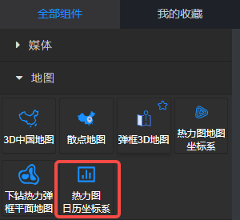

- 拖入画布后：

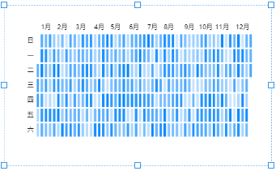

- 在后面板生成一个含有输入桩的节点：

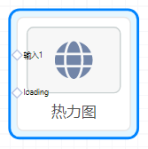
<a name="Xx8GL"></a>
## 数据

- 接收上游节点发送来的数据。
- 接收数据类型为：含有两列数据的二维数组的json，其中第一列是日期，第二列是数值。
- 默认数据：
```json
[   
  ["date", "value"],
  ["2019-01-01", 1770],
  ["2019-01-02", 3756],
  ["2019-01-03", 1149],
  ["2019-01-04", 2383],
  ["2019-01-05", 7951],
  ["2019-01-06", 7516],
  ["2019-01-07", 7543],
  ["2019-01-08", 277],
  ["2019-01-09", 2584],
  ["2019-01-10", 1189],
  ["2019-01-11", 8400],
  ["2019-01-12", 9022],
  ["2019-01-13", 188],
  ["2019-01-14", 7490],
  ["2019-01-15", 5789],
  ["2019-01-16", 269],
  ["2019-01-17", 5149],
  ["2019-01-18", 4908],
  ["2019-01-19", 2105],
  ["2019-01-20", 8870]
]
```
<a name="kXzsg"></a>
## 参数
<a name="2Idca"></a>
#### 基本参数

- 数据源：url，一个json文件的url，json文件中的数据需要遵循Echarts图表的标准数据格式。
- 背景色：颜色值。
- 边框颜色：颜色值。
- 字体颜色：包含图表中标签、名称、图例字体的颜色
- 图表色系：图表中各个系列的颜色，格式为英文逗号分隔的颜色值。
   - 默认：

<br />#0084ff, #339cff, #66b5ff, #99ceff, #cce6ff

   - 参考色系：
      - #37a2da,#32c5e9,#67e0e3,#9fe6b8,#ffdb5c,#ff9f7f,#fb7293,#e062ae,#e690d1,#e7bcf3,#9d96f5,#8378ea,#96bfff
      - #6ea8e5,#ff962e,#ff5c5f,#70cc62,#86d1ca
- 图表名称：字符串，默认null。
- 名称位置：英文逗号, 分隔的两个字符串或数值，分别定义名称相对于图表左侧和上方的位置。默认 left, top 即名称位于左上角。还可以是 40, 20 等数字，表示距离左侧40像素，距离上方20像素。
- 名称颜色：color值，定义图表名称的字体颜色。
<a name="XzmDv"></a>
#### 图例参数

- 图例：选项 "无"、"水平"、"垂直" ，默认 无 ，即图表中不渲染图例。
   - 水平：图例水平排列
   - 垂直：图例垂直排列。
- 图例位置：两个冒号: 分隔的键值对。
   - : 左侧填写图例的相对位置，一个是水平方向（left或right），另一个是垂直方向（top或bottom）；
   - : 右侧填写水平或垂直方向对应的位置，可以是数值、百分比，若水平方向也可以填 left、right、center、auto，若垂直方向也可以是 top、bottom、center、auto。
   - 配合图例的 水平/垂直 方向，可以设置为图表的任何位置。
   - 示例：


- 图例映射：一对或多对由英文冒号: 分隔的数据，: 左侧是数据表中表头的字段，右侧是自定义的表头。如果要自定义多对，那么用英文逗号, 分隔。
- 图例字号：number类型值，定义图例的字体大小，单位px。默认12。最小 8 。
- 图例字体：选项 "默认"、"庞门正道"、"DS-Digital" 。
- 图例间隔：number类型值，定义图例之间的间距，单位px。默认10。最小 4 。
- 图例标记类型：选项 '圆形'、'矩形'、'圆角矩形'、'三角形'、'菱形'、'大头针'、'箭头'、'无' ，默认 圆角矩形。
- 图例标记宽度：number类型值，定义图例标记的宽度，单位px。默认25 。最小 4 。
- 图例标记高度：number类型值，定义图例标记的高度，单位px。默认14 。最小 4 。
<a name="Do5ik"></a>
#### 绘图网格参数

- 容器边距（左,上,右,下）：英文逗号分隔的四个数字或百分数，分别表示图表距离容器左、上、右、下边的距离。默认 10%,60,10%,60 
<a name="ekRD3"></a>
#### 日历坐标系参数

- 布局朝向：选项 '水平'、'垂直'。定义日历坐标的布局朝向。默认水平 。
- 日历范围：必填，定义日历坐标的范围，支持多种格式。
   - 某一年，如 2019。
   - 某个月，如 2019-02。
   - 某个区间，如 2019-01-09, 2019-05-10

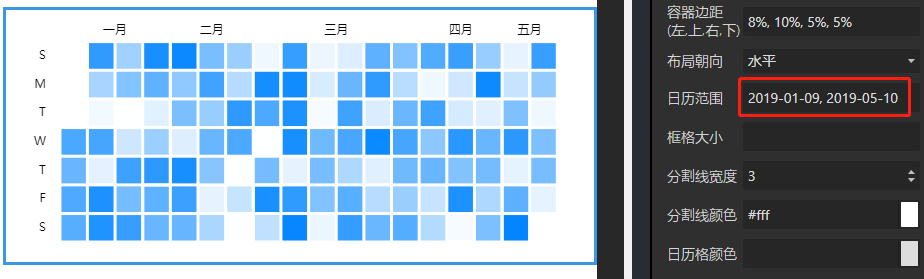

- 框格大小：该设置暂时无效，框格大小会根据图表的大小和容器边距的设置自动平均分布。
- 分割线宽度：number类型值，定义日历坐标分割线的宽度。
- 分割线颜色：color值，定义日历坐标分割线的颜色。
   - 示例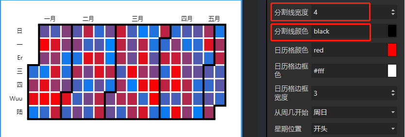
- 日历格颜色：color值，定义日历图形的颜色。默认null。一般情况下，这个颜色会被热力图节点的颜色覆盖。
   - 下面是一个设置了视觉映射的颜色透明度的效果，其中的蓝色是_图表色系_中的默认值：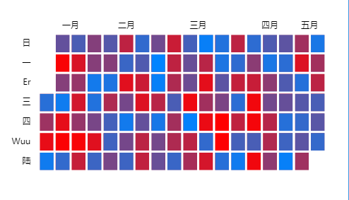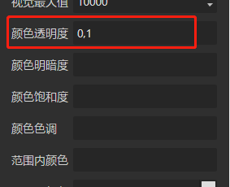
- 日历格边框色：
- 日历格边框宽度：
- 从周几开始：选项 '周日'、'周一'、'周二'、'周三'、'周四'、'周五'、'周六'。一周从周几开始，默认从周日开始。
- 星期位置：选项 '开头'、'结尾'。定义月份的位置。默认开头 。
- 星期标签映射：可设置中英文以及自定义。默认cn。
   - 中文：cn
   - 英文：en
   - 自定义：英文逗号,分隔的字段。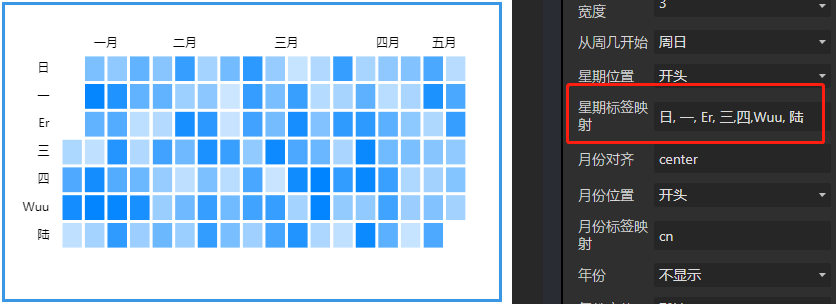
- 月份对齐：选项 '水平居左'、'水平居中'、'水平居右'。定义月份文字的水平对齐方式，默认 水平居中。
- 月份位置：选项 '开头'、'结尾'。定义月份的位置。默认开头 。
- 月份标签映射：可设置中英文以及自定义。默认cn。
   - 中文：cn
   - 英文：en
   - 自定义：英文逗号,分隔的字段。示例如下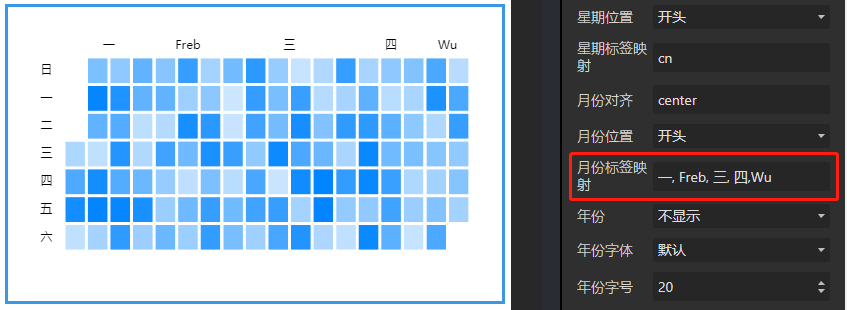
- 年份：选项 '不显示'、'上方显示'、'下方显示'、'左侧显示'、'右侧显示'。默认 不显示。
- 年份字体：选项 '默认'、'庞门正道'、'DS-Digital'。定义年份的字体。
- 年份字号：nunber类型值，定义年份的字体大小，单位px。最小12。默认20。
<a name="IKDYz"></a>
#### 标签参数

- 标签：布尔值，是否显示标签。默认true。
- 标签颜色：color值，定义标签的字体颜色。
<a name="WXC3r"></a>
#### 连续型视觉映射

- 视觉映射：选项 '无'、'顶部居左'、'顶部居右'、'中部居左'、'中部居右'、'底部居左'、'底部居右'。
   - 无：不设置视觉映射。
   - 其他：设置视觉映射，并定义视觉映射图例的位置。
- 视觉映射朝向：选项'水平'、'垂直'。定义视觉映射图例的方向。默认 水平。
- 视觉最小值：number类型值，默认0。定义视觉映射允许的最小值，和最大值一起形成了视觉映射的『定义域』。
- 视觉最大值：number类型值，默认10。定义视觉映射允许的最大值，和最小值一起形成了视觉映射的『定义域』。
- 颜色透明度：英文逗号,分隔的0~1的数值。定义 **在选中范围中** 的图元的颜色的透明度。默认'0, 1'，表示值维度的数据中，数据与视觉最小值相等的图元颜色为完全透明，数据与视觉最大值相等的图元颜色为不透明。图元的透明度根据数值维度的数据在0~1之间变化。
- 颜色明暗度：英文逗号,分隔的0~1的数值。定义 **在选中范围中** 的图元的颜色的明暗度。默认null。
   - 示例：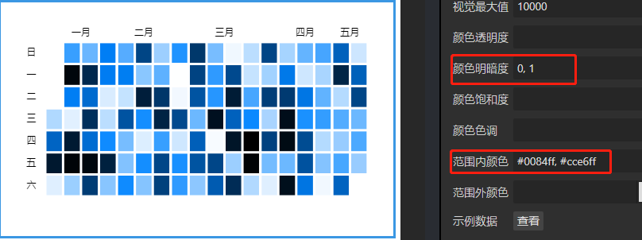
- 颜色饱和度：英文逗号,分隔的0~1的数值。定义 **在选中范围中** 的图元的颜色的饱和度。默认null。
- 颜色色调：英文逗号,分隔的0~359的数值。定义 **在选中范围中** 的图元的颜色的色调。默认null。
   - 示例：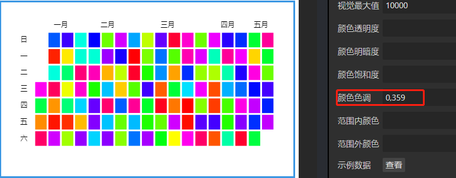
- 范围内颜色：单个颜色值，或多个由英文逗号,分隔的颜色值。定义 **在选中范围中** 的图元的颜色，默认 #0084ff。
- 范围外颜色：单个颜色值，或多个由英文逗号,分隔的颜色值。定义 **在选中范围外** 的颜色。默认rgba(0,0,0,0.2)
