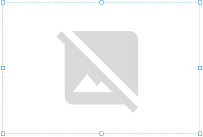
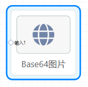
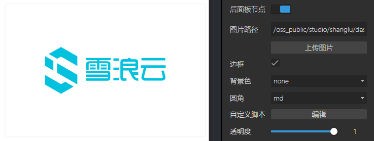

## 概览
- 内置组件/媒体/图片
- 将组件拖入前面板画布后：

- 同时，后面板画布中会生成一个“图片”节点，含有一个输入端口：

## 数据
项目运行后，后面板中的“图片”节点的“输入1”端口接收上游节点输出的base64数据。

## 参数

- 图片路径：上传本地图片到线上作为默认图片。
- 边框：Boolean值，定义图片是否有边框。
- 背景色：选择项定义图片的背景。默认none，无背景。
- 圆角：定义图片的圆角。其中xxl为 50%。正方形的图片时，选择xxl圆角可以定义圆形图片。
