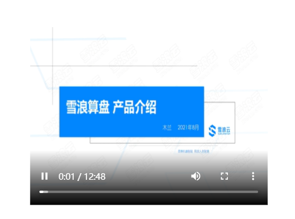

# 概览

## 前面板

## 后面板

# 功能说明

拖入视频组件后，需在右侧“视频源”配置项中，填入视频文件地址。

支持的视频格式包括

| 视频类型       | 文件扩展名 |
| -------------- | ---------- |
| Flash          | .flv       |
| MPEG-4         | .mp4       |
| 3GP Mobile     | .3gp       |
| QuickTime      | .mov       |
| A/V Interleave | .avi       |
| Windows Media  | .wmv       |

## 配置项

| **配置项** | **说明**                                                                                                                                                                                             |
| ---------- | ---------------------------------------------------------------------------------------------------------------------------------------------------------------------------------------------------- |
| 视频源     | 视频文件地址，如 [https://sp.xuelangyun.com/common_static/video/suanpan_introduction.mp4](https://sp.xuelangyun.com/common_static/video/suanpan_introduction.mp4)，这种可以直接访问到文件的 URL      |
| 自动播放   | 是否自动播放视频                                                                                                                                                                                     |
| 视频控件   | 是否显示视频控制按钮，如播放、暂停、全屏等                                                                                                                                                           |
| 循环播放   | 播放完毕后是否循环播放                                                                                                                                                                               |
| 静音       | 是否静音                                                                                                                                                                                             |
| 背景色     | 视频在未加载时组件的背景颜色                                                                                                                                                                         |
| 边框色     | 视频组件边框颜色                                                                                                                                                                                     |
| 圆角       | 视频组件边框是否是圆角                                                                                                                                                                               |
| Video 填充 | 调整视频比例，可选项为   填充：将画面铺满视频组件，可能会造成视频长宽比改变   包含：视频画面完全包含在组件内，保持视频原有长宽比不变   覆盖：视频画面覆盖组件，保持视频原有长宽比不变 |
