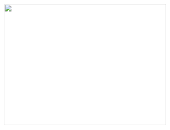
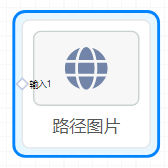

## 概览
- 内置组件/媒体/路径图片
- 拖入前面板画布后：

- 同时，在后面板生成“路径图片”节点，含有一个输入端口，项目运行后接受上游节点发送的数据：

## 数据

- 输入数据：端口接收从上游节点传入的数据，一个string。
- 如果输入数据是 studio/ 开头，则会将输入的数据作为oss的Key去获取signedUrl，否则会将输入的数据直接作为图片的src。

## 参数

- 默认路径：一个图片的地址，也可以是dataUrl。定义该组件的初始化图片。默认null。

## 其他设置

- 设置大小：
   - 选中后，拖动锚点改变图片大小。
   - 选中后，在右面板 **样式/位置及尺寸** 中修改_ 宽度 高度 。_
- 设置边框：
   - 选中后，在右面板 **样式/颜色及边框** 中，修改 _边框线_、_边框圆角_等。
- 设置背景色：
   - 选中后，在右面板 **样式**/**颜色及边框**中，修改 _背景颜色_。

