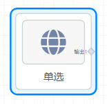

## 概览
- 内置组件/控件/单选

- 拖入前面板画布后，整体是一个**单选组**，其中的每一个选项是**单选项**

- 拖入前面板画布后的“单选”组件会在后面板画布中生成一个对应的后面板节点，这个节点有一个输出端口，当项目运行，用户选择了选项后，选项的value会向下游节点输出。

## 说明

- 单选，包含一个单选组mdc-radio-group组件，和其中的多个单选项组件mdc-radio。
- 单选项选中后，可以Ctrl+C复制，Ctrl+V粘贴，在单选组中生成多个选项，选中后按Delete键删除。
- **同一组的单选项，需要设置相同的name和不同的id**。

## 参数

#### 单选组

- 列数：Int类型数值，默认3。控制选项组中的列数。
- 默认选中项id：必须是单选组中某一个单选项的Id，默认选中该选项。

#### 单选项

- Id：必填，同一组的单选项，必须设置不同的Id。
- Name：必填，同一组的单选项，必须设置相同的Name。
- Value: 必填，同一组的单选项，必须设置不同的Value。
- 文本：必填，选项的显示文本，如概览截图中的“单选 1”。
