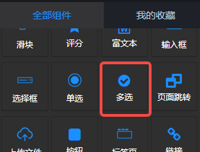
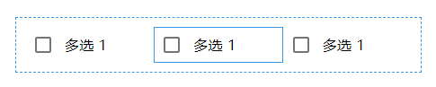
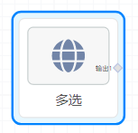
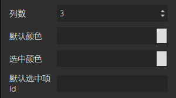
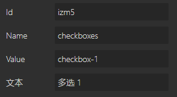

## 概览
- 内置组件/控件/多选

- 拖入前面板画布后，整体是一个**多选组**，其中的每一个选项是**选项**

- 拖入前面板画布后的“多选”组件会在后面板画布中生成一个对应的后面板节点，这个节点有一个输出端口，当项目运行，用户选择了选项后，选项的value会向下游节点输出。value是一个数组。

## 说明

- 多选，包含一个多选组mdc-checkbox-group组件，和其中的多个多选选项组件mdc-checkbox。
- 多选选项选中后，可以Ctrl+C复制，Ctrl+V粘贴，在多选组中生成多个选项，选中后按Delete键删除。
- **同一组的多选选项，需要设置相同的name和不同的id**。

## 参数

#### 多选组

- 列数：Int类型数值，默认3。控制选项组中的列数。
- 默认颜色：多选框的默认颜色。
- 选中颜色：选项被选中后的多选框颜色。
- 默认选中项id：必须是多选组中某个选项的Value，默认选中该选项。

#### 选项

- Id：必填，同一组的选项，必须设置不同的Id。
- Name：必填，同一组的选项，必须设置相同的Name。
- Value: 必填，同一组的选项，必须设置不同的Value。
- 文本：必填，选项的显示文本，如概览截图中的“多选 1”。
