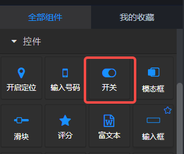
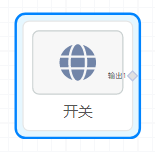
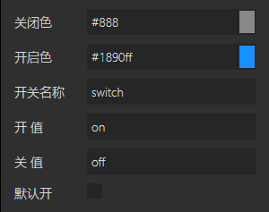

## 概览
- 内置组件/控件/开关：

- 拖入画布后：

- 可以单独使用，也可以配合表单组在表单组件中使用。单独使用时，在后面板生成一个有输出端口的节点。

## 数据

- 在后面板生成的节点（开关）中包含一个输出端口（输出1），在前面板页面中开启或关闭时，向后面板的下游节点发送在参数中设置的‘开值’或‘关值’。

## 参数

- 关闭色：开关关闭状态的颜色值，默认#888。
- 开启色：开关开启状态的颜色值，默认#1890ff。
- 开关名称：开关在表单中的唯一name值。
- 开 值：开关开启时发送给后面板下游组件的数据。
- 关 值：开关关闭时发送给后面板下游组件的数据。
- 默认开：可选项，true | false。默认false，初始化开关关闭。

