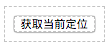
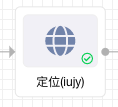

## 概览

### 前面板



### 后面板



- 功能说明

  - 前面板拖入组件, 为一个按钮, 点击按钮即可得到当前地址数据

### 数据

- 数据来源: 后面板输入节点传入

  - 样例

```json
{ "mode": "accurate" | "fuzzy" }
```

- 数据说明

  - 传入数据为 `JSON`  格式, 字段名 `mode`  表示当前模式, 有 `accurate`  和 `fuzzy`  两种模式可以选择, 具体也可参考 **参数**  部分

- 数据输出: 根据不同的模式和当前情况输出

  - 样例

```json
// accruate 模式下
{
  "position": xxx,
  "accuracy": xxx,
  "formattedAddress": "xxx"
  ...
}

// fuzzy 模式下
{
  "city": xxx
  ...
}
```

- 数据说明

  - 输出数据为 `JSON`  格式, 当 `mode`  为 `accurate`  模式下, 返回结果参考高德地图的  [GelolocationResult 对象](https://lbs.amap.com/api/javascript-api/reference/location), `fuzzy`  模式下, 返回结果包含省, 市, adcode, citycode, 城市共性点 center 等信息. 具体参考高德地图的  [getCityInfo(callback:function(status,result){})](https://lbs.amap.com/api/javascript-api/reference/location)  里的说明

- 其他情况
  - 当发送定位请求失败时会默认使用浏览的定位 API 进行定位, 返回当前的经度和纬度:

```json
{"latitude": xxx, "longitude": yyy}
```

### 参数

- 定位模式
  - 选择进行定位的模式, 有 `accurate`  和 `fuzzy`  两种模式, 前者进行精确定位, 返回数据也更加全面, 后者根据 IP 进行模糊定位, 返回数据也较为笼统
