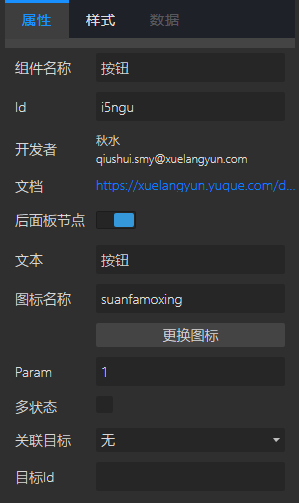

## 概览
- 内置组件/控件/按钮：

- 拖入画布后：

- 在后面板生成一个有输出端口的节点：

## 数据
项目运行后，在前面板点击按钮，后面板中对应的“按钮”节点的输出端口会向下游组件发送参数[Param]的值。

## 参数

- 文本：string类型，默认“按钮”。定义按钮上的文本。如果是多状态，每个状态的文本之间请用英文逗号分隔。如"停止, 开始"。
- 图标名称/更换图标：点击更换图标按钮，选择置于按钮上的图标。如果是多状态，请将每个状态的icon用英文逗号, 分隔。如 "pause, play"。
- Param：string类型，定义按钮点击时发送给下游节点的数据。
   - 如果要发送json，请在双引号前加转义符。示例 {\"name\": \"SuanPan\"}
   - 如果是多状态，请输入用英文逗号, 分隔的字符串。
- 多状态：布尔值，默认false。为true时，配合多状态的文本、icon和Param设置，每次点击发送不同的参数。
- 关联目标：可选“无”、“模态框”、“表格”、“选择框”。默认“无”，选择“模态框”或“表格”、“选择框”时，需要在 目标Id 参数输入 相关联的模态框或表格的id。
- 目标Id：string类型，默认null。设置相关联的模态框或表格的id。

## 演示

