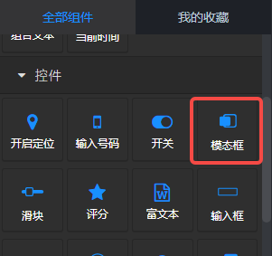
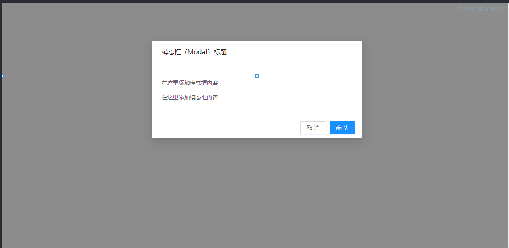
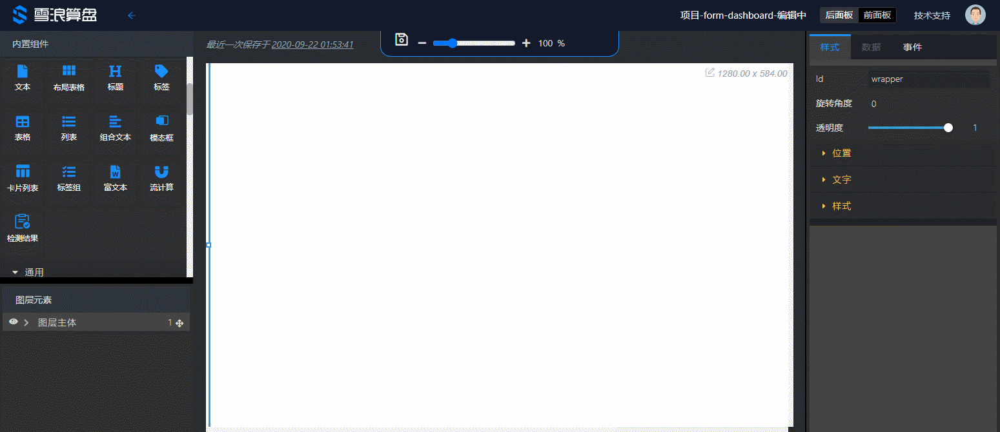

## 概览
- 内置组件/控件/模态框

- 拖入画布后，模态框是打开状态。灰色背景是模态框打开后的遮罩层。

## 操作

#### 基本操作

- 鼠标点击灰色背景选中模态框组件。
- 模态框的头部、内容、底部可以选中后修改样式或者文本。
- 可以在图层元素面板中将其他组件拖入模态框的内容中。

#### 配合按钮组件
可以配合按钮组件使用，控制模态框的打开。方法：

- 在按钮组件的‘关联目标’选择“模态框”；
- 在按钮组件的‘目标Id’输入模态框的id；
- 设置模态框的‘默认显示’为false；

演示：

## 参数

- 默认显示：布尔值，默认true。定义默认状态十分显示模态框。
- 遮罩：布尔值，默认true。定义是否显示遮罩层。
