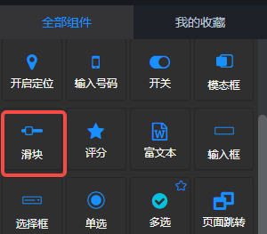
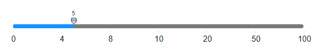
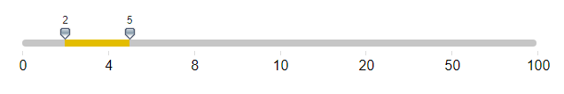
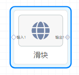
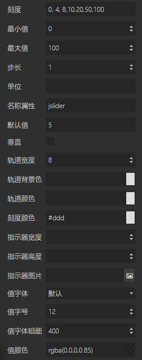
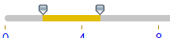
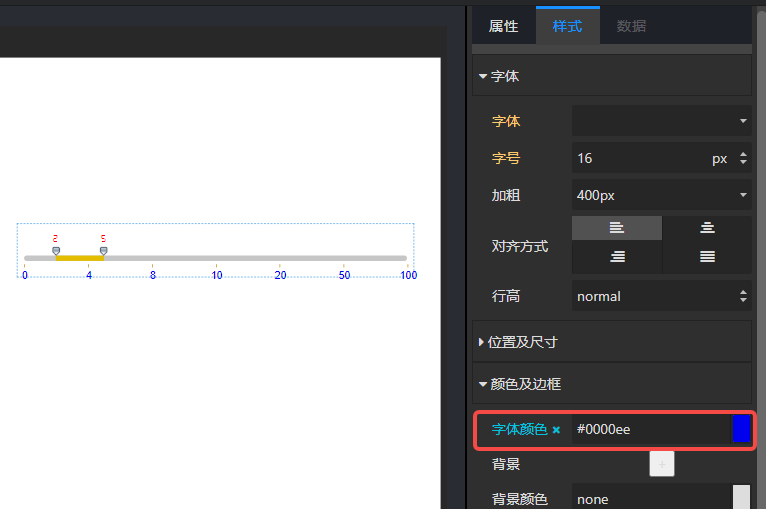
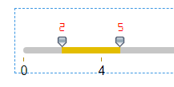
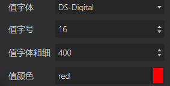

## 概览
该组件基于外部插件jslider

- 组件/控件/滑块

- 拖入前面板画布后的设置截图：
   - 图一：默认配置

   - 图二：默认值为 2; 5 

- 拖入前面板画布后，后面板画布中同时生成一个“滑块”节点，有一个输入端口和一个输出端口。

## 数据
#### 输入数据
项目运行后，后面板节点“滑块”的输入端可以从上游节点接收数据作为滑块的值。
输入数据类型：

- Number 类型
- **英文逗号,**分隔的两个数字，如 2, 5
#### 输出数据
拖动滑块，鼠标左键松开后，向后面板下游组件输出当前的滑块值。
通常为一个数值，当滑块选中一个区域时，输出该区域的开始、结束两个数值，以**英文分号;** 分隔。如： 2;5
## 参数设置

#### 基本参数

- 刻度：英文逗号, 分隔的一系列数值，设置滑块的刻度。默认 0, 4, 8,10,20,50,100
- 最小值：Number类型，最小刻度值。默认 0。
- 最大值：Number类型，最大刻度值。默认100。
- 步长：拖动滑块改变的数值大小。默认1。
- 单位：滑块上方数值的单位。
- 名称属性：非必填项。仅用于给滑块的input标签的name属性赋值。
- 默认值：一个数值，或者以**英文分号; **分隔的两个数值。表示滑块的默认值。如果是一个数值，如图一，滑动滑块改变当前数值。如果是分号;分隔的两个值，则如图二，是一个区域。
- 垂直：布尔值，默认false。滑块是否垂直。
#### 轨道样式

- 轨道宽度：Number类型，设置轨道的宽度，单选 px，默认 8px。
- 轨道背景颜色：轨道的背景颜色，如上图中的灰色#c6c6c6
- 轨道颜色：轨道的颜色，如上图中的黄色#e3bd00
- 刻度颜色：滑块**刻度线**的颜色。

如果要设置**刻度值**的颜色，则需要选中该滑块后在【样式/颜色及边框】中设置字体颜色，如下：

#### 指示器样式

- 指示器宽度
- 指示器高度
- 指示器图片
#### 值的样式
样式： 
相关配置：

- 值字体：选中值的字体。
- 值字号：选中值的字体大小。
- 值字体粗细：选中值的字体的粗细。默认400，为正常。500、600、……逐渐加粗。
- 值颜色：选中值的字体颜色。

