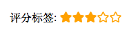
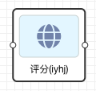

## 概览
### 前面板



### 后面板



### 功能说明

  * 从前面板拖入组件, 默认显示 5 颗星星, 并且没有任何高亮

  * 可以点击任意星星, 比如点击第 3 颗星星, 第三颗星星(包含第三颗星星)之前的所有星星都会被高亮, 高亮
  默认颜色为橘黄色

  * 可以删除星星, 选中任意星星按下键盘上的 delete 键即可删除, 配置属性的星星总数绑定会随之变化, 其
  余星星的行为(高亮或者不高亮)不受影响
  
  * 可以设置星星的总数, 星星总数不管比原先增加还是减少, 原先已经存在的星星如果还存在其行为不会受到影
  响
    * 可以设置星星的颜色, 所有星星颜色均一致
    * 可以将所有的星星颜色清空


## 数据

### 数据来源

后面板输入节点传入

```json
  {"score": 3, "total": 10}
```
* 数据说明
  
  后面板传入 JSON 格式的数据, score 代表目前高亮的星星数量, total 代表星星总数

### 数据输出

根据输入或用户点击情况输出

```json
{"score": 5, "total": 10}
```
  * 数据说明
    
    输出和输入一样均为 JSON 格式, 用户可以在后面板传入数据之后对评分进行配置, 只要触发点击星星的行为就会输出当前的星星信息

## 参数

* 星星颜色

  可以在配置项选择修改颜色, 默认星星颜色为橘黄色

* 星星总数量

  可以在配置项选择修改星星总数, 默认为 5 颗星

  设置数量的时候如果新设置的数量大于已有的星星数量, 新增的星星默认为没有高亮, 已有的星星的行为不会被改变. 反之, 多余的星星会被删除, 存在的星星行为同样不会改变

* 清空所有高亮

  一个按钮, 点击可以清空当前所有星星的高亮
