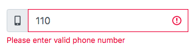
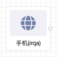

### 概览
- 前面板

- 后面板

- 功能说明
   - 从前面板拖入组件, 为一个输入框允许输入数字, 长度限制为 11 位手机位数
   - 默认为中国手机号标准校验, 当失去焦点之后会进行手机号验证
   - 失去焦点后会将手机号码以及验证结果以及方式发送给后面板
### 数据

- 数据来源: 无
- 数据输出: 用户输入的手机号
   - 样例

{ "phone": 110xxxxx, "validation": { "type": "general" | "detailed", "result": true | false } }

   - 数据说明
      - phone 字段为用户的手机号, 长度限制为 11 位数
      - validation 字段为一个对象, type 在当前手机验证的方式, 可以为 general, 此模式下只验证手机号长度是否为 11 位数. 也可以为 detailed, 进行手机号验证, result 为最后验证的结果
### 参数

- 验证
   - 当前的验证模式, 有 general 和 detailed 两个选项, 默认为 detailed , general 模式下仅验证手机号长度是否为 11 位数. detailed 会用户输入是否是一个合法的手机号, 例如 11111111111 在 general 下校验会成功, 在 detailed 下校验会失败

