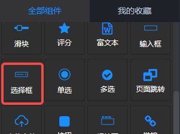
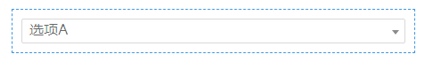
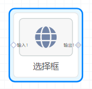
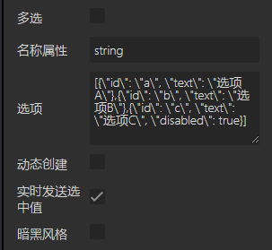
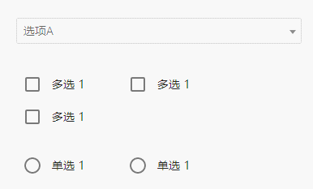

## 概览
- 内置组件/控件/选择框：

- 拖入画布后：

- 在后面板生成一个对应的节点，该节点有一个输入端口和一个输出端口

## 数据
当“选择框”组件单独使用（不在表单组件内部）时，会在后面板生成一个节点，该节点有一个输入端口和一个输出端口。

#### 默认数据
包含字段id、text的对象组成的数组。示例 [{"id": "a", "text": "选项A"},{"id": "b", "text": "选项B"},{"id": "c", "text": "选项C", "disabled": true}] ，表示该选择框有三个选项“选项A”、“选项B”和“选项C”，其中“选项C”不可用。当用户选中“选项A”时，向下游节点发送JSON数据 {"id": "a", "text": "选项A", "selected": true} 。

#### 输入端口
接收一个数组的json数据，用来渲染选择框的选项。该数组由一个或多个包含字段id、text的对象组成。也可以包含disabled，表示该选项不可选。

#### 输出端口
当用户选择一个选项后，向下游节点发送该选项的JSON数据。如 {"id": "a", "text": "选项A", "selected": true} 。

## 参数

- 多选：布尔值，定义是否为多选。默认false，单选。
- 名称属性：字符串类型，当选择框组件在表单组件内时**必填**。定义该选择框数据在表单中的name字段。
- 选项：定义初始选项，默认[{\"id\": \"a\", \"text\": \"选项A\"},{\"id\": \"b\", \"text\": \"选项B\"},{\"id\": \"c\", \"text\": \"选项C\", \"disabled\": true}] 。注意双引号" 前的\ 。
- 动态创建：布尔值，定义是否可以在使用时动态创建选项。默认false，不创建。
- 实时发送选中的值：布尔值，默认为true。即允许状态下，在前面板页面选择后，后面板节点即时向下游发送选中项。
- 暗黑风格：布尔值，默认 false。为true时适用于背景后暗黑风格的前面板页面。

## 动态创建演示

