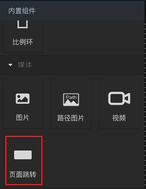
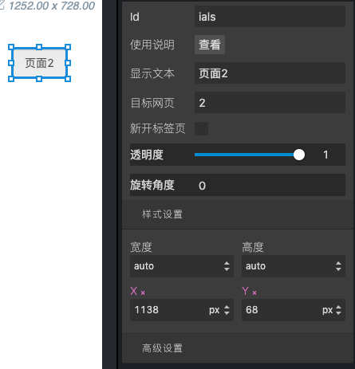

## 组件介绍
在完成多个页面编辑后，可使用“页面跳转”前面板组件实现在部署前面板后，在不同页面间进行切换。
在编辑页面左侧的“内置组件”区域，“媒体”分类下找到“页面跳转”组件，拖入前面板画布中，如图2-1所示。

图2-1 前面板组件“页面跳转”

## 参数配置

拖入页面跳转组件后，其配置属性如图2-2所示。

图2-2 页面跳转组件配置属性

常用的配置属性如下：

1. 使用说明。点击“查看”按钮打开说明文档；

2. 显示文本。可通过修改显示文本改变组件的显示文案；

3. 目标网页。可填入跳转的页面编号，如1，2，3。前面板页面列表序号默认从1开始；也可填入完整的url地
址，如https://www.xuelangyun.com，可跳转到算盘以外的网页；

4. 新开标签页。勾选中“新开标签页”时，在前面板页面点击组件时，浏览器会打开新的标签页展示网页，否则在当前页进行跳转。