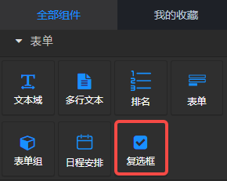
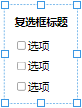
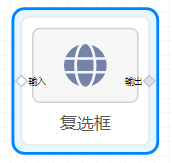
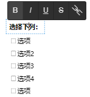

## 概览
- 内置组件/表单/复选框：

- 将组件拖入前面板画布后：

- 同时，在后面板生成一个对应的“复选框”节点，包含1个输入端口和1个输出端口：

## 数据

#### 输入数据

- 示例：[{name: '选项', checked: false}, ...]
- name：字符串，定义选项名称。
- checked：布尔值，定义选项是否被选中。

#### 输出数据
同输入数据。

## 参数
排列方式：选项“vertical、horizontal”。vertical——垂直排列，horizontal——水平排列。 增加：点击“增加选项”按钮，增加复选框的选项。

## 其他操作

- 复选框标题 和 选项 均可双击修改文本内容。
