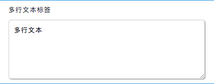

## 概览

### 前面板

### 后面板

- 功能说明:
   - 可以接受数据输入, 也可以接受数据输入, 数据格式任意
   - 可以对文本输入框进行一些配置, 见下面的参数部分

### 数据

- 数据来源: 后面板输入节点输入
   - 样例
      - 字符串, 数字, `JSON` 等均可
   - 数据说明
      - 无特殊说明
- 数据输出: 根据文本内的内容输出
   - 样例
      - 根据文本内容决定
   - 数据说明
      - 无特殊说明

### 参数

- 手动缩放: 有 `both` , `horizontal` , `vertical` , `off` 四个选项, 默认 `both` 允许两边缩放. 用于设置该文本框手动缩放的行为, 设置 `off` 无法进行手动缩放, 其右下角的灰色小三角标志消失, 其余三个选项分别代表两边均可缩放, 横向缩放, 纵向缩放
- 自动缩放: 复选框. 默认选中允许自动缩放, 可以在用户输入文字的同时随着字数的增加自动缩放
- 编辑: 复选框. 默认选中允许编辑, 定义该多行文本是否被运行编辑
- 文本换行: 有 `soft` , `hard` , `off` 三个选项, 默认为 `soft` , 用于设置文本换行的行为
- 默认提示: 用于设置 `placeholder` 
- 文本最大长度: 用于设置该多行文本最大可接受的字符长度, 默认为 0 表示没有限制, 输入 1 及以上可以设置, 其余 0 或者其他(负数, 字符串等)均表示没有限制
- 文本高度: 用于设置文本的高度, 默认为 5
- 文本宽度: 用于设置文本的宽度, 默认为 50
