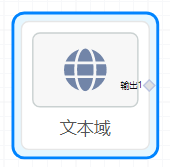

*建议使用 内置组件/控件/输入框组件

## 概览

- 内置组件/表单/文本域：

- 将组件拖入画布后：

- 同时，后面板生成一个对应的“文本域”节点，包含1个输入端口：

## 数据
输出数据：string类型。项目运行后，输出1端口向下游输出用户在前面板页面的文本域中输入的文本。

## 参数

- 类型：选项“单行、多行”，定义文本域为单行输入或多行输入。
- Name：字符串定义文本域input的name属性，当文本域在表单中时需要。
- Id：字符串定义文本域input的id属性，当文本域在表单中时需要。
- Label：文本域的label内容。
