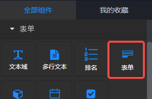
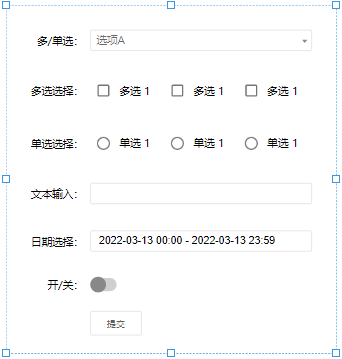
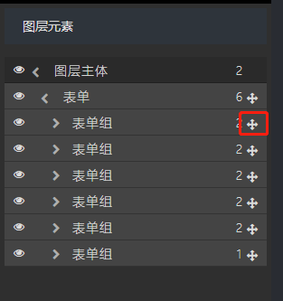
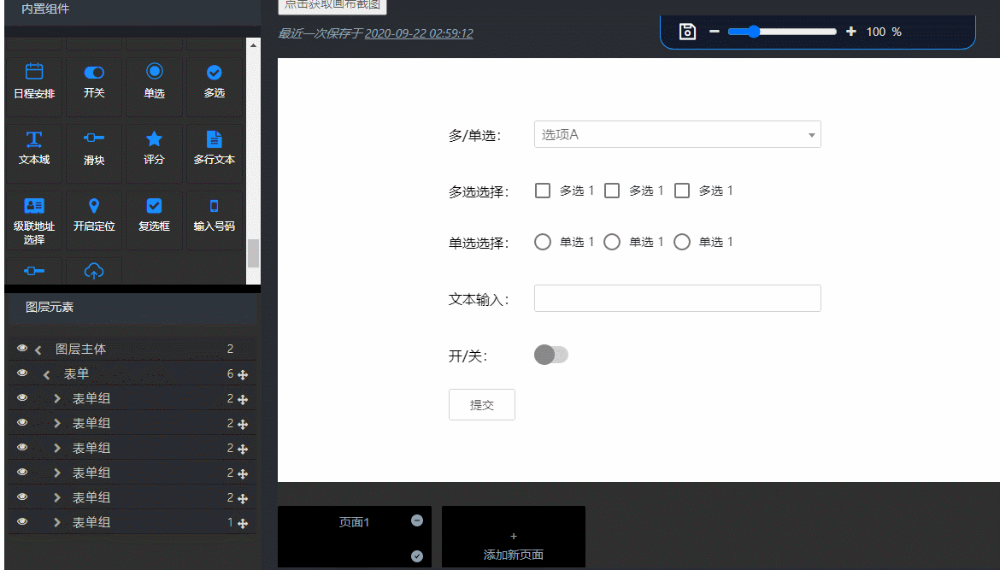

## 概览
- 内置组件/表单/表单

- 将组件拖入前面板画布后：

## 组件说明

- 表单组件Form被拖入至画布后，自带输入框等表单元素子组件，以及用以提交数据的按钮。
- 表单组件中的子组件的Name参数不能相同。
- 输入框等子组件可以ctrl+C复制、Delete删除。
- 在图层元素面板中，可以用鼠标左键按住右侧的十字移动图标，来改变表单组的位置：

- 若要向表单中增加新的表单组件，可以将其先拖动至画布后，再在图层元素面板中移动至表单内部。

## 组件参数

- 背景色：颜色值。
- 边框颜色：颜色值。
- 数据输出为：列表/对象。
   - 列表，表单向下游组件输出的数据格式为含有name、value属性的对象组成的数组，如：[{name: name, value: value}]。
   - 对象，表单向下游组件输出的数据格式为格式为一个由name、value组成的键值对的对象，如：{name: value}。列表或对象均被格式化为JSON数据输出。
