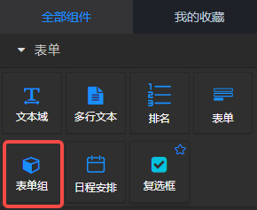
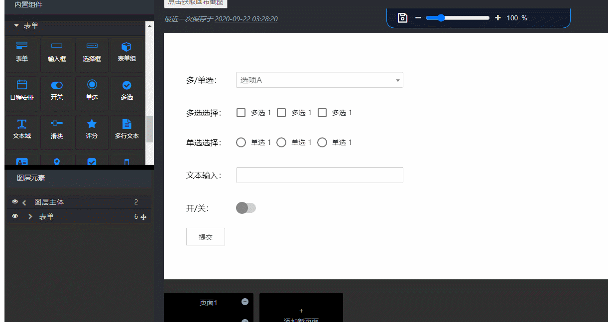
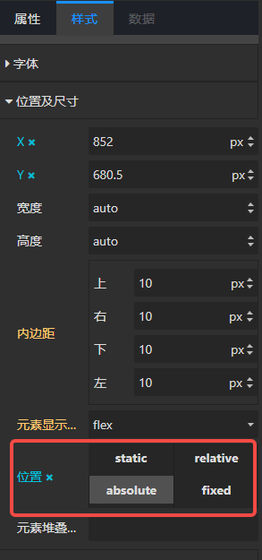

## 概览
- 内置组件/表单/表单组：

- 拖入画布后：

## 使用方法
表单组是一个包含label的空盒子，具有表单组的样式特性。是一个没有后面板节点的，纯粹用于表单布局的组件。

- 双击label文本“双击可编辑：”，修改label的内容。
- 将表单组件，拖入该组件中，置于label<文本标签>的后面。然后在右侧【样式】面板的“位置及尺寸/位置”点击** × **，取消绝对定位即可。
- 将表单组组件拖入表单组件中，可以成为表单的一部分，提交表单内容时，该表单组中的表单组件的数据被提交。然后在右侧【样式】面板的“位置及尺寸/位置”点击 × ，取消绝对定位即可。
- 演示：
- 取消绝对定位

