<a name="kOCBY"></a>
## 概览
- 内置组件/表格/表格：

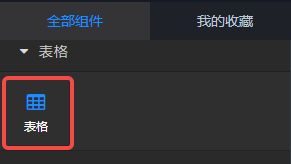

- 将组件拖入前面板画布后：

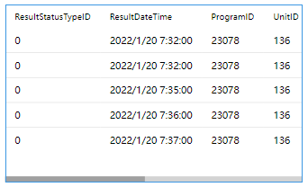

- 同时，后面板中生成一个对应的“表格”组件，含有1个输入端口和2个输出端口。

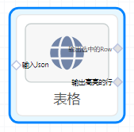
<a name="qUZTC"></a>
## 数据
<a name="dYaTH"></a>
#### 默认数据
```json
[
    [
        "ResultStatusTypeID",
        "ResultDateTime",
        "ProgramID",
        "UnitID",
        "PositionID",
        "Length",
        "TorqueMax",
        "AngleMax",
        "STATUS"
    ],
    [
        "0",
        "2022/1/20 7:32:00",
        "23078",
        "136",
        "1",
        "541",
        "110.723",
        "89.73299999999998",
        "1"
    ],
    [
        "0",
        "2022/1/20 7:32:00",
        "23078",
        "136",
        "1",
        "533",
        "111.289",
        "79.365",
        "1"
    ],
    [
        "0",
        "2022/1/20 7:35:00",
        "23078",
        "136",
        "1",
        "526",
        "110.334",
        "81.187",
        "1"
    ],
    [
        "0",
        "2022/1/20 7:36:00",
        "23078",
        "136",
        "1",
        "552",
        "110.48",
        "78.10300000000002",
        "1"
    ],
    [
        "0",
        "2022/1/20 7:37:00",
        "23078",
        "136",
        "1",
        "500",
        "110.221",
        "76.889",
        "1"
    ]
]
```
<a name="m759K"></a>
#### 数据说明

1. 二维数组数据集。
1. 默认第一行为表头数据。
<a name="o7FsK"></a>
#### 输入1
上游节点输入的数据，json类型，数据格式见“默认数据”。
<a name="KZizB"></a>
#### 输出1
多选行为false时，用户点击任一行输出改行数据。如：[["005","孙华","女","42","2020-01-02 14:28:36"]]
<a name="INkAa"></a>
#### 输出2
表格的“向上滚动”和“高亮行”设置为true时，表格在自动滚动时输出的高亮行的数据。
<a name="j3xIZ"></a>
## 样式说明
表格中字体（font-family）、文本颜色color、大小font-size、粗细font-weight、字体风格font-style，以及水平对齐text-align，使用在 样式/文字 面板中定义的参数。
<a name="p6BF6"></a>
## 参数说明
<a name="nxtBi"></a>
#### 表头

- 显示表头：布尔值，true | false。定义是否将第一行数据做表头显示。默认true。
- 表头行高(px)：number值，单位px。定义表头的行高。默认40。
- 表头背景色：color值，定义表头的背景颜色。默认无。
- 表头字体颜色：color值，定义表头的字体颜色。默认无，遗传组件的全局字体颜色。
- 表头字号：number值，单位px。定义表头的字体大小。默认 14。
- 表头字体粗细：number值，最小400，步长100。定义表头的字体粗细，即font-weight。默认400。
- 表头字体风格：可选“正常”或“倾斜”，默认“正常”。
<a name="6DWG0"></a>
#### 行

- 偶行背景：color值，定义表格中（表头除外）的偶数行背景的颜色。默认null。
- 奇行背景：color值，定义表格中（表头除外）的奇数行背景的颜色。默认null。
- 选中行背景：color值，定义选中行的背景颜色。绑定鼠标事件时有效。默认 #cce6ff
- 行边框类型：可选项 '无边框' 、 '实线' 、 '虚线' 、 '点线'，定义每行之间的边框类型。默认 “实线”。
- 行边框颜色：color值，定义每行之间的边框颜色。默认'#ddd'
- 行高(px)：number值，单位px。定义每行的高度。默认40。
- 显示行数：布尔值，定义是否在每行的第一列显示改行的序号。默认false，不显示。
- 多选行：布尔值，定义是否在每行显示多选框。默认false，不显示。
- 行上下间距：number值，单位px。定义每行之间的上下间距，定义后，原来的行边框将不再显示。
<a name="GxWwi"></a>
#### 单元格

- 单元格左右间距：number值，单位px。定义每行单元格之间的左右间距。
- 不换行：布尔值，单元格的文本超出宽度时自动换行，该选项定义单元格中的文本长度超出时不换行。默认false。
<a name="qz4e2"></a>
#### 列

- 固定列宽(px)：number值，单位px。定义后每一列的宽度相等。
- 列:宽：定义某一列或某几列的宽度，key（列索引）：value（列宽度）键值对。例如，定义表格第2列的宽度为90：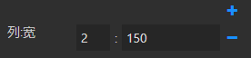
- 列:对齐：定义某一列或某几列的文本对齐。
- 列:图片：定义某一列或某几列的数据对应的图片目录，必须是一个可以访问的url，该目录中需要包含文件名为该列文本的png图片。例如，第1列的图片目录设置为 [https://suanpan-public.oss-cn-shanghai.aliyuncs.com/images/suanpanJSsdkImages/table/logo/](https://suanpan-public.oss-cn-shanghai.aliyuncs.com/images/suanpanJSsdkImages/table/logo/)  ，第2列的数据是该目录中图片的名称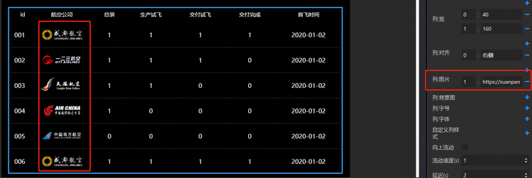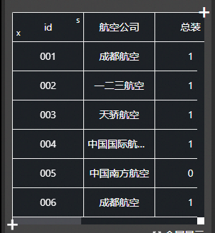      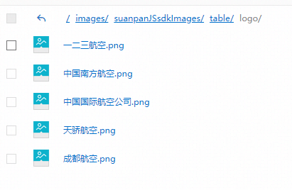
- 列:背景图：定义对应列的背景图片，跟“列:图片”不同，这里是定义图片的url，而不是图片所在的目录。对于图片的名称和类型不限制。
- 列:字号：定义列对应的字体大小。
- 列:字体：定义列对应的字体。默认为“默认”，可选项为 “默认”、“庞门正道”、“DS-Digital”。
- 自定义列样式：定义列对应的样式，左侧输入框是列索引，右侧多行文本框中输入自定义样式，如：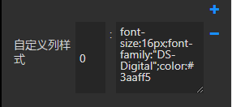
<a name="6EIjx"></a>
#### 超出高度
当数据量很多，超出了组件的高度时，默认生成滚动条，还可以设置超出后逐行向上滚动的动画。

- 向上流动：布尔值，定义当高度超出时是否向上流动。默认false。
- 流动速度(s)：每行向上流动的速度，单位秒，默认1s。
- 延迟(s)：定义多久向上流动一次，即每行的流动间隔时间。单位秒，默认2s。效果如下：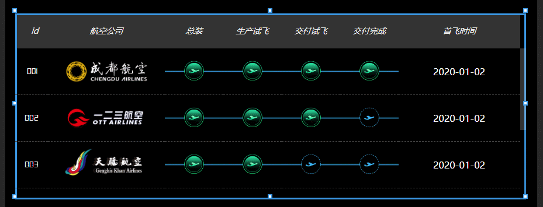

<a name="UyVWc"></a>
#### 高亮行显示
开启表格向上流动后，可以设置表格行高亮显示。

- 设置高亮：布尔值，定义表格行是否高亮显示。默认false。
- 高亮行：number值，定义需要高亮显示的行，默认1。
- 高亮字体颜色：color值，定义高亮行的字体颜色，默认null。
- 高亮行背景：color值，定义高亮行的背景颜色，默认null。效果如下：

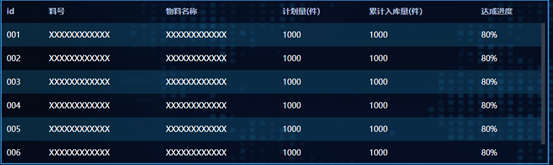

<a name="csQEG"></a>
#### 搜索

- 可搜索：布尔值，定义是否显示搜索框。默认false，不显示。
- 搜索框宽度：string值，单位自定义，可 % ，也可 px。定义搜索框的宽度。
- 搜索框位置：选项 “居左”、“居中”、“居右”，定义搜索框相对表格的水平位置。搜索框的宽度小于表格宽度时有效。
<a name="Ht1mn"></a>
#### 下载

- 可下载：布尔值，定义是否显示搜索框。默认false，不显示。

勾选后，显示“导出”按钮，点击后以csv文件方式下载当前表格数据到本地。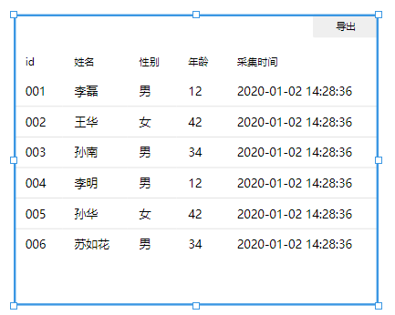
<a name="2272Z"></a>
#### 进度条
当列中的内容为百分比字符串或者0-1之间的数字时，可以把表格中对应列的内容以进度条的形式显示

- 替换进度条：布尔值，把表格中对应列替换成进度条。默认false。
- 列数：number值，需要替换第几列，默认值为1。
- 已完成颜色：color值，进度条左则已完成的背景颜色，默认rgb(24, 144, 255)。
- 待完成颜色：color值，进度条右侧未完成的背景颜色，默认rgba(24, 144, 255, 0.3)。
- 条纹颜色：color值，进度条条纹背景颜色，默认rgb(77, 175, 226)。效果如下：

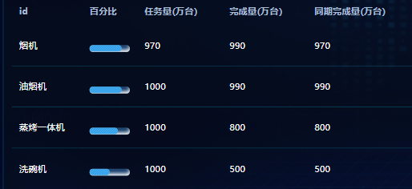
<a name="UIl5Y"></a>
#### 设置列正负值颜色

- 设置列颜色：布尔值，是否设置列正负值颜色，默认false。
- 列数：number值，设置第几列显示正负值颜色，默认1。
- 列正值字体颜色：color值，设置列正值字体颜色，默认red。
- 列负值字体颜色：color值，设置列负值字体颜色，默认green。

<a name="PzrbE"></a>
#### 其他

- 非渲染数据维度：定义不需要渲染到表格中的数据的维度。可以是单个的数字或以英文逗号, 分隔的多个数字。不渲染在表格的数据在绑定鼠标事件时，向下游节点发送的数据中仍旧包含在其中。
- 加载动画：布尔值，是否显示数据加载时的loading动画。
- 鼠标事件：选项'无' 、 '单击' 、 '双击' 、 '按下' 、 '松开'。定义表格的单行鼠标事件，默认“单击”，即click事件。无需向下游节点发送数据时，请选择“无”。
- 行选中方式：选项“多选、单选”，默认“多选”。该配置项在设置“鼠标事件”为“无”时无效。
   - 多选：若鼠标事件为“单击”，则单击某行会选中改行并下发改行数据；若再次点击改行会取消选中，若未取消而点击选中另一行时，之前的选中行不清理，下发时多行数据一起下发；
   - 单选：若鼠标事件为“单击”，则点击一行选中一行，点击另一行，之前的选中行会自动取消选中。
