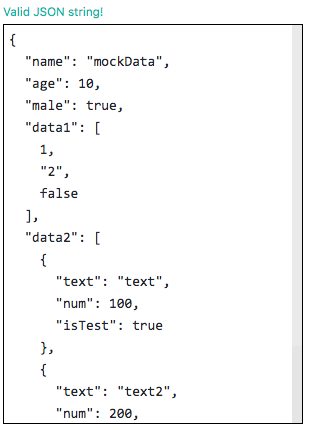
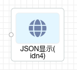

### 概览

- 前面板



- 后面板



- 功能说明
  - 接受数据输入, 当数据为一个 JSON 格式的字符串, 进行处理格式化展示出来, 同时有提示 Valid JSON string!
  - 当数据格式不符合 JSON, 将会展示原始数据, 同时顶部提示: Invalid JSON string, raw data displayed 类似提示
  - 当数据超过一定长度之后右侧会显示滚动条

### 数据

- 数据输入:
  - 上游组件传递下来, 当为合法的 JSON 字符串时进行格式化, 如示例所示
  - 如果传递的是不符合格式的 JSON 字符串, 如下这种:

```json
{
  "name": "name"
}
```

这种不符合格式的 JSON 字符串会被直接显示, 顶部出现红色提示: Invalid JSON string 等类似字样

### 参数(配置)

暂无配置
