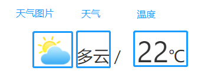

## 组件介绍


| 功能 | _展示天气和温度__ |
| :---: | --- |
| 组件接收数据格式 | ```格式```：[[ __天气__, __温度__ ]] <br /> ```天气```："暴雪"，"大雨"，"多云"，"雷阵雨"，"晴"，"小雪"，"小雨"，"阴"，"阵雨"，"中雪"，"冰雹"，"霾"，"沙尘暴"，"雾"，"雷雨" |
| 组件发送数据 | 无 |

## 参数配置

- 天气图片宽度：宽度像素值
- 天气图片高度：高度像素值
- 天气字体大小：字体像素值
- 天气字体颜色：颜色值
- 温度字体大小：字体像素值
- 温度字体颜色：颜色值
- 温度单位字体大小：字体像素值
- 温度单位字体颜色：颜色值
- 温度间隔：天气和温度的间隔像素值
- 默认展示天气：下拉框，初始显示天气
- 默认展示温度：初始显示温度
- 示例数据：下载csv的示例数据
