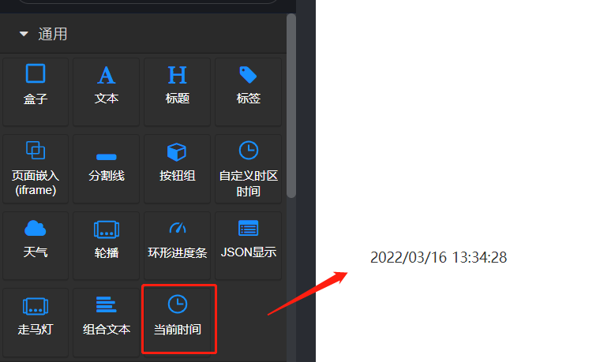

# 前面板

# 功能说明

用于显示当前的系统时间。显示的内容为 日期 + 时间 的字符串

## 配置项

| 配置项   | 说明               | 样例                                                                                                                                                                          |
| -------- | ------------------ | ----------------------------------------------------------------------------------------------------------------------------------------------------------------------------- |
| 朝向     | 可选项：水平、垂直 | 水平：    垂直： |
| 日期格式 | 配置日期的显示格式   Y 代表年份   M 代表月份   D 代表日期 | |
| 日期字体大小 | | |
| 日期字体粗细 | | |
| 日期字体颜色 | | |
| 时间格式 | 配置日期后面的时间的格式   H 代表小时   m 代表分   s 代表秒 | |
| 时间字体大小 | | |
| 时间字体粗细 | | |
| 时间字体颜色 | | |
| 日期时间间距离像素（水平方向） | 在朝向设置为水平时，控制日期与时间之间的间隔 | |
