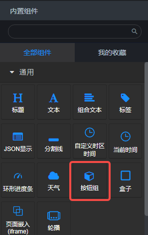
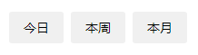
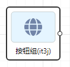
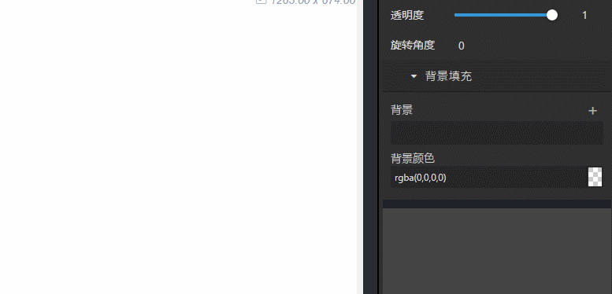

### 概览
- 内置组件/通用/按钮组：

- 拖入画布后：

- 在后面板生成一个有输出端口的节点：

### 数据

- 点击按钮之后，向后面板的下游组件发送参数该按钮对应的Param的值。

### 参数

- 垂直：布尔值，默认false。定义按钮是否垂直排列。
- Labels：以英文逗号分隔的string类型值，依次对应按钮上的文本，如果只有一个字符串而没有. 分隔的话，那么只生成一个按钮。
- Params：以英文逗号分隔的string类型值，定义每个按钮被点击时向下游组件发送的数据。
- 默认发送Param：string类型值，必须是Params中被, 分隔的其中的一个值。定义页面初始化时被选中的按钮。
- 风格：选项'button', 'nav', 'tab'，定义三种不同类型的风格，默认 button 。

### 演示

