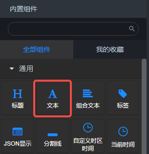
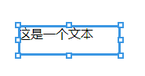
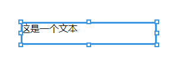
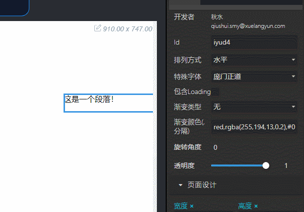
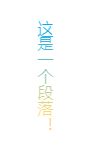

## 概览
在内置组件面板中：  拖入画布后： 

### 数据

#### 默认数据
默认数据可以通过双击文本来修改。

- 修改文本：
- 增加/删除链接：

#### 输入数据
文本组件可以接收一切后面板节点发送来的数据。

### 参数
排列方式：选项“水平”、“垂直”，默认“水平”。定义文本的排列方式。 特殊字体：选项“inherit”、“DS-Digital”、“庞门正道”。默认“inherit”，即继承父级的字体设置。 数据加载动画：布尔值，默认false。定义在等待数据输入时是否有加载动画。 渐变类型：文本渐变方向选项，默认“无”，即不设置渐变。 渐变颜色：文本渐变颜色。以逗号, 分隔的颜色值。

#### 渐变且垂直排列设置预览：

