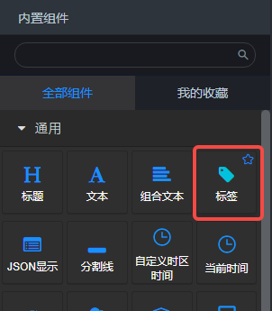

## 组件概览

### 组件

### Demo示例

### 说明：

- 标签组件拖入画布后，会在后面板中生成有一个输入节点的后面板组件。
- 从上游组件得到的数据会渲染到上图Demo示例的“50”位置。
- 标签组件在前面板中的静态文字，如上图Demo中的“统计”、“kg”、“50”、“个”可以双击自定义。

## 输入数据
标签组件可以从上游组件接收一个字符串数据，该数据会被渲染在“Demo示例”截图中的“50”的位置。

## 组件参数

- 大小：可以通过拖拽前面板组件的方式，或者修改图表尺寸来修改。
- 字体颜色：颜色值。
- 背景颜色：颜色值。

## 样式调整

- 除了在“组件参数”中的参数可以调整部分样式外，更丰富的样式调整可以通过**位置**、**文字**、**样式**面板。
- 若标签组件中的内容已经被组合，无法单独选中调整，可以通过在组件上双击鼠标左键来组合和解除组合。
