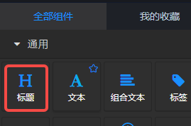
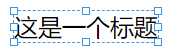
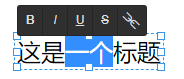
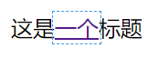
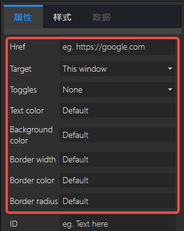

## 概览
- 组件：

- 前面板：

## 说明
通用标题组件不会在后面板生成组件，仅用于页面前端布局，不参与数据处理。

## 基本设置

### 如何修改？

#### 编辑文本

- 在前面板中，选中通用标题，出现如上图中的蓝色虚线框和锚点。
- 在框内区域双击鼠标右键，出现如下图所示状态。
   - 
- 上图中，1 红框中是文本修饰按钮，可以选中某个字或多个字，然后点击上面的按钮。按钮从左到右依次为：加粗、斜体、下划线、删除线和链接。
- 上图中的 2，是我们熟悉的文本闪烁光标，可以在光标位置输入文字。

#### 加链接

- 选中文字后，点击上图 1 中的最右边按钮，就给改文字加上链接了。然鹅儿，可能会没发现什么变化。鼠标点击空白区域，会发现文本已经发生变化。

- 但是，链接到哪里去了呢？鼠标点击蓝色文字后，如下图：

- 这是一个Link，选中后，右边的设置面板中可以设置Link的参数：

#### 改变大小

- 可以通过拖曳锚点改变宽度和高度
- 可以通过全局样式中的图表尺寸改变宽度和高度

### 参数

- 排列方式：选项“水平”、“垂直”，默认“水平”。定义文本的排列方式。
- 特殊字体：选项“inherit”、“DS-Digital”、“庞门正道”。默认“inherit”，即继承父级的字体设置。
- 渐变类型：文本渐变方向选项，默认“无”，即不设置渐变。
- 渐变颜色：文本渐变颜色。以逗号, 分隔的颜色值

## 高级设置
如果基本设置无法满足对样式的要求，可以在高级设置进行相关配置，高级设置支持绝大部分的css样式。

