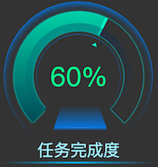
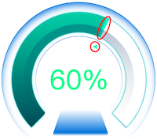

### 数据
- 默认数据：
    ```json
        [["任务完成度", 60]]
    ```
### 参数

- 背景色：颜色，需要与整体背景色一致<br />例如，当搭建大屏背景为#333，需要将环形进度条的背景色设置成#333<br />

   =>  

- 指针颜色：颜色，包括部分如图：



- 进度条颜色：字符串，可以设置单个颜色（例如，#333333），也可以设置两个颜色的渐变（例如：#164955|#4dc9a4。注意：只有当【进度条渐变】设置不为“无”时，渐变才起作用）
- 进度条内部环形阴影颜色：颜色，只可以设置十六进制形式的颜色值（例如，#333333）
- 其他参数名称明了，没有额外补充
