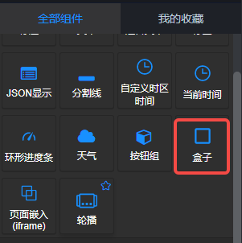
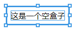
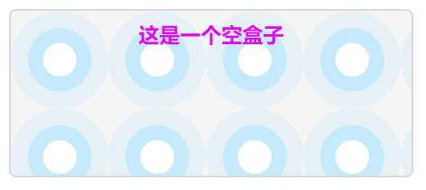
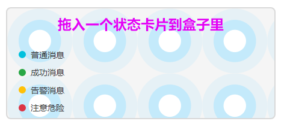
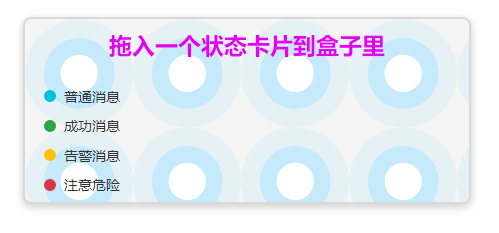

## 概览
- 内置组件/通用/盒子：

- 拖入画布后：

- 这是一个前面板布局的组件，不产生后面板节点。仅是一个div元素中包含了一个span元素。

## 用法

- 可以用右面板的 **样式** 面板中的参数来设置这个空盒子的大小、位置、背景、边框、文本等。

- 将画布中的其他组件拖入盒子中，可以用于流式布局等。

## 参数

- 阴影：布尔值，默认false。设置为true时，给盒子加一个参数为0 3px 8px rgba(0,0,0,0.2) 的阴影。如下
